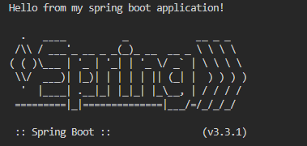
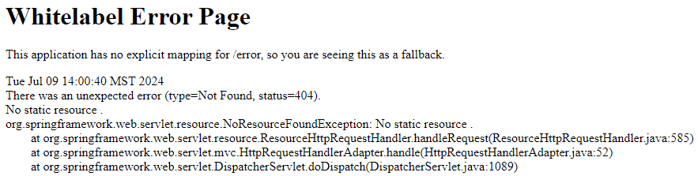
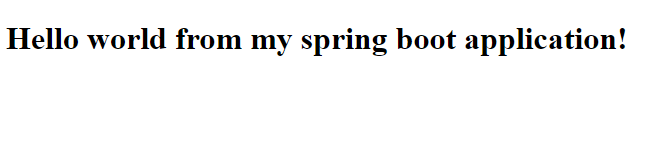
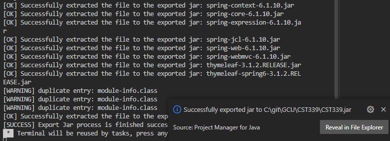
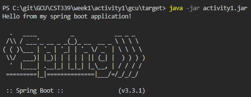
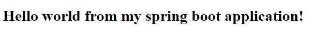

# Week 1

### Class: CST-339
### Professor: Prof. Mauger
### Author: Phillip Ball

---

### Tools Installation & Validation 

**Screenshot of console output when running the Topic11Application class**

**Screenshot of the White label Error Page.**

**Screenshot of the White label Error Page.**

### Learning Maven

**Take a screenshot of the console output for the Maven build**

**Screenshot including the console command to run the activity1.jar file**

**Open a browser and go to localhost:8080. The content of the index.html page should be displayed. Take a screenshot**

