# Week 2

### Class: CST-339
### Professor: Prof. Mauger
### Author: Phillip Ball

---

# Activity 2

[Part 1](#part-1-creating-models-views-and-controllers-using-spring-mvc)

[Part 2](#part-2-creating-forms-with-data-validation-using-spring-mvc)

[Part 3](#part-3-creating-layouts-using-thymeleaf)

### Part 1: Creating Models, Views, and Controllers Using Spring MVC

[Back to Top](#week-2)

**Run the application. Open a browser and go to localhost:8080/hello/test1. The text response of Hello World! should be displayed in your browse**

**Run the application. Open a browser and go to localhost:8080/hello/test2. The text response of Hello Spring MVC Framework! should be displayed in your browse**

**Run the application. Open a browser and go to localhost:8080/hello/test3. The text response with both messages should be displayed in your browser**

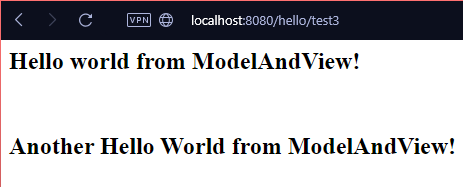

**Run the application. Open a browser and go to localhost:8080/hello/test2. Test the anchor tag in the hello view**

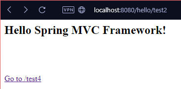

**Run the application. Open a browser and go to localhost:8080/hello/test2. The text responses with the proper messages and a links to the '/test2', '/test3', and '/test4' URI's should be displayed. Validate all of the anchor tags work as expected**

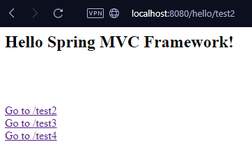

**Run the application. Open a browser and go to localhost:8080. The Welcome to CST-339 Topic 2 Activity message and a link to the /hello/test2 URI should be displayed. Validate the anchor tag works as expected**

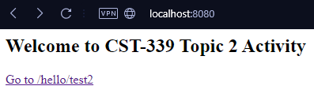

### Part 2: Creating Forms with Data Validation Using Spring MVC

[Back to Top](#week-2)

**Run the application. Open a browser and go to localhost:8080/login/. The Login Form should be displayed. Validate the Login Form works as expected**

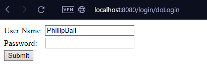

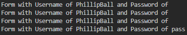

**Run the application. Open a browser and go to localhost:8080/login/. Submit the form to display the Orders View**

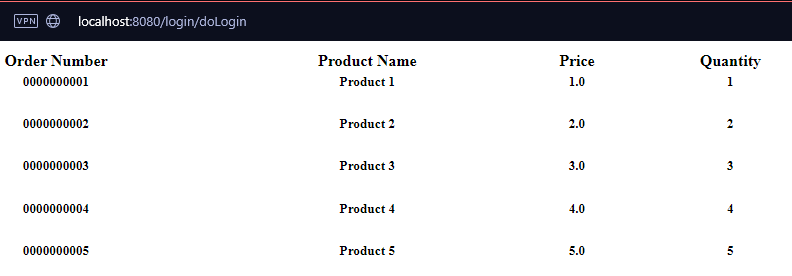

**Run the application. Open a browser and go to localhost:8080/login/. Submit the form with validation errors and verify that the field level data validation errors and list of data validation errors are displayed properly**

>The data validation did not work properly and I honestly have no idea why. I have attached some screenshots of everything that I have added.

**NotNull/Size Annotations being used**

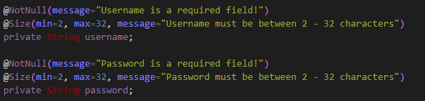

**Dependencies properly added**

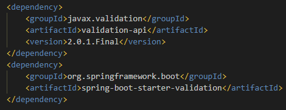

**doLogin Function with logs on the loginModel and bindingResult**

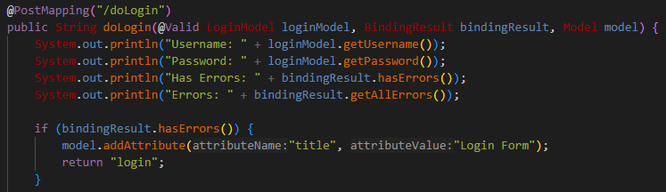

**Logs after submit button pressed**

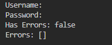

>I was at it for quite some time, looked at stuff on the internet and still couldn't make out why this was not working whatsoever 

### Part 3: Creating Layouts Using Thymeleaf

[Back to Top](#week-2)

**Screenshot of Login page using Layouts**

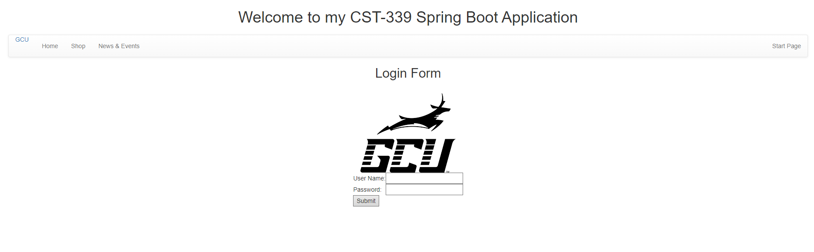

**Screenshot of Orders page using Layouts**

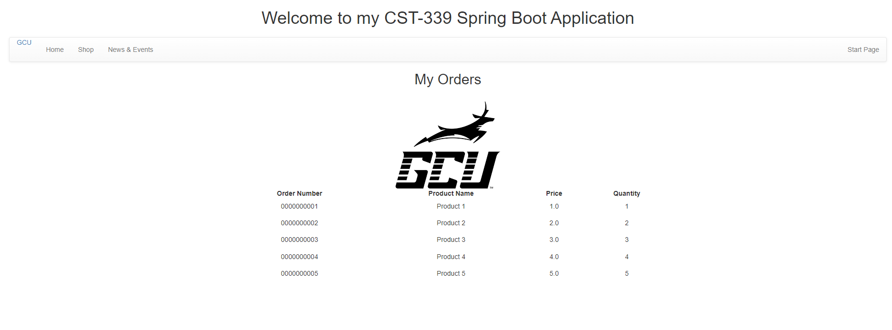
