# Cover Sheet

### Class: CST-339
### Professor: Prof. Mauger
### Author: Phillip Ball

---

# Activity 3

## Creating Spring Bean Services Using Spring Core

**Screenshot of console output for OrdersBusinessService**

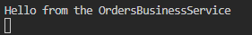

**Screenshot of console output for AnotherOrdersBusinessService**

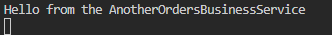

**Screenshot of console output for SecurityBusinessService**

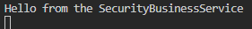

**Screenshot of the Orders page**

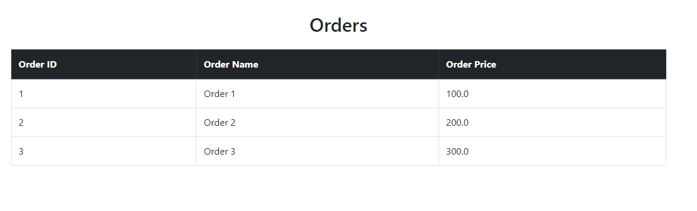

## Spring Bean Life Cycle and Scopes

**1: Update Spring Bean annotation in SpringConfig class**

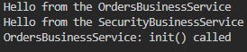

### Readme

The init() method was called when the Orders Business Service bean was initialized by the Spring container. The number of calls to init() was made once per bean initialization.

**2: Add @Scope("prototype") annotation to getOrdersBusiness() method**

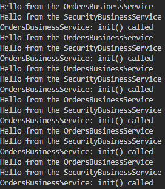

### Readme

The init() method was called each time a new instance of the Orders Business Service was created, which occurred every time the form was submitted due to the prototype scope.

**3: Add @RequestScope annotation to getOrdersBusiness() method**

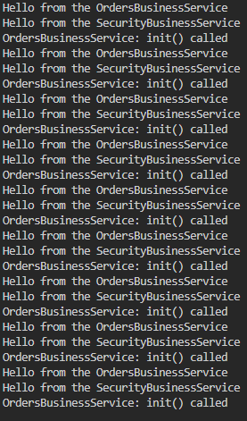

### Readme

The init() method was called each time the login form page was requested, creating a new instance of the Orders Business Service for each HTTP request due to the request scope.

**4: Add @SessionScope annotation to getOrdersBusiness() method:**

### Readme

The init() method was called once per unique browser session, creating a new instance of the Orders Business Service for each session due to the session scope.

**5: Remove the @SessionScope annotation to set default Singleton Scope**

### Readme

The init() method was called only once when the Orders Business Service bean was initialized by the Spring container, as singleton is the default scope.

## Creating REST Services Using Spring REST Controllers

**Screenshot of the formatted JSON displayed in the browser**

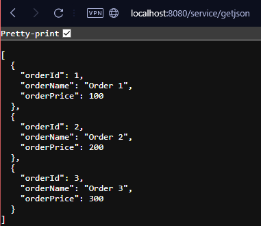

**Screenshot of the formatted XML displayed in the browser**

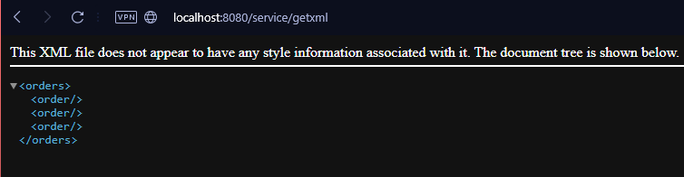

**Screenshot of the formatted JSON displayed in Postman**

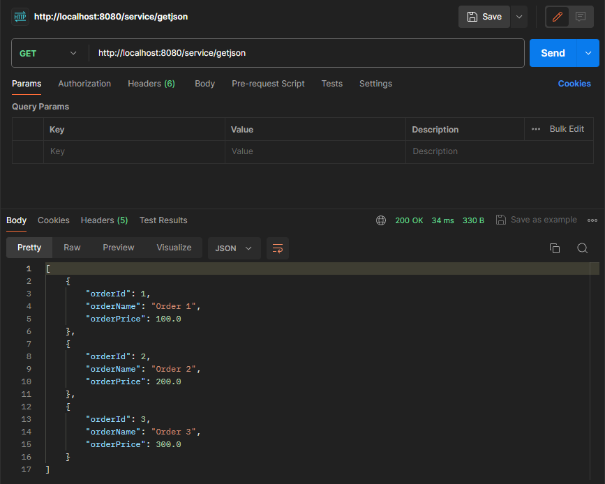

**Screenshot of the formatted XML displayed in Postman**

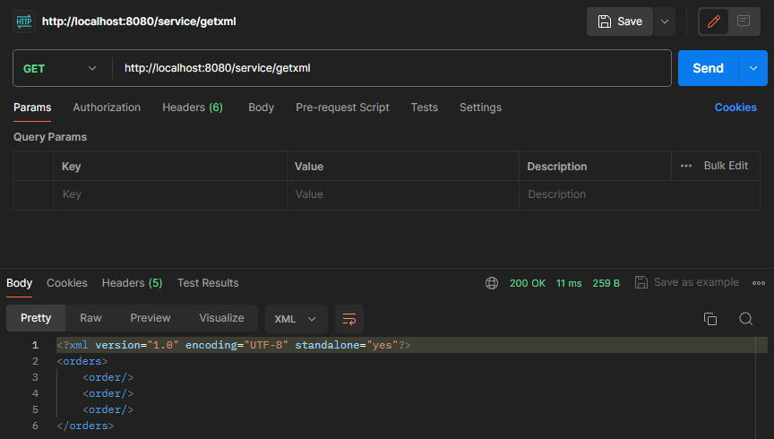
