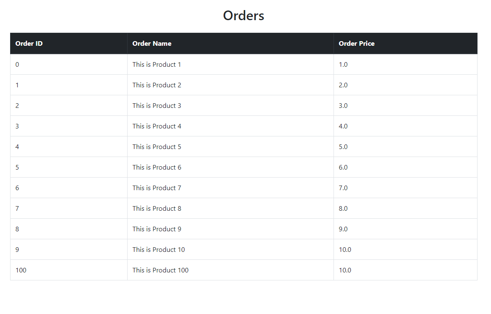
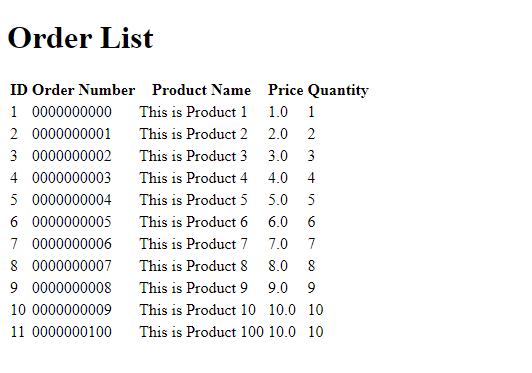
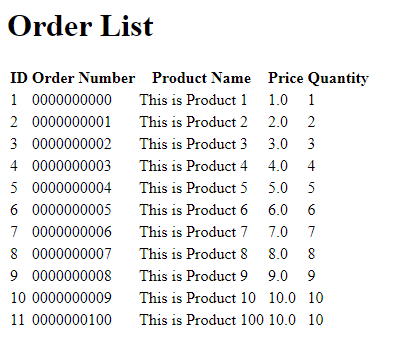

# Cover Sheet

### Class: CST-339
### Professor: Prof. Mauger
### Author: Phillip Ball

---

# Activity 4

### Part 1: Creating Data Services Using Spring JDBC

**Orders Screenshot**

### Part 2: Creating Data Services Using Spring Data JDBC

**Orders Screenshot**

### Part 3: Creating Data Services Using Spring Data JDBC Native Queries

**Orders Screenshot**

