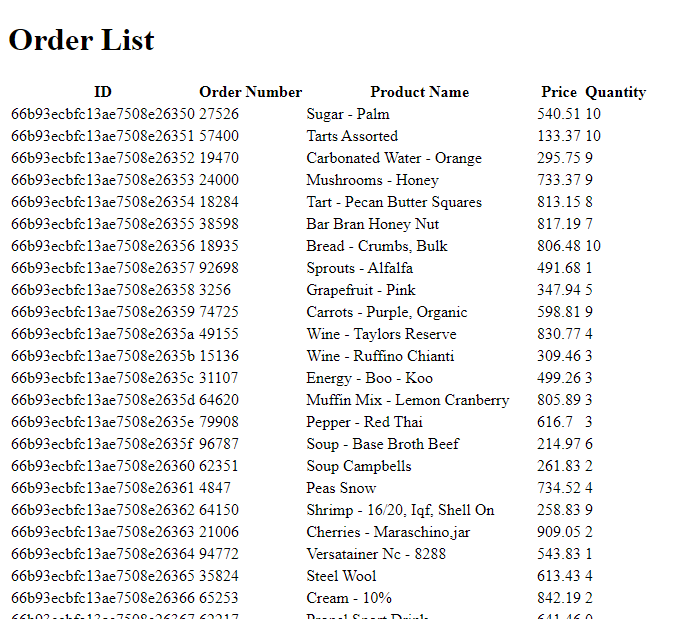
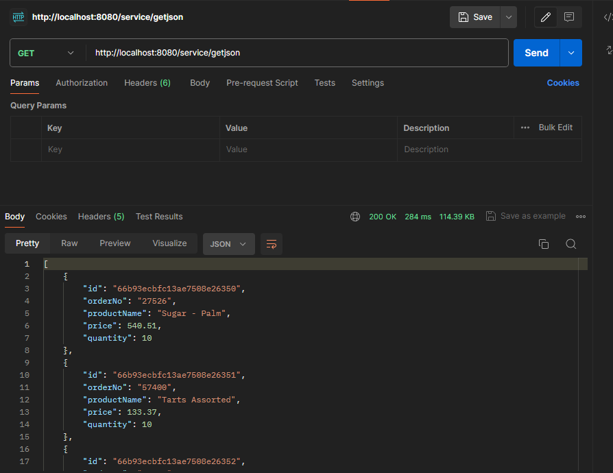
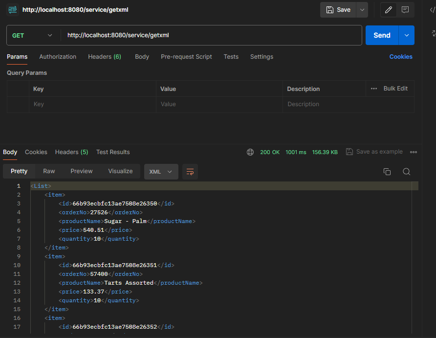
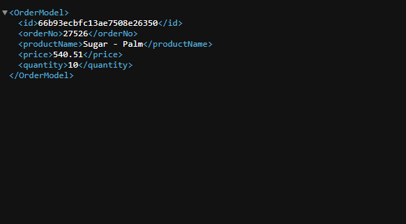

# Cover Sheet

### Class: CST-339
### Professor: Prof. Mauger
### Author: Phillip Ball

---

# Activity 5

## Part 1: Creating Data Services Using Spring Data MongoDB

**Orders Page - Generated the data from mockaroo**

**JSON Response**

**XML Response**

## Part 2: Adding New Queries in the MongoDB Repository

**Screenshot of the response with a known ID**

**Screenshot of the response with an invalid ID**

