# Cover Sheet

### Class: CST-339
### Professor: Prof. Mauger
### Author: Phillip Ball

---

# Part 1: Securing a Web Application Using an In-Memory Datastore

### Screenshot of the Orders page

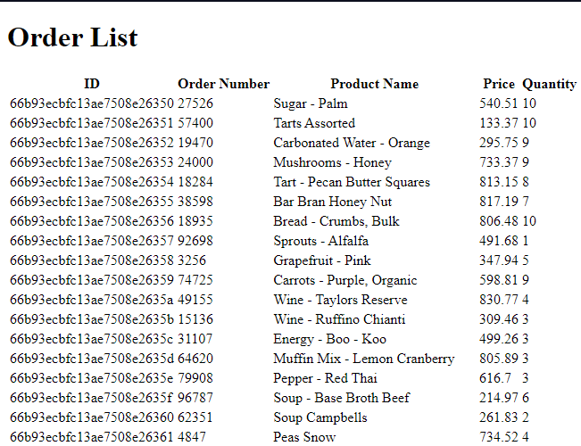

### Screenshot of the JSON and XML REST API responses

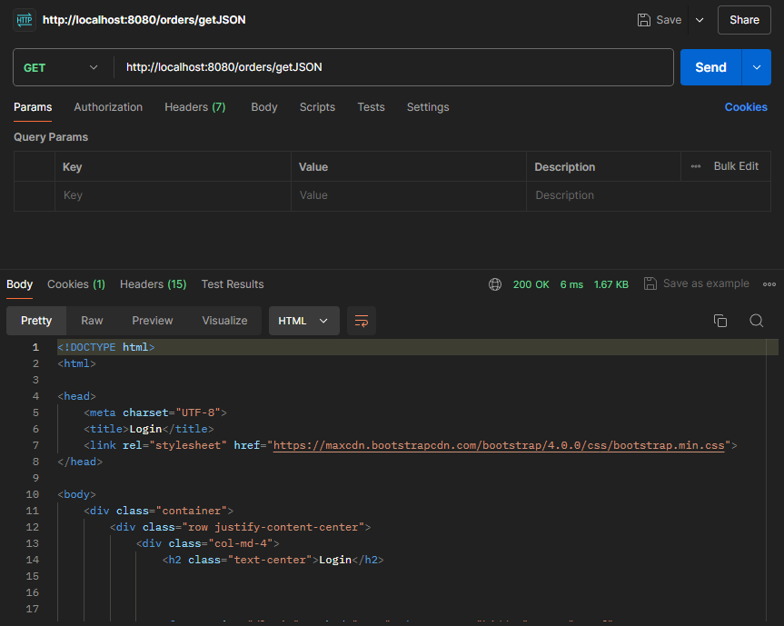

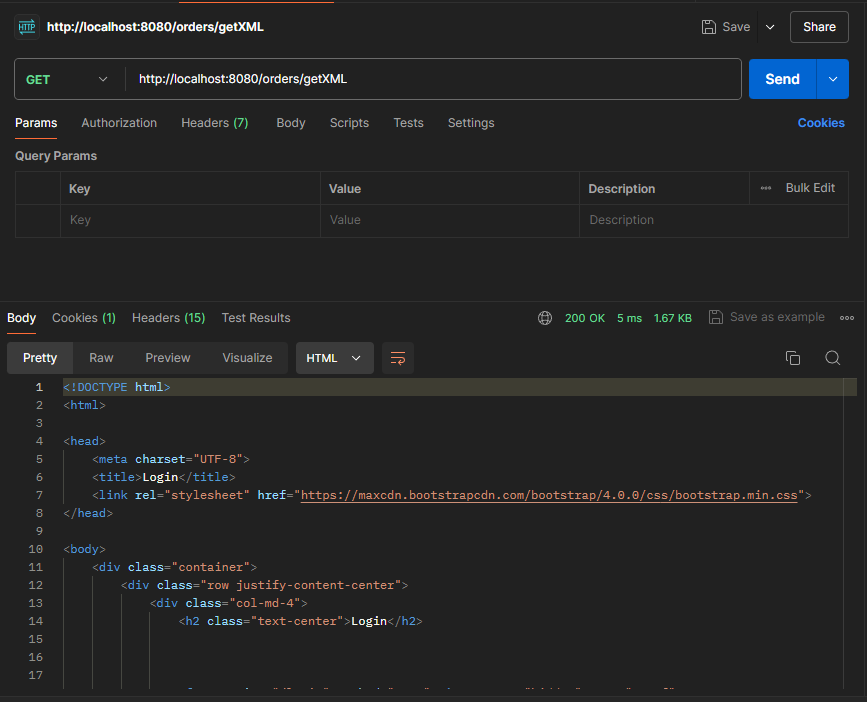

# Part 2: Securing a Web Application Using a Database

### Screenshot of the Orders page

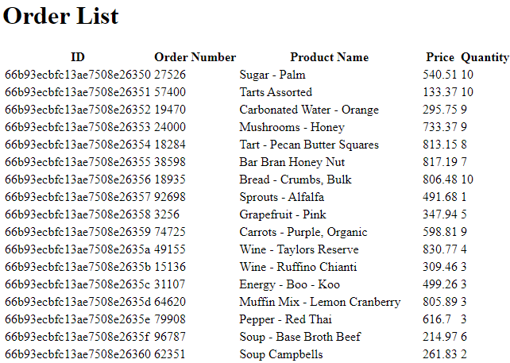

### Screenshot of the JSON and XML REST API responses

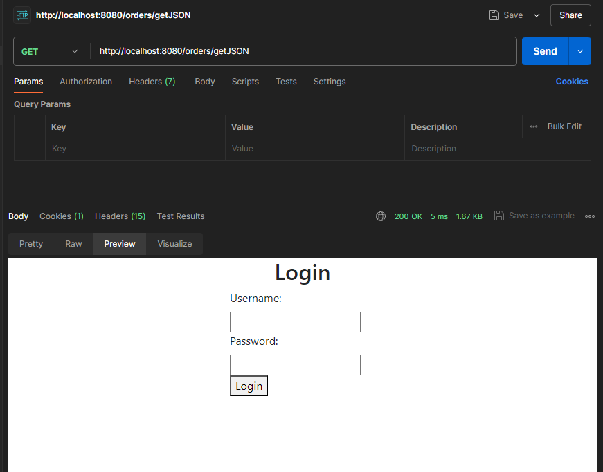

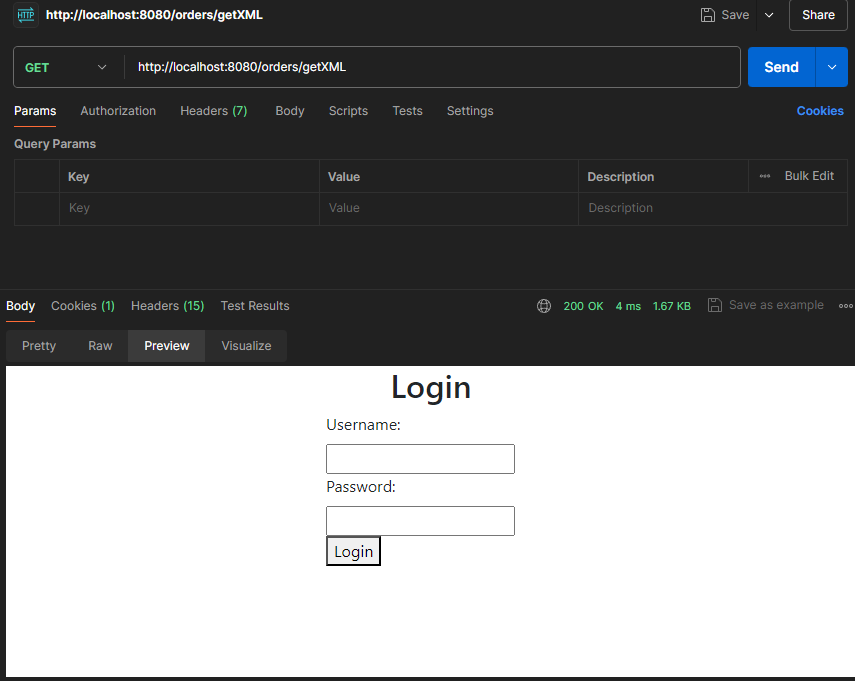

# Part 3: Securing REST APIs Using Basic HTTP Authentication

### Screenshot of the /getjson API response with good login credentials.

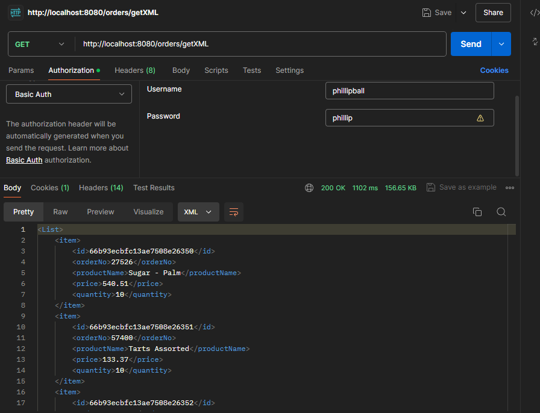

### Screenshot of the /getjson API response with bad login credentials.

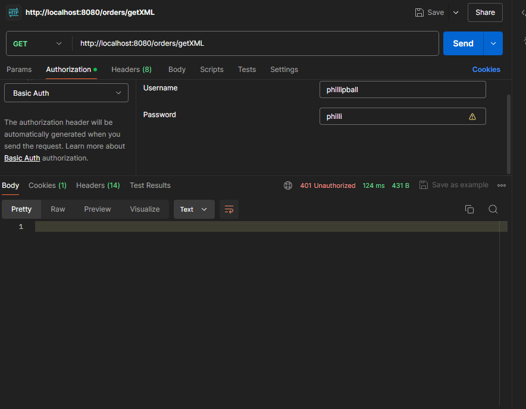

### Screenshot of the /getxml API response with good login credentials.

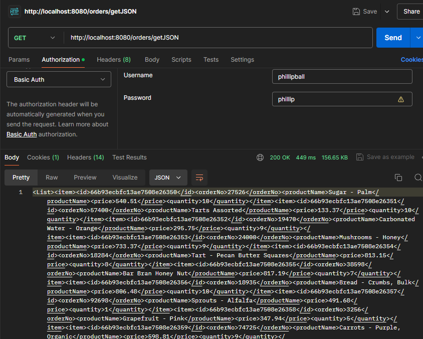

### Screenshot of the /getxml API response with bad login credentials.

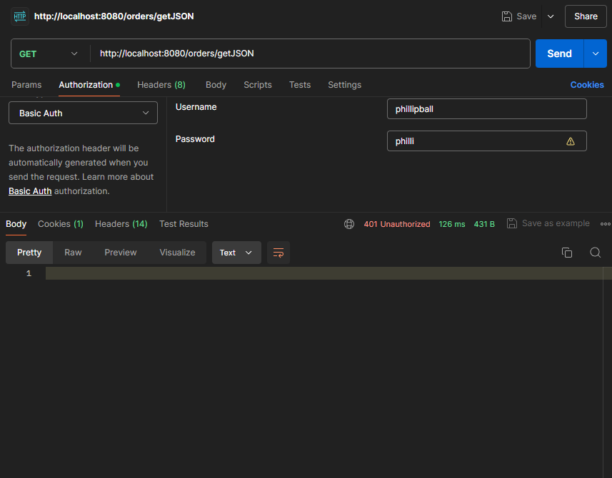

# Part 4: Securing REST APIs Using OAuth2 Authentication

### Screenshot of the GitHub login screen.

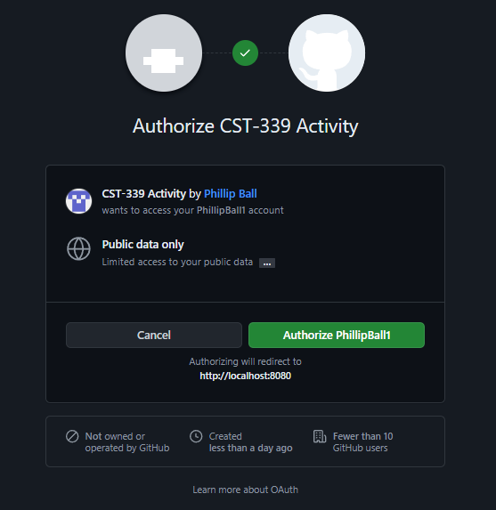

### Connection after Auth

