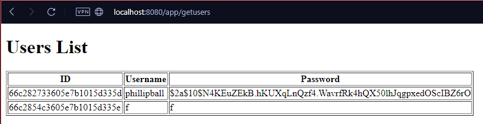
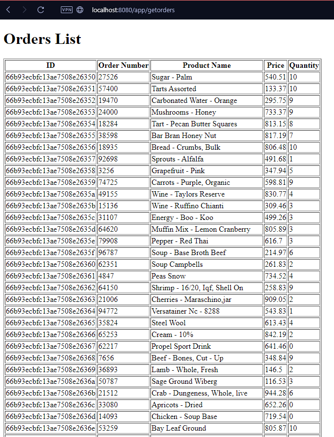
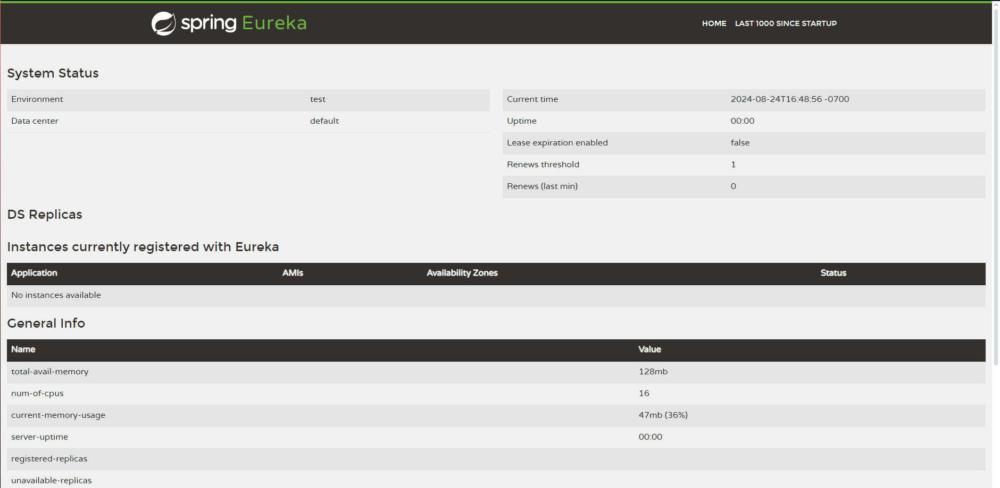

# Cover Sheet

### Class: CST-339
### Professor: Prof. Mauger
### Author: Phillip Ball

---

# Part 1: Building a Web Application That Consumes Microservices

### Screenshot of the users displayed in a table

### Screenshot of the orders displayed in a table

# Part 2: Integrating a REST Service Registry and Discovery Service

### Screenshot of the Eureka Server dashboard

For the rest of this portion I could not get EurekaClient to work. I started by using "private EurekaClient eurekaClient;" as I assumed that is what was being used in the assignment. At the start I was getting initialization errors as the client wasnt set to anything, returning errors like "eurekaClient is null". Then I changed to @Autowired as I was using @EnableEurekaServer in the application.java, so I assumed it would work. This then gave the error that a bean was required, which confused me as I thought the enable in the application covered that. I even trie to manually make my own config for a bean but stressed over it a bit too much and realized that it probably was not meant to be this frustrating to use EurekaClient. I updated my pom and rebuilt plenty of times, still I have no idea what the issue is and after some time I felt like I tried all of the main things that would work.