# Cover Sheet

### Class: CST-250
### Professor: Jason Jazzar
### Author: Phillip Ball

---

|Milestone| Page Link | Video Link |
| :--------:  | ----------- | -------------- |
| 1 | [Here](#milestone-one) | None |
| 2/3 | [Here](#milestone-twothree) | None |
| 4 | [Here](#milestone-four) | None |

# Milestone One

***This milestone shows the board functionally displaying, where the 0's are empty squares with no neighboring bombs, X's are bombs, and every numbered square shows how many bombs are near their center from a 3 by 3 area. The screenshots display the changeability in the board and how it is generated.***

## UML Diagram
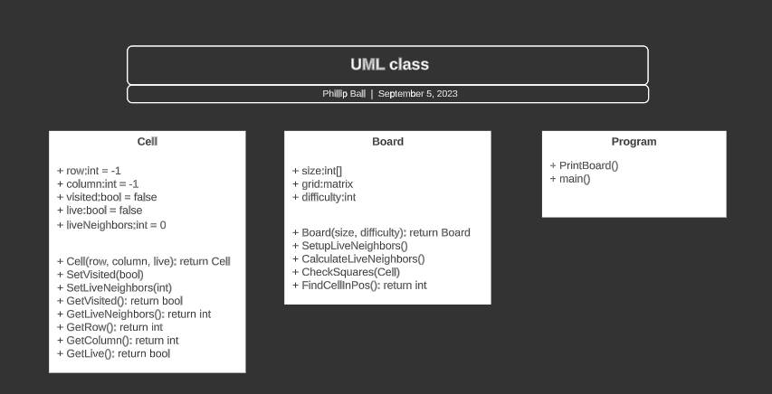

## Screenshots

**10 by 10 with a 10% chance to spawn a bomb**

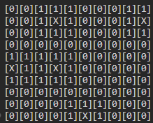

**10 by 10 with a 30% chance to spawn a bomb**

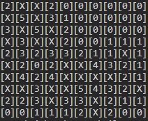

**20 by 20 with a 10% chance to spawn a bomb**

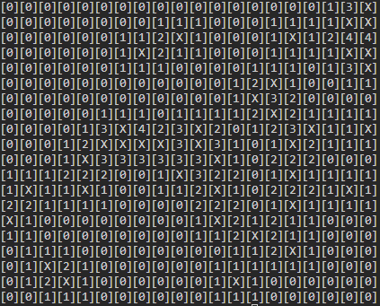

**20 by 20 with a 30% chance to spawn a bomb**

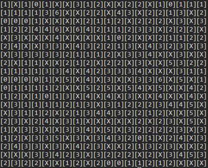

**20 by 20 with a 1% chance to spawn a bomb**

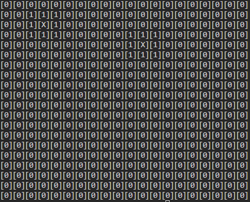

# Milestone Two/Three

[Back to Top](#cover-sheet)

***I Saw Milestone two and mainly read that it needs to be an interactive version for the game thinking that it should be a playable console minesweeper. Afterwards I just began programming it inside of the program.cs and ended up adding a bunch of functions to make the full minesweeper game. This led me to adding the recursion and after viewing milestone three, I see that I messed up. I will just put them both into this page of the markdown, if I should do something else, please let me know. Thanks!***

## UML Diagram
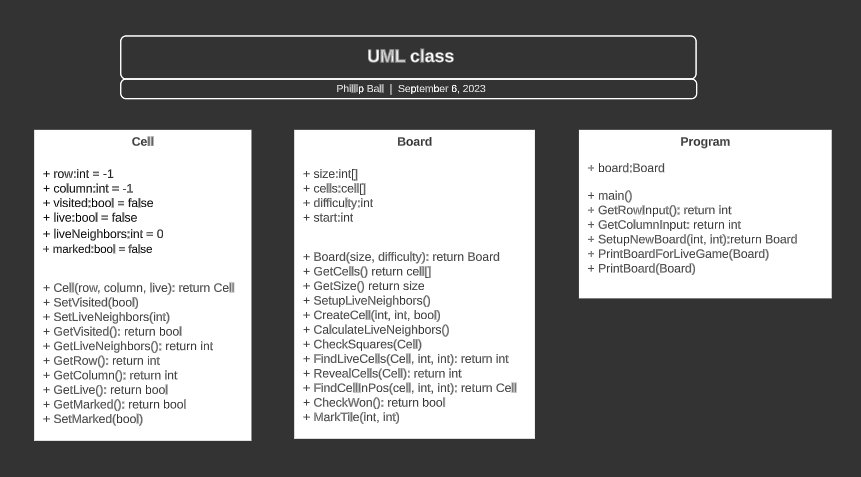

## Flow Chart
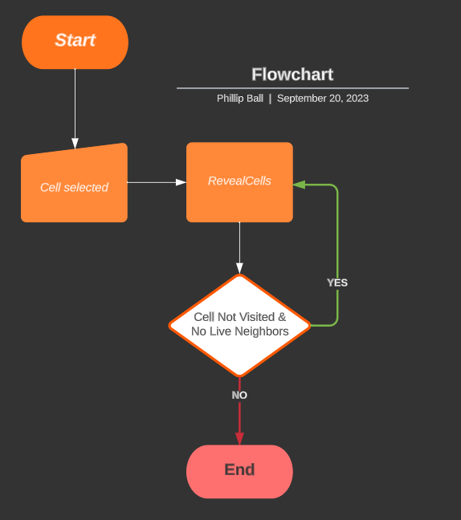

## Screenshots

**Initial pop-up Screen**

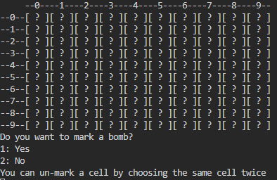

**After the Row and Column inputs are received ( 0, 0), on the game board the question mark that was once there is now a 1. This screenshot displays the base input functionality.**

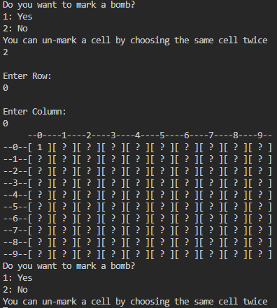

**After entering the inputs ( 5, 5), we can see that the whole board opened correctly from the recursion, this was due to ( 5, 5) being a blank square which allowed for the recursion to start working. This screenshot displays the recursion functionality.**

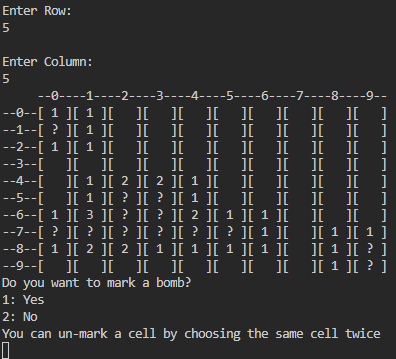

**After seeing that ( 1, 0) had a bunch of ones nearby it's cell, it was safe to assume that ( 1, 0) was a bomb and I chose to mark it with an X. This screenshot displays the marking functionality.**

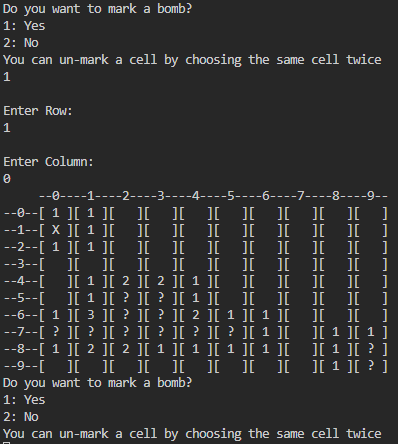

**After seeing that ( 1, 0) was a bomb, there was a good opportunity to showcase the endgame functionality, which displays the full board uncovered. This works the same for the win game function with just the "You hit a bomb :(" message saying "You beat the game!" instead. This screenshot shows the endgame functionality.**

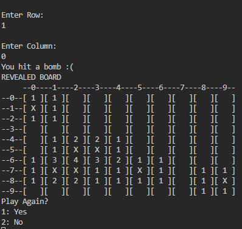

**After losing or winning the game the user can just hit 1 on their keyboard to play again. This screenshot just demonstrates that a new board with new hidden cells shows up when a 1 is entered.**

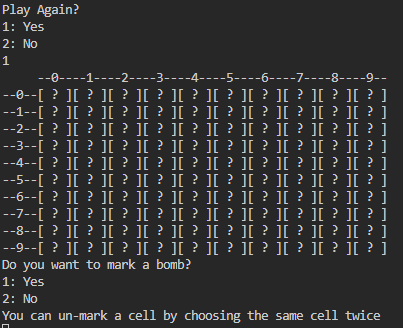

# Milestone Four

[Back to Top](#cover-sheet)