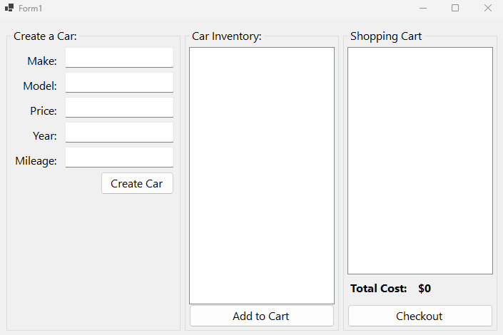
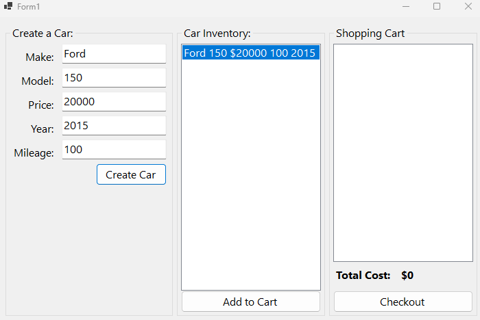
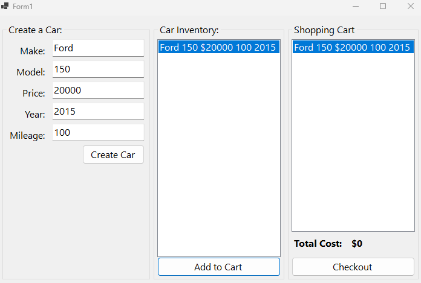
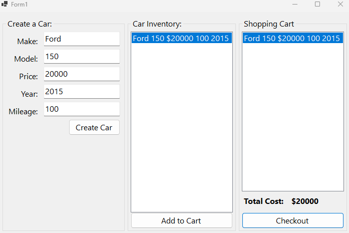

# Cover Sheet

### Class: CST-250
### Professor: Jason Jazzar
### Author: Phillip Ball

---

## Screenshots

**Completed Form**

**Create car button demonstration**

**Add to cart button demonstration**

**Checkout button demonstration**

## Challenges

I have plenty of experience with C# and Visual Studio so I was pretty comfortable doing this work. I did enjoy the library to form1.cs connection. When I used to make form apps I never really considered keeping the backend away from frontend and I just put everything into the form. 