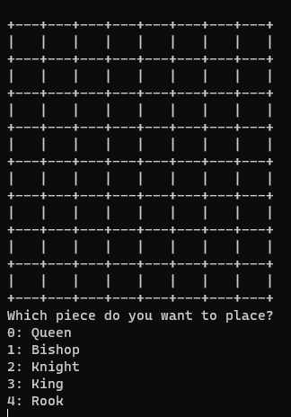
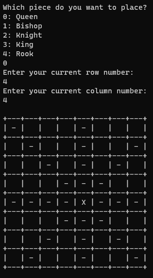
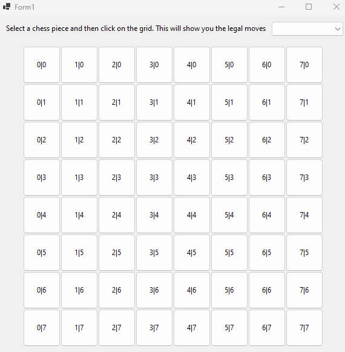
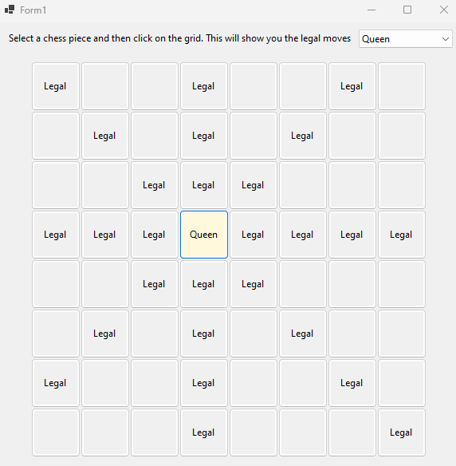
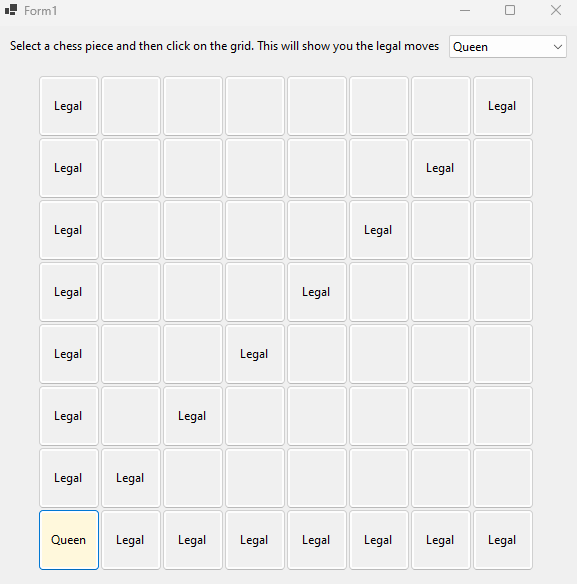
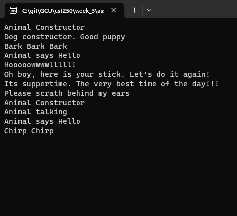

# Cover Sheet

### Class: CST-250
### Professor: Jason Jazzar
### Author: Phillip Ball

---

[Part 1: Console App](#part-1-console-app)

[Part 2: Windows Form App](#part-2-windows-form-app)

[Part 3: Animal Classes](#part-3-animal-classes)

# Part 1: Console App
[Back to Top](#cover-sheet)
## Screenshots

**Initial Board (console app)**

**Ask user to choose piece, then place that piece on the board showing legal moves with '-' and piece current position with 'X' (console app)**

# Part 2: Windows Form App
[Back to Top](#cover-sheet)
## Screenshots

**Initial Board (windows form app)**

**After user selects a piece from the dropdown and clicks on of the buttons on the board. This shows their legal moves as 'Legal' and the piece position with the piece name (windows form app)**

**This screenshot shows what the board looks like after clicking a different button during the same play through (windows form app)**

# Part 3: Animal Classes
[Back to Top](#cover-sheet)
## Screenshots

**Constructor's after run**

## Video
[Video Link](https://www.youtube.com/watch?v=x8IjXdKud20)
