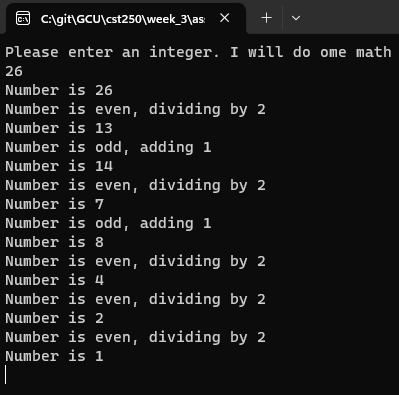
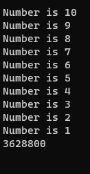
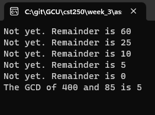
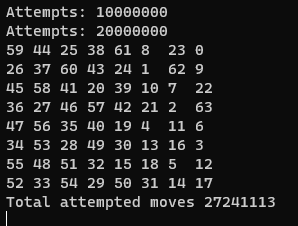
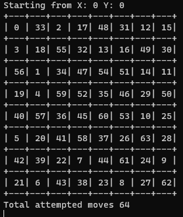
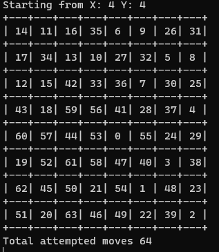

# Cover Sheet

### Class: CST-250
### Professor: Jason Jazzar
### Author: Phillip Ball

---

## Screenshots

**Recursive function to count to one**

**Recursive function to count a factorial**

**Recursive function to find the greatest common denominator**

**Brute force knights tour - 27 million attempted moves**

**Warnsdorff's Algorithm from 0,0 - 64 attempted moves**

**Warnsdorff's Algorithm from 4,4 - 64 attempted moves**

