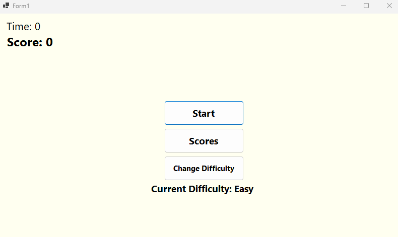
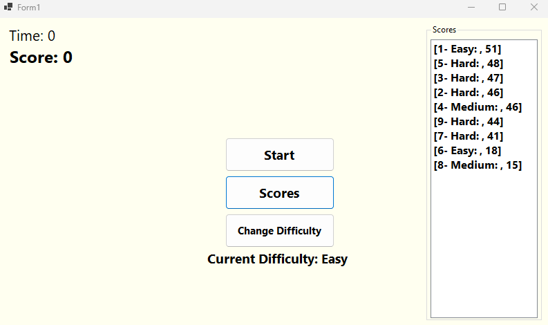
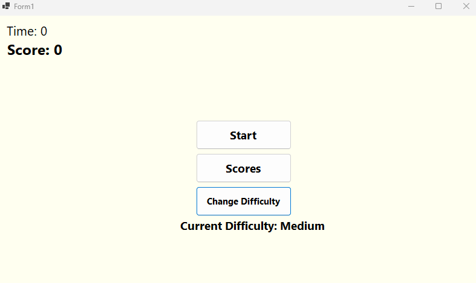
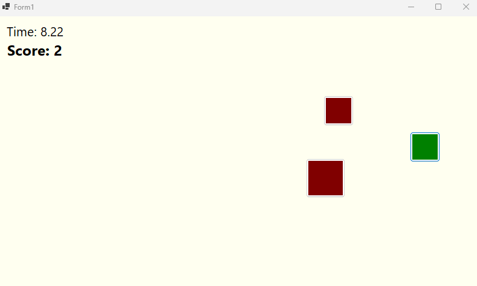
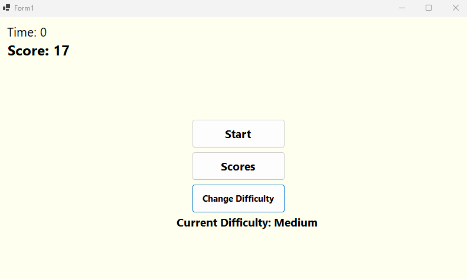
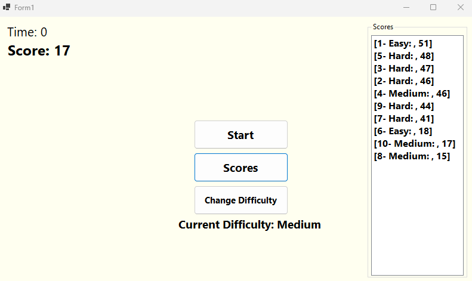

# Cover Sheet

### Class: CST-250
### Professor: Jason Jazzar
### Author: Phillip Ball

---

### [Video Demonstration](https://www.youtube.com/watch?v=ljYxUKQaY_A)

## Screenshots

**Initial startup screen**

**Scores button pressed**

**Difficulty button pressed**

**While game is being played, showing that score is increased on green button press**

**After game is over, displaying score in top left**

**Showing that the score is then saved into the dictionary at [10- Medium:, 17]**

