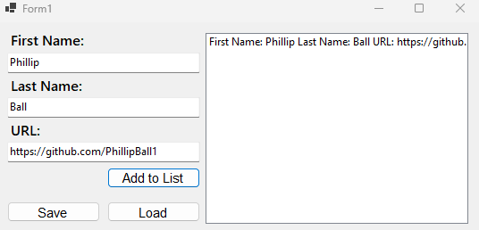

# Cover Sheet

### Class: CST-250
### Professor: Jason Jazzar
### Author: Phillip Ball

---

## Screenshots

### Part 1

**initial read from file test**

**Error checking**

**GUI layout filled in**

**After adding to the list**

**After saving the current list, closing the app, opening the app, then loading the list**

### Part 2

**Getting scores between 80-89**

**Created students dynamically and sorted them by each attribute given**

