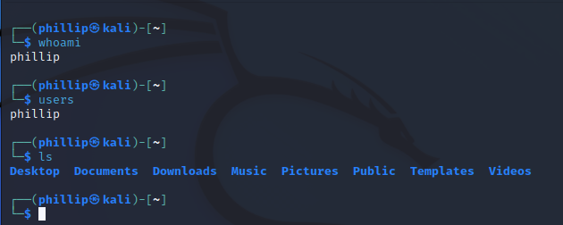
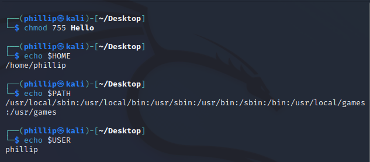
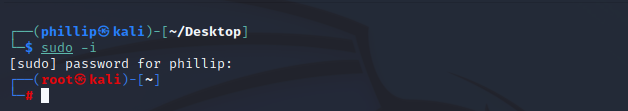
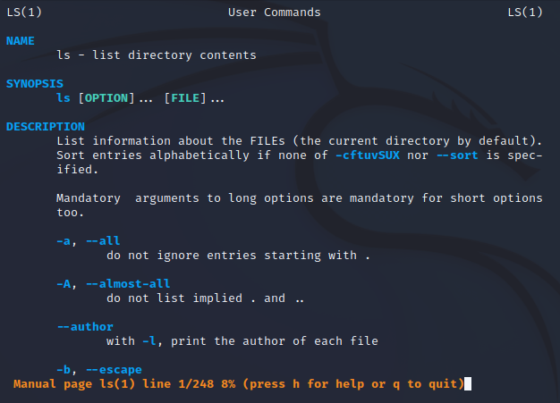
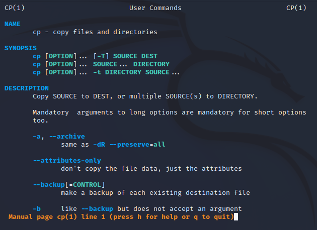
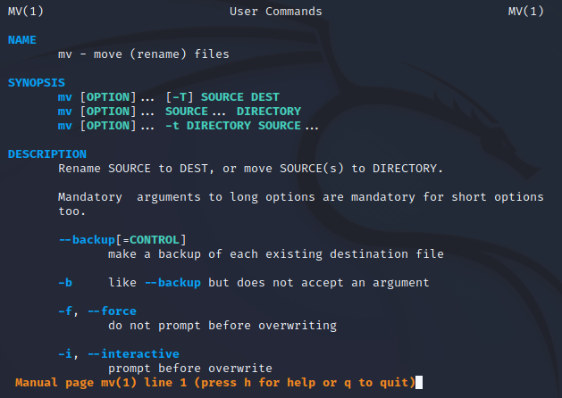
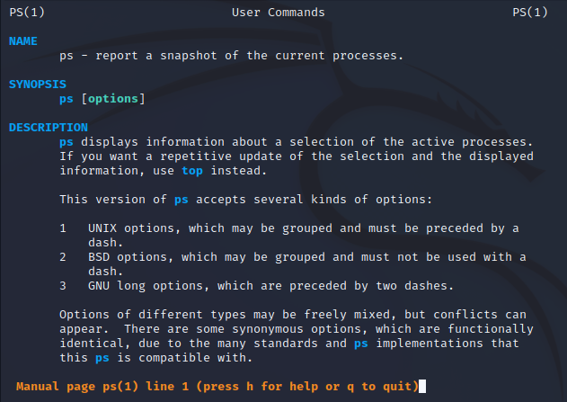
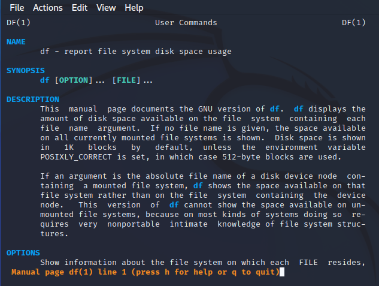
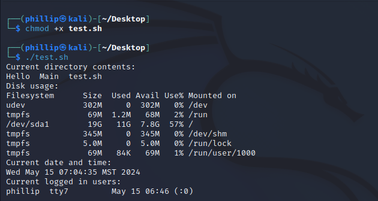
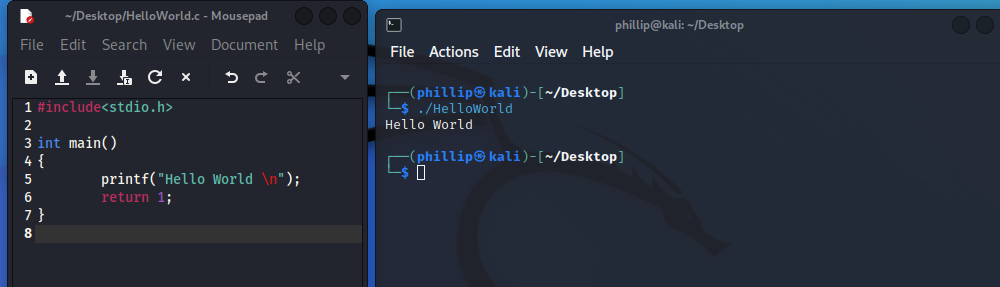

# Week One

### Class: CST-321
### Professor: Dr. White
### Author: Phillip Ball
### Date: 5 / 15 / 24

---

[UNIX Family of Operating Systems](#unix-family-of-operating-systems)

[Systems & Tools](#systems--tools)

[Activity 1](#activity-1)

## UNIX Family of Operating Systems
[Back to Top](#week-one)

`1. whoami`
`2. users`
`3. ls`

`4. Change r,w,x permission to a file using chmod`
`5. Check the value of any 3 environment variables`

`6. Use grep to search for specific content in a file`
`7. Use sort, grep, and piping to find a string in a list of files in a directory`

`8. Explore the super user account and explain when and how would you use it` 

>You would use the superuser account for tasks such as installing software, changing system settings, managing users, and editing system files.

`9. Use the Linux/UNIX built-in manual and identify 5 additional, distinct, useful commands. Execute each and capture the results.`

`1. man ls`  
>Lists directory contents.

`2. man cp`
>Copies files and directories.

`3. man mv`
>Moves/renames files and directories.

`4. man ps`
>Displays information about running processes.

`5. man df`
>Reports file system disk space usage.

`10. Create a shell script test.sh with 5 different UNIX/Linux commands of your choosing, execute it, and show the results.`

## Systems & Tools
[Back to Top](#week-one)

`Choose 5 features and explain what (in your opinion) you think happens when you access them.`

**I have never looked into any of these processes, so these are all heavy assumptions**

>**1. Opening Folders:** When I access a list of files from a folder, the storage drive reads and writes from whatever folder I am clicking into, displaying the files to the user. I'm assuming that there is a call to the system that retrieves the list of files existing in that directory.

>**2. Opening Files:** When I access a file, the storage drive reads the data from that file then considers how the file should be open, with how .txt files are usually just text files, I still get 8 different options to choose from when I attempt opening one, so I am assuming that theres some process that considers the file type then gets a call from applications that could manipulate the file type in question. 

>**3. Network Connection:** When I connect to the internet, I believe there is some initial request to the router, which may involve getting my domain name into an IP address, then sending this information to the OS through packets. Then when I connect to a website or a server, The connection from my OS sends information to the website/server containing my IP address. 

>**4. Installing:** When I am installing a software I usually see a windows defender request initially, so I'm assuming that the first thing that happens is a firewall check with the contents and the validity of the files being downloaded. Then files are installed into the directories that may have been specified beforehand. Once the process is complete, there could be a shortcut generated or maybe the software opens immediately. 

>**5. Creating a New User:** When I created my user for windows, I got asked a bunch of different questions such as language, keyboard layout, systems preferences, etc. I believe that it takes in all of that information to set up the initial environment for the user. Each question answered changes settings inside of the OS and I'm assuming that it all is stored within the OS itself. 

## Activity 1
[Back to Top](#week-one)