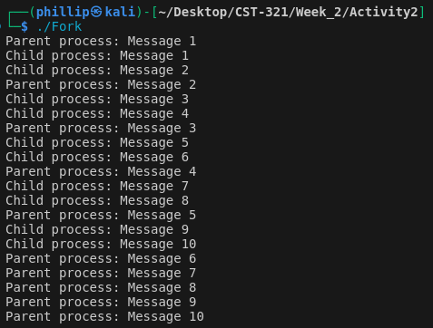
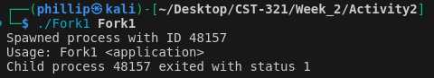
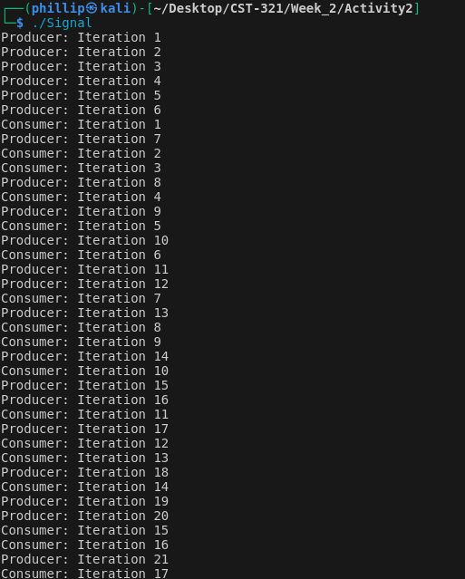
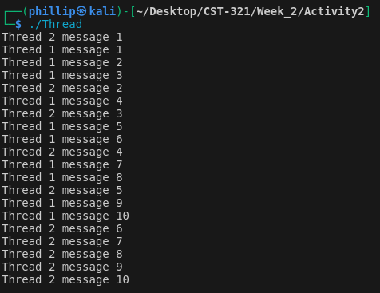
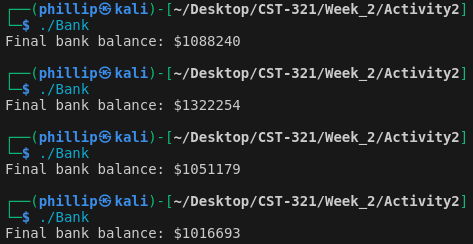
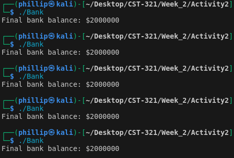
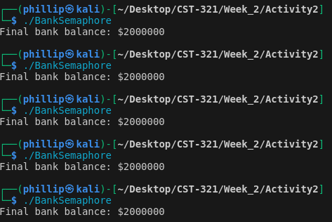

# Week Two

### Class: CST-321
### Professor: Dr. White
### Author: Phillip Ball

---

[Mutexes & Semaphores Video Link](https://www.youtube.com/watch?v=Iwe73BlNiP8)

[Mutexes & Semaphores Code](#mutexes-and-semaphores)

[Producer & Consumer Video Link](https://www.youtube.com/watch?v=wWWby2xVHS0)

[Producer & Consumer Code](#producer-and-consumer)

[Activity 2](#activity-2)


## Mutexes and Semaphores

[Back to Top](#week-two)

### Mutex
````
#include <stdio.h>
#include <stdlib.h>
#include <pthread.h>

#define NUM_THREADS 10
#define NUM_INCREMENTS 100

int counter = 0; // Shared counter
pthread_mutex_t mutex; // Mutex for protecting the counter

void* increment_counter(void* arg) {
    for (int i = 0; i < NUM_INCREMENTS; i++) {
        pthread_mutex_lock(&mutex); // Lock the mutex before updating the counter
        int temp = counter;
        temp += 1; // Simulate non-thread-safe increment
        counter = temp;
        pthread_mutex_unlock(&mutex); // Unlock the mutex after updating the counter
    }
    return NULL;
}

int main() {
    pthread_t threads[NUM_THREADS];
    pthread_mutex_init(&mutex, NULL); // Initialize the mutex

    for (int i = 0; i < NUM_THREADS; i++) {
        pthread_create(&threads[i], NULL, increment_counter, NULL); // Create threads
    }

    for (int i = 0; i < NUM_THREADS; i++) {
        pthread_join(threads[i], NULL); // Wait for all threads to finish
    }

    printf("Final counter value: %d\n", counter); // Expected: 1000

    pthread_mutex_destroy(&mutex); // Destroy the mutex
    return 0;
}
````

### Semaphore

````
#include <stdio.h>
#include <stdlib.h>
#include <pthread.h>
#include <semaphore.h>
#include <unistd.h>

#define NUM_THREADS 10
#define NUM_RESOURCES 3

int resources_in_use = 0;
sem_t semaphore;

void* access_resource(void* arg) {
    printf("Thread %ld trying to access resource\n", (long)arg);
    
    // Wait for a resource to become available
    sem_wait(&semaphore);
    
    // Critical section: Access the resource
    resources_in_use++;
    printf("Thread %ld accessing resource (in use: %d)\n", (long)arg, resources_in_use);
    sleep(1); // Simulate resource usage
    resources_in_use--;
    printf("Thread %ld releasing resource (in use: %d)\n", (long)arg, resources_in_use);
    
    // Signal that a resource has been released
    sem_post(&semaphore);
    
    return NULL;
}

int main() {
    pthread_t threads[NUM_THREADS];
    
    // Initialize the semaphore with the number of available resources
    sem_init(&semaphore, 0, NUM_RESOURCES);
    
    // Create threads
    for (long i = 0; i < NUM_THREADS; i++) {
        pthread_create(&threads[i], NULL, access_resource, (void*)i);
    }

    // Wait for all threads to finish
    for (int i = 0; i < NUM_THREADS; i++) {
        pthread_join(threads[i], NULL);
    }
    
    // Destroy the semaphore
    sem_destroy(&semaphore);
    
    return 0;
}

````

## Producer and Consumer

[Back to Top](#week-two)

````
#include <stdio.h>
#include <stdlib.h>
#include <unistd.h>
#include <sys/types.h>
#include <sys/ipc.h>
#include <sys/shm.h>
#include <signal.h>

#define BUFFER_SIZE 5  // Define the size of the circular buffer

// Structure for the circular buffer
typedef struct {
    int buffer[BUFFER_SIZE];  // Array to hold the buffer elements
    int head;  // Points to the next write position
    int tail;  // Points to the next read position
    int count; // Number of elements in the buffer
} CircularBuffer;

// Shared buffer pointer
CircularBuffer *cb;

// Create and attach shared memory
int setup_shared_memory() {
    // Generate a unique key for shared memory
    key_t key = ftok("shmfile", 65);
    // Create shared memory segment
    int shmid = shmget(key, sizeof(CircularBuffer), 0666 | IPC_CREAT);
    if (shmid < 0) {
        perror("shmget");
        exit(1);
    }
    // Attach to the shared memory segment
    cb = (CircularBuffer*) shmat(shmid, NULL, 0);
    if (cb == (void*) -1) {
        perror("shmat");
        exit(1);
    }
    return shmid;
}

// Initialize the circular buffer
void initialize_buffer() {
    cb->head = 0;
    cb->tail = 0;
    cb->count = 0;
}

// Put an item into the buffer
void put(int item) {
    while (cb->count == BUFFER_SIZE) {
        // Buffer is full, wait
        usleep(1000);
    }
    // Add item to the buffer
    cb->buffer[cb->head] = item;
    // Update head position and count
    cb->head = (cb->head + 1) % BUFFER_SIZE;
    cb->count++;
}

// Get an item from the buffer
int get() {
    while (cb->count == 0) {
        // Buffer is empty, wait
        usleep(1000);
    }
    // Retrieve item from the buffer
    int item = cb->buffer[cb->tail];
    // Update tail position and count
    cb->tail = (cb->tail + 1) % BUFFER_SIZE;
    cb->count--;
    return item;
}

// Producer function to generate and add items to the buffer
void producer() {
    int item;
    while (1) {
        item = rand() % 100;  // Generate a random number
        printf("Producing %d\n", item);
        put(item);  // Add item to the buffer
        sleep(1);  // Wait for a second
    }
}

// Consumer function to retrieve and consume items from the buffer
void consumer() {
    int item;
    while (1) {
        item = get();  // Get item from the buffer
        printf("Consuming %d\n", item);
        sleep(1);  // Wait for a second
    }
}

int main() {
    // Set up shared memory and initialize the buffer
    int shmid = setup_shared_memory();
    initialize_buffer();

    pid_t pid = fork();  // Fork the process to create producer and consumer

    if (pid == 0) {
        // Child process: Consumer
        consumer();
    } else if (pid > 0) {
        // Parent process: Producer
        producer();
    } else {
        perror("fork");
        exit(1);
    }

    // Detach and remove shared memory
    shmdt(cb);
    shmctl(shmid, IPC_RMID, NULL);

    return 0;
}
````
## Activity 2

[Back to Top](#week-two)

[Q1](#question-1) | [Q2](#question-2) | [Q3](#question-3) 
| [Q4](#question-4)

[Q5](#question-5) | [Q6](#question-6) | [Q7](#question-7)

## Question 1
[Back](#activity-2) | [Code](#1)

**From the main() function using the fork() function to create a parent and child process**

**The child process should print 10 messages to the console and sleep for 1 second between message then exit the process with a return code of 0**

**The parent process should print 10 messages to the console and sleep for 2 seconds between message then exit the process with a return code of 0**



#### Theory of Operation

>The fork() system call is used to create a new process, known as the child process, which is an identical copy of the calling process, known as the parent process. After the fork() call, both the parent and child processes continue execution from the point of the fork() call, but they have separate memory spaces.

## Question 2

[Back](#activity-2) | [Code](#2)

**From the main() function, accept a command line argument that will be used to spawn off the passed in application**

**Use the POSIX posix_spawn() function to spawn off the application**

**Print the process ID to the console**

**Wait for the process to end by calling the waitpid() function**



#### Theory of Operation

>posix_spawn() is a function used to create a new process with specified attributes, such as executable path and environment variables. It returns the process ID (PID) of the new child process. waitpid() is then used in the parent process to wait for the child process to terminate, suspending the parent process until the child exits. After the child process exits, the parent process can continue its execution. These functions provide a way to create and manage processes in a more controlled manner than using fork().

## Question 3

[Back](#activity-2) | [Code](#3)

**From the main() function, use the fork() function to create a parent producer and child consumer process**

**The child consumer process should create a signal called WAKEUP, sleep until that signal is received, then once received run a loop for 20 iterations printing a message to the console and sleeping for 1 second for each iteration, then exit the process with a return code of 1**

**The parent producer process should run a loop for 30 iterations printing a message to the console and sleeping for 1 second for each iteration and once a count of 5 has been reached send the WAKEUP signal, then exit the process with a return code of 1**



#### Theory of Operation

>The code uses fork() to create a child process, which allows for parallel execution of the parent and child processes. It then sets up signal handling using signal() to define how each process should respond to specific signals, such as SIGINT or SIGTERM. By checking between the parent and child processes after fork(), the code can create different signal handlers for each process, enabling them to handle signals independently. This approach ensures that each process can respond appropriately to signals.

## Question 4

[Back](#activity-2) | [Code](#4)

**From the main() function, use the pthread_create() function to create thread 1 and thread 2**

**The thread 1 function should print 10 messages to the console and sleep for 1 second between message then exit the thread with a return code of null**

**The thread 2 function should print 10 messages to the console and sleep for 2 seconds between message then exit the thread with a return code of null**

**The main() function should use the pthread_join() function to wait for each thread to exit before exiting the main program**



#### Theory of Operation

>The code utilizes POSIX threads (pthreads) to create threads in a multi-threaded program. Pthreads provide a way to achieve parallelism by creating multiple threads of execution within a single process. The code would use functions like pthread_create() to create new threads, pthread_join() to wait for threads to finish execution, and possibly pthread_mutex_lock() and pthread_mutex_unlock() to synchronize access to shared resources between threads. Each thread would execute its designated function concurrently with other threads, allowing for parallel processing and improved performance.

## Question 5

[Back](#activity-2) | [Code](#5)

**Write a bad bank program that simulates bank deposit transactions**

**From the main() function, use the pthread_create() function to create 2 threads**

**Each thread will call the same function, which simulates a bank deposit transaction, then should sit in a loop for each least 1,000,000 transactions and adding 1 (simulating $1 deposit) to a global variable representing a bank balance that starts out with a value of 0. The thread should return null after all deposits have been made**

**Run the program. The expected bank balance should be $2,000,000 2 threads each depositing $1,000,000**



#### Theory of Operation

>The program did not behave as expected because it suffered from a race condition due to concurrent access to the bank_balance variable by multiple threads without proper synchronization. In the original code, the deposit function in each thread would increment bank_balance without any coordination.

## Question 6

[Back](#activity-2) | [Code](#6)

**Fix the bad bank program by using POSIX mutexes**

**Run the program. The expected bank balance should be $2,000,000 (2 threads each depositing $1,000,000). Take a screenshot of the Terminal and Console window output. Write a theory of operation explaining why the program now behaves properly with the mutexes**



#### Theory of Operation

>Using mutexes ensures that only one thread can access the bank_balance variable at a time. This prevents race conditions where multiple threads might try to update the balance simultaneously, leading to incorrect results. The pthread_mutex_lock() function is used to acquire the mutex before updating the balance, and pthread_mutex_unlock() is used to release the mutex after the update. This way, each thread waits its turn to update the balance, ensuring that the final balance is correct


## Question 7

[Back](#activity-2) | [Code](#7)

**Fix the bad bank program by using POSIX semaphores**

**Run the program. The expected bank balance should be $2,000,000 (2 threads each depositing $1,000,000). Take a screenshot of the Terminal and Console window output. Write a theory of operation explaining why the program now behaves properly with the semaphores**



#### Theory of Operation
>Using semaphores ensures that only one thread can access the bank_balance variable at a time, similar to using a mutex. However, semaphores can also be used for more complex synchronization scenarios involving multiple threads. The semaphore is initialized with a value of 1, ensuring that only one thread can access the critical section (updating bank_balance) at a time. The sem_wait() function decrements the semaphore, blocking the thread if the semaphore is already 0. The sem_post() function increments the semaphore, allowing another thread to enter the critical section.

## Activity 2 Code

### 1
[Back](#question-1)
````
int main() {
    pid_t pid = fork(); // Create a new process

    if (pid < 0) { // Error in fork()
        perror("fork failed");
        return 1;
    } else if (pid == 0) { // Child process
        for (int i = 0; i < 10; i++) {
            printf("Child process: Message %d\n", i + 1);
            sleep(1); // Sleep for 1 second
        }
        return 0; // Exit with return code 0
    } else { // Parent process
        for (int i = 0; i < 10; i++) {
            printf("Parent process: Message %d\n", i + 1);
            sleep(2); // Sleep for 2 seconds
        }
        wait(NULL); // Wait for the child process to finish
        return 0; // Exit with return code 0
    }
}
````

### 2
[Back](#question-2)

````
int main(int argc, char *argv[]) {
    if (argc < 2) {
        fprintf(stderr, "Usage: %s <application>\n", argv[0]);
        return 1;
    }

    pid_t pid;
    char *app = argv[1];
    char *args[] = { app, NULL };
    int status;

    if (posix_spawn(&pid, app, NULL, NULL, args, NULL) != 0) {
        perror("posix_spawn");
        return 1;
    }

    printf("Spawned process with ID %d\n", pid);

    // Wait for the child process to finish
    if (waitpid(pid, &status, 0) == -1) {
        perror("waitpid");
        return 1;
    }

    printf("Child process %d exited with status %d\n", pid, WEXITSTATUS(status));

    return 0;
}
````

### 3
[Back](#question-3)

````
#define WAKEUP SIGUSR1

// Global variable to count iterations
int count = 0;

// Signal handler for WAKEUP signal
void wakeup_handler(int signum) {
    // Do nothing, just wake up the child process
}

int main() {
    // Install signal handler for WAKEUP signal
    signal(WAKEUP, wakeup_handler);

    // Create the child process
    pid_t pid = fork();

    if (pid < 0) {
        // Fork failed
        perror("fork");
        exit(1);
    } else if (pid == 0) {
        // Child process (consumer)
        while (1) {
            // Sleep until WAKEUP signal is received
            pause();

            // Run a loop for 20 iterations
            for (int i = 0; i < 20; i++) {
                printf("Consumer: Iteration %d\n", i+1);
                sleep(1);
            }

            // Exit the child process
            exit(1);
        }
    } else {
        // Parent process (producer)
        while (count < 30) {
            // Print message to console
            printf("Producer: Iteration %d\n", count+1);
            count++;

            // Sleep for 1 second
            sleep(1);

            // Check if count is 5, then send WAKEUP signal to child
            if (count == 5) {
                kill(pid, WAKEUP);
            }
        }

        // Wait for the child process to finish
        wait(NULL);

        // Exit the parent process
        exit(1);
    }

    return 0;
}
````

### 4
[Back](#question-4)

````
#define NUM_MESSAGES 10

void *thread1_function(void *arg) {
    for (int i = 0; i < NUM_MESSAGES; ++i) {
        printf("Thread 1 message %d\n", i + 1);
        sleep(1);
    }
    pthread_exit(NULL);
}

void *thread2_function(void *arg) {
    for (int i = 0; i < NUM_MESSAGES; ++i) {
        printf("Thread 2 message %d\n", i + 1);
        sleep(2);
    }
    pthread_exit(NULL);
}

int main() {
    pthread_t thread1, thread2;
    int ret1, ret2;

    // Create thread 1
    ret1 = pthread_create(&thread1, NULL, thread1_function, NULL);
    if (ret1) {
        fprintf(stderr, "Error - pthread_create() return code: %d\n", ret1);
        exit(EXIT_FAILURE);
    }

    // Create thread 2
    ret2 = pthread_create(&thread2, NULL, thread2_function, NULL);
    if (ret2) {
        fprintf(stderr, "Error - pthread_create() return code: %d\n", ret2);
        exit(EXIT_FAILURE);
    }

    // Wait for thread 1 to finish
    pthread_join(thread1, NULL);

    // Wait for thread 2 to finish
    pthread_join(thread2, NULL);

    return 0;
}
````

### 5
[Back](#question-5)

````
#define NUM_THREADS 2
#define NUM_TRANSACTIONS 1000000

int bank_balance = 0;

void *deposit(void *arg) {
    for (int i = 0; i < NUM_TRANSACTIONS; ++i) {
        bank_balance += 1;
    }
    pthread_exit(NULL);
}

int main() {
    pthread_t threads[NUM_THREADS];
    int ret[NUM_THREADS];

    for (int i = 0; i < NUM_THREADS; ++i) {
        ret[i] = pthread_create(&threads[i], NULL, deposit, NULL);
        if (ret[i]) {
            fprintf(stderr, "Error - pthread_create() return code: %d\n", ret[i]);
            exit(EXIT_FAILURE);
        }
    }

    for (int i = 0; i < NUM_THREADS; ++i) {
        pthread_join(threads[i], NULL);
    }

    printf("Final bank balance: $%d\n", bank_balance);

    return 0;
}
````

### 6
[Back](#question-6)

````
#define NUM_THREADS 2
#define NUM_TRANSACTIONS 1000000

int bank_balance = 0;
pthread_mutex_t mutex = PTHREAD_MUTEX_INITIALIZER;

void *deposit(void *arg) {
    for (int i = 0; i < NUM_TRANSACTIONS; ++i) {
        pthread_mutex_lock(&mutex);
        bank_balance += 1;
        pthread_mutex_unlock(&mutex);
    }
    pthread_exit(NULL);
}

int main() {
    pthread_t threads[NUM_THREADS];
    int ret[NUM_THREADS];

    for (int i = 0; i < NUM_THREADS; ++i) {
        ret[i] = pthread_create(&threads[i], NULL, deposit, NULL);
        if (ret[i]) {
            fprintf(stderr, "Error - pthread_create() return code: %d\n", ret[i]);
            exit(EXIT_FAILURE);
        }
    }

    for (int i = 0; i < NUM_THREADS; ++i) {
        pthread_join(threads[i], NULL);
    }

    printf("Final bank balance: $%d\n", bank_balance);

    return 0;
}
````

### 7
[Back](#question-7)

````
#define NUM_THREADS 2
#define NUM_TRANSACTIONS 1000000

int bank_balance = 0;
sem_t semaphore;

void *deposit(void *arg) {
    for (int i = 0; i < NUM_TRANSACTIONS; ++i) {
        sem_wait(&semaphore);
        bank_balance += 1;
        sem_post(&semaphore);
    }
    pthread_exit(NULL);
}

int main() {
    pthread_t threads[NUM_THREADS];
    int ret[NUM_THREADS];

    sem_init(&semaphore, 0, 1);

    for (int i = 0; i < NUM_THREADS; ++i) {
        ret[i] = pthread_create(&threads[i], NULL, deposit, NULL);
        if (ret[i]) {
            fprintf(stderr, "Error - pthread_create() return code: %d\n", ret[i]);
            exit(EXIT_FAILURE);
        }
    }

    for (int i = 0; i < NUM_THREADS; ++i) {
        pthread_join(threads[i], NULL);
    }

    printf("Final bank balance: $%d\n", bank_balance);

    sem_destroy(&semaphore);

    return 0;
}
````