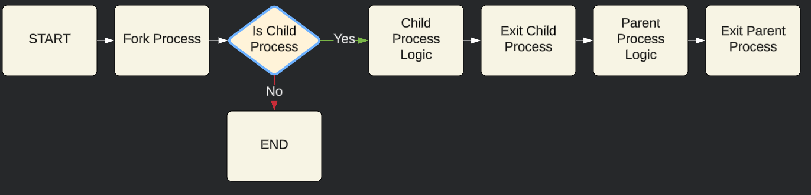

# Week 3

### Class: CST-321
### Professor: Dr. White
### Author: Phillip Ball

---

[Activity 3](#activity-3)

[Deadlock Avoidance](#deadlock-avoidance)

# Activity 3

## More Signals in Linux

**[More Signals in Linux Video](https://www.youtube.com/watch?v=hQpK7WevEDM)**

### Theory of Operation

>The program initializes a shared circular buffer using mmap() for inter-process communication between a parent producer and a child consumer. The parent process creates a message and sends each character, including a null character, to the shared buffer, signaling the child process with SIGUSR1 after placing each character. The child process sets up a signal handler to catch SIGUSR1 and processes the data from the buffer, printing each character and exiting upon receiving the null character. The synchronization is achieved through the use of signals and the circular buffer, ensuring the child only reads when notified by the parent, maintaining a proper producer-consumer relationship.

## More Signals and Mutexes in Linux

**[More Signals and Mutexes in Linux Video](https://www.youtube.com/watch?v=KNR4RVKvBMM)**

### Theory of Operation

>The program uses mutexes to ensure that only one thread can access the shared counter variable at a time. When the counter_thread increments the counter, it locks the mutex to prevent other threads, like the monitor_thread, from accessing the counter simultaneously. This prevents race conditions where multiple threads might try to modify the counter variable concurrently, leading to unpredictable behavior. The monitor_thread uses the mutex to safely read the counter variable, ensuring that it does not read a partially modified value. By using mutexes, the program guarantees that the counter variable is accessed and modified atomically, maintaining data integrity and preventing conflicts between threads.

## More Signals and Semaphores in Linux

**[More Signals and Semaphores in Linux Video](https://www.youtube.com/watch?v=BhW73M6Zylg)**

### Theory of Operation

>The child process locks the semaphore, simulating a long-running or stuck process by holding the lock for 60 seconds before releasing it. Meanwhile, the parent process starts a thread that waits for 10 seconds and then attempts to acquire the semaphore using sem_trywait(). If the parent process successfully acquires the semaphore, it means the child process is not stuck and has released the semaphore. However, if the parent process is unable to acquire the semaphore within the 10-second window, it concludes that the child process is stuck and terminates it using kill(pid, SIGKILL). This ensures that the program behaves properly by allowing the parent process to detect and handle a stuck child process.

# Deadlock Avoidance

[Back to Top](#week-3)

[Deadlock Avoidance Video Link](https://www.youtube.com/watch?v=R1k9U1i9Jp0)

## Flowchart



## Description

>In this program, each process (parent and child) tries to access the resource. If the resource is not available, the process waits for it to become available. If the process is starved (the resource does not become available within MAX_WAIT_TIME seconds), the timer signal handler is called, and the process is terminated.

## Code

````
#include <stdio.h>
#include <stdlib.h>
#include <unistd.h>
#include <signal.h>
#include <sys/types.h>
#include <sys/wait.h>

#define MAX_WAIT_TIME 5 // Maximum wait time in seconds

int resource_available = 1; // 1 if resource is available, 0 if not

void timer_handler(int signal) {
    // Handle timer signal
    fprintf(stderr, "Process %d is starved. Terminating...\n", getpid());
    exit(1);
}

int main() {
    signal(SIGALRM, timer_handler); // Register the timer handler function

    int pid = fork(); // Create a child process
    if (pid == 0) {
        // Child process
        fprintf(stderr, "Child process %d trying to access resource.\n", getpid());
        alarm(MAX_WAIT_TIME); // Set the timer
        while (!resource_available) {
            // Wait for resource to become available
        }
        // Resource is available
        fprintf(stderr, "Child process %d successfully accessed resource.\n", getpid());
    } else {
        // Parent process
        fprintf(stderr, "Parent process %d trying to access resource.\n", getpid());
        alarm(MAX_WAIT_TIME); // Set the timer
        while (!resource_available) {
            // Wait for resource to become available
        }
        // Resource is available
        fprintf(stderr, "Parent process %d successfully accessed resource.\n", getpid());
    }

    return 0;
}

````

