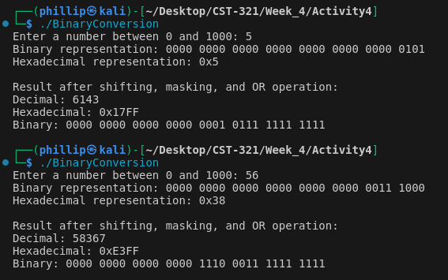
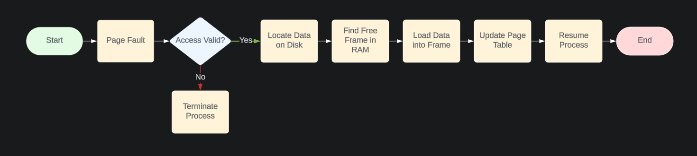
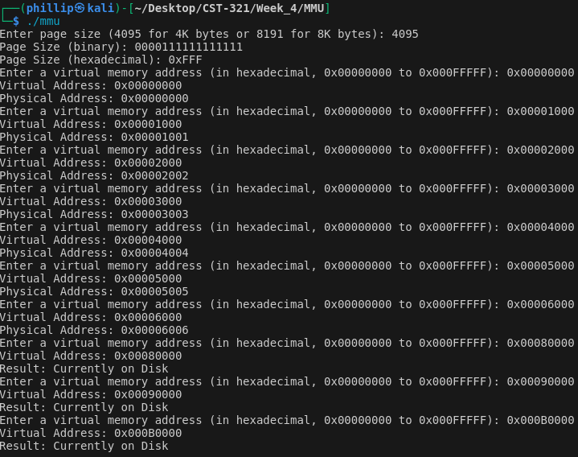

# Week 4

### Class: CST-321
### Professor: Dr. White
### Author: Phillip Ball

---

[Activity 4](#activity-4)

[Memory Management](#memory-management)


# Activity 4

### Output



### Code

````
#include <stdio.h>
#include <stdint.h>

// Function to convert a number to binary and print it
void printBinary(uint32_t num) {
    for (int i = 31; i >= 0; i--) {
        printf("%u", (num >> i) & 1);
        if (i % 4 == 0) printf(" ");
    }
    printf("\n");
}

int main() {
    uint32_t number;
    printf("Enter a number between 0 and 1000: ");
    scanf("%u", &number);

    if (number > 1000) {
        printf("Number is out of range. Please enter a number between 0 and 1000.\n");
        return 1;
    }

    // Convert to binary and print
    printf("Binary representation: ");
    printBinary(number);

    // Convert to hexadecimal and print
    printf("Hexadecimal representation: 0x%X\n", number);

    // Shift left by 10 bits
    uint32_t shifted = number << 10;

    // Mask out lower 10 bits and logically OR with 0x3FF
    uint32_t result = (shifted & ~0x3FF) | 0x3FF;

    // Print result in decimal, hexadecimal, and binary
    printf("Result after shifting, masking, and OR operation:\n");
    printf("Decimal: %u\n", result);
    printf("Hexadecimal: 0x%X\n", result);
    printf("Binary: ");
    printBinary(result);

    return 0;
}

````

### Theory of Operation

>User Input: The program prompts the user to enter a number between 0 and 1000 using the printf() function. The scanf() function captures the user's input and stores it in the number variable. If the number is out of the specified range, the program prints an error message and exits.

>Binary Conversion: The program uses the printBinary() function to convert the input number to binary. The function iterates over each bit from the most significant bit (31) to the least significant bit (0), checking if each bit is set and printing accordingly.

>Hexadecimal Conversion: The program converts the number to hexadecimal using the %X format specifier in printf() and prints the result.

>Bitwise Operations: The program shifts the input number left by 10 bits (number << 10). It then masks out the lower 10 bits using the bitwise AND operator with the 0x3FF. The program ORs the result with 0x3FF to set the lower 10 bits. The final result is printed in decimal, hexadecimal, and binary formats.


# Memory Management

[MMU Research](#mmu-research) | [Flowchart](#flowchart) | [Separation Policy](#separation-policy)

[Back to Top](#week-4)

---
## MMU Research

[Back to Memory Management](#memory-management)

**Memory Management Unit**
>An important hardware component that turns virtual addresses into physical addresses. This process is used for virtual memory, which allows an operating system to use more memory than is available and makes sure that each process operates in its own address space.

**MMU Functionality**
>The MMU turns virtual addresses to physical addresses using page tables. When the CPU creates a virtual address, the MMU looks this address up in the page table to find a correlated physical address. Each entry in the page table maps a virtual page to a physical frame. If the address is not present in the page table, the operating system loads the required page into physical memory.

**MMU in Operating Systems**
>The MMU enables efficient memory management by providing each process with its own virtual address space, ensuring isolation and protection between processes. The operating system manages the page tables, updates them, and handles page faults, ensuring that memory is allocated and deallocated as needed.

**Pseudo Code**

````
function translateVirtualToPhysical(virtualAddress):
    pageNumber = extractPageNumber(virtualAddress)
    offset = extractOffset(virtualAddress)
    
    if pageTable[pageNumber] is valid:
        frameNumber = pageTable[pageNumber].frameNumber
        physicalAddress = concatenate(frameNumber, offset)
        return physicalAddress
    else:
        handlePageFault(virtualAddress)

function extractPageNumber(virtualAddress):
    return virtualAddress >> OFFSET_BITS

function extractOffset(virtualAddress):
    return virtualAddress & OFFSET_MASK

function handlePageFault(virtualAddress):
    # Load the required page into memory
    loadPageIntoMemory(virtualAddress)
    updatePageTable(virtualAddress)

````

>This pseudo code demonstrates how the MMU could turn virtual addresses to physical addresses. The translateVirtualToPhysical function takes the page number and offset from the virtual address, checks the page table for a valid entry, and constructs the physical address if found. If not found, it calls handlePageFault to manage the missing page, making sure memory management is efficient and protected.
---
## Flowchart

[Back to Memory Management](#memory-management)



**Summary**

>Page fault handling allows an operating system to extend the memory available to processes beyond the physical memory installed. The operating system maximizes memory usage and ensures that processes can run seamlessly even when the required memory exceeds the available physical resources by loading only necessary data into physical memory and handling page faults as they happen. This is achieved through steps that include validating the memory access, loading the required data from disk, and updating the memory mappings, allowing for smooth execution.

---
## Separation Policy

[Back to Memory Management](#memory-management)

**MMU**

>The MMU is used for the low-level task of translating virtual addresses to physical addresses. It uses page tables to map these addresses and performs the actual address translation. The MMU handles address validation and protection checks, triggering page faults when necessary.

**Page Fault Handler**

>The page fault handler is a part of the operating system that activates when the MMU encounters a page fault. Its role is to figure out the cause of the fault and respond, such as loading the required page from disk into physical memory.

**External Pager**

>The external pager defines the rules for memory management, such as page replacement algorithms, when to swap pages in and out of memory, and how to allocate memory to processes. The pager decides which pages should be kept in memory and which should be swapped out based on the system's current state.

**Cooperation**

>MMU: Performs the address translation and triggers page faults but does not decide how memory is managed.

>Page Fault Handler: Responds to faults by invoking the external pager's rules without having rule decisions itself.

>External Pager: Implements the rules that determine how memory is managed, such as which pages to swap in or out, based on criteria like least recently used (LRU) or other algorithms.

## Program

[Back to Memory Management](#memory-management)

[Screencast Link](https://www.youtube.com/watch?v=FxZqd8Fyy_s)

**Program running**



**Code**

````
#include <stdio.h>
#include <stdlib.h>

// Define constants for the memory sizes
#define ONE_MEGABYTE 0x100000
#define PHYSICAL_MEMORY_SIZE 0x80000 // 512 KB

// Function to display an integer as a 16-bit binary number
void displayBinary(int num) {
    for (int i = 15; i >= 0; i--) {
        printf("%d", (num >> i) & 1);
    }
    printf("\n");
}

int main() {
    int pageSize;
    unsigned int pageTable[256]; // Simplified page table
    char hexInput[9];
    unsigned int virtualAddr;
    unsigned int physicalAddr;
    unsigned int pageNumber;
    unsigned int offset;
    unsigned int numPages;
    unsigned int physicalBaseAddr = 0;

    // Prompt the user for page size
    printf("Enter page size (4095 for 4K bytes or 8191 for 8K bytes): ");
    scanf("%d", &pageSize);

    if (pageSize != 4095 && pageSize != 8191) {
        printf("Invalid page size.\n");
        return 1;
    }

    // Display the page size in binary and hexadecimal
    printf("Page Size (binary): ");
    displayBinary(pageSize);
    printf("Page Size (hexadecimal): 0x%X\n", pageSize);

    // Populate the page table
    numPages = ONE_MEGABYTE / pageSize;
    for (unsigned int i = 0; i < numPages; i++) {
        if (physicalBaseAddr < PHYSICAL_MEMORY_SIZE) {
            pageTable[i] = physicalBaseAddr;
            physicalBaseAddr += pageSize;
        } else {
            pageTable[i] = 0xFFFFFFFF; // Indicates page is on disk
        }
    }

    // Prompt the user for virtual addresses and convert them to physical addresses
    for (int i = 0; i < 10; i++) {
        printf("Enter a virtual memory address (in hexadecimal, 0x00000000 to 0x000FFFFF): ");
        scanf("%s", hexInput);
        virtualAddr = (unsigned int)strtol(hexInput, NULL, 16);

        if (virtualAddr > 0x000FFFFF) {
            printf("Invalid virtual memory address.\n");
            continue;
        }

        printf("Virtual Address: 0x%08X\n", virtualAddr);
        pageNumber = virtualAddr / pageSize;
        offset = virtualAddr % pageSize;

        if (pageTable[pageNumber] == 0xFFFFFFFF) {
            printf("Result: Currently on Disk\n");
        } else {
            physicalAddr = pageTable[pageNumber] + offset;
            printf("Physical Address: 0x%08X\n", physicalAddr);
        }
    }

    return 0;
}

````