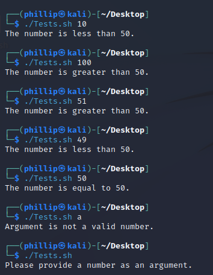
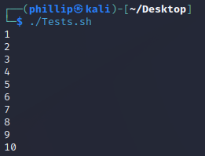
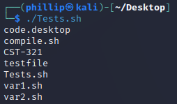
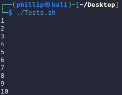
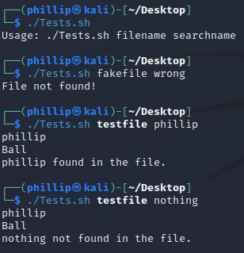
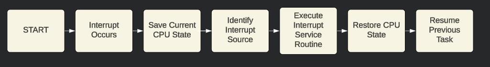
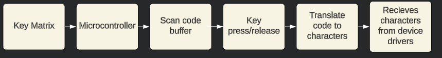
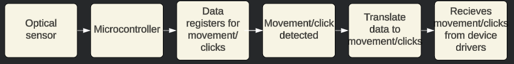

# Week 5

### Class: CST-321
### Professor: Dr. White
### Author: Phillip Ball

---

[Activity 5](#activity-5)

[Input/Output Research](#inputoutput-research)

# Activity 5

[Bash Shell Scripting](#bash-shell-scripting)

## Research Questions

**What are these bridges and what functions do they perform?**

Bridges, in computer architecture, enable communication through subsystems by connecting different parts of the computer system. There are 2 primary types, Northbridge and Southbridge. 

Northbridge connects the CPU to components such as RAM and the graphics card (GPU), crucial for running tasks requiring high speed data transfers, such as gaming or heavy computational work. 

Southbridge manages the I/O functions and the slower components inside of the computer, including storage, USB ports, audio hardware, and more. Its also responsible for connecting peripherals to the CPU, ensuring data is properly routed between them. 

**Why are there two bridges?**

The division into two bridges helps to balance the workload and improve the efficiency of the computer system. This separation allows the Northbridge to focus on high-speed, high-priority tasks, ensuring that the CPU can access critical data and components without delay. Meanwhile, the Southbridge can handle lower-speed peripheral communication without dragging down the system's performance. This division is important for keeping system stability and performance, as it prevents bottlenecks that could occur if a single bridge were responsible for all data traffic.

**What I/O devices are handled in each bridge?**

Northbridge:
- Main memory (RAM)
- Graphics card (GPU)
- High-speed expansion slots (e.g., PCI Express)

Southbridge:
- Hard disk drives (HDDs) and solid-state drives (SSDs)
- USB ports and devices
- Audio hardware
- Network interfaces (Ethernet ports)
- Other peripheral interfaces (e.g., SATA ports, legacy ports like PS/2)

**Where do components like a DMA controller fit into the bridges?**

The DMA controller is integrated into the Southbridge. It allows certain hardware subsystems to access the main system memory independently of the CPU, allowing high-speed data transfers between memory and devices like disk drives and network interfaces. By taking these tasks from the CPU, the DMA controller helps improve overall system performance and efficiency.

**How are devices like a keyboard, mouse, network, and hard disk handled?**

Keyboard and Mouse: These devices are typically connected through USB ports, which are managed by the Southbridge. The Southbridge processes inputs from these devices and communicates the data to the CPU and the operating system for appropriate handling and response.

Network: Network interfaces are also managed by the Southbridge. The Southbridge handles the data packets received and sent over the network, working with the network interface card to ensure data integrity and proper routing.

Hard Disk: Storage devices like hard disk drives are connected via SATA ports, which are managed by the Southbridge. The Southbridge facilitates data transfer between these storage devices and the main memory, allowing the CPU to access stored data as needed.

## Bash Shell Scripting

| [1](#1) |-| [2](#2) |-| [3](#3) |-| [4](#4) |-| [5](#5) |

[Back to Top](#week-5)

## 1

**Write a script that takes a single argument and uses if conditional logic to determine and print if the number is less than 50, equal to 50, or greater than 50**

### Screenshot



### Theory of Operation

- The script starts by checking if an argument is provided. If not, it exits with a message.
- It then checks if the argument is a valid number using a regular expression.
- The number is compared to 50 using if, elif, and else conditions.
- Based on the comparison, it prints whether the number is less than, equal to, or greater than 50.

### Code

````
#!/bin/bash

# Check if an argument is provided
if [ -z "$1" ]; then
  echo "Please provide a number as an argument."
  exit 1
fi

# Check if the argument is a number
if ! [[ "$1" =~ ^-?[0-9]+$ ]]; then
  echo "Argument is not a valid number."
  exit 1
fi

number=$1

if [ $number -lt 50 ]; then
  echo "The number is less than 50."
elif [ $number -eq 50 ]; then
  echo "The number is equal to 50."
else
  echo "The number is greater than 50."
fi
````

## 2

[Back to Assignment](#bash-shell-scripting)

**Write a script that uses a for loop to display numbers 1 thru 10**

### Screenshot



### Theory of Operation

- The for loop iterates over a sequence of numbers from 1 to 10.
- In each iteration, the current number is printed using echo.

### Code

````
#!/bin/bash

for i in {1..10}
do
  echo $i
done
````

## 3

[Back to Assignment](#bash-shell-scripting)

**Write a script that uses a for loop to print all the files from the ls list command**

### Screenshot



### Theory of Operation
- The script uses ls to list files and directories in the current directory.
- A for loop iterates over each item returned by ls.
- Each item is printed using echo.

### Code

````
#!/bin/bash

for file in $(ls)
do
  echo $file
done
````

## 4

[Back to Assignment](#bash-shell-scripting)

**Write a script that uses a while loop to display numbers 1 thru 10**

### Screenshot



### Theory of Operation
- The script initializes a counter variable i to 1.
- The while loop continues to execute as long as i is less than or equal to 10.
- In each iteration, the current value of i is printed and then incremented by 1.

### Code

````
#!/bin/bash

i=1
while [ $i -le 10 ]
do
  echo $i
  i=$((i + 1))
done
````

## 5

[Back to Assignment](#bash-shell-scripting)

**Write a script that uses a for loop to print all sorted names from a text file and searches for a desired name using an in condition**

### Screenshot



### Theory of Operation
- The script checks if both a filename and a search name are provided as arguments.
- It checks if the provided file exists.
- The names in the file are sorted using the sort command.
- A for loop iterates over the sorted names, printing each one.
- The script uses grep to search for the desired name in the sorted list and prints whether the name is found or not.

### Code

````
#!/bin/bash

# Check if a file and a search name are provided
if [ -z "$1" ] || [ -z "$2" ]; then
  echo "Usage: $0 filename searchname"
  exit 1
fi

filename=$1
searchname=$2

# Check if the file exists
if [ ! -f "$filename" ]; then
  echo "File not found!"
  exit 1
fi

# Sort the names and print them
sorted_names=$(sort $filename)
for name in $sorted_names
do
  echo $name
done

# Search for the desired name
if echo "$sorted_names" | grep -wq "$searchname"; then
  echo "$searchname found in the file."
else
  echo "$searchname not found in the file."
fi
````

# Input/Output Research 

[Flowchart](#flowchart) | [Keyboard/Mouse](#keyboardmouse)

[Back to Top](#week-5)

## 4 Layer Research

**User-Level I/O Software**

User-level I/O software encompasses application programs and system utilities that facilitate user interactions for performing I/O operations. This layer simplifies user engagement with the computer system through various programs utilizing I/O functionalities.

The main function of this layer is to provide a user-friendly interface for requesting I/O operations. It abstracts hardware complexities and lower-level operations, enabling users to easily perform tasks like file reading or writing, sending network packets, or displaying information.

In the Linux environment, typical examples of user-level I/O software include text editors, web browsers, and command-line utilities. These applications employ system calls such as read(), write(), and ioctl() to interact with the I/O system.

**Device-Independent I/O Software**

This layer offers a uniform interface for performing I/O operations regardless of the specific hardware devices used. It handles common functionalities required by all devices, ensuring consistency and standardization.

The goal of device-independent I/O software is to provide a standardized set of operations applicable across various devices. This standardization allows higher-level software to interact with different hardware without needing detailed knowledge of each device, simplifying the development process.

In Linux, the Virtual File System (VFS) is a crucial component of this layer. VFS provides a common file system interface, allowing different file systems to be accessed uniformly. This abstraction enables applications to perform standard file operations without concern for the underlying file system.

**Device Drivers**

Device drivers are tailored to specific hardware devices, acting as intermediaries between the operating system and the hardware. They translate generic I/O commands into device-specific operations.

The purpose of device drivers is to manage communication between the operating system and hardware devices. They handle data transfer, control commands, and error management, enabling the operating system to support a broad range of devices without incorporating hardware-specific code.

In Linux, device drivers are often implemented as kernel modules. Examples include snd_hda_intel for audio hardware and e1000 for Intel Ethernet adapters. These drivers load into the kernel to manage their respective hardware, facilitating effective communication and control by the operating system.

**Interrupt Handlers and Hardware Interfaces**

This layer manages hardware interrupts and direct hardware communication. Interrupt handlers are routines responding to hardware signals, ensuring prompt CPU responses to hardware events.

The primary role of this layer is to handle hardware interrupts, allowing immediate responses to hardware events. This ensures the CPU can quickly manage urgent tasks like keyboard or mouse input, network packet arrivals, or disk I/O completion, maintaining system responsiveness and efficiency.

In Linux, interrupt handlers are defined in the kernel and associated with specific hardware interrupts. For instance, network card drivers have interrupt handlers for processing incoming packets. Upon receiving an interrupt signal, the CPU pauses its current activity to execute the interrupt handler, processes the event, and then resumes the previous activity.

## Flowchart

[Back to Assignment](#inputoutput-research)



**Summary of Interrupt Handling Process**

Handling a hardware interrupt involves several critical steps to ensure the system responds promptly while maintaining overall stability. When an interrupt occurs, the CPU pauses its current operations and saves the current state to preserve context. The system then identifies the source of the interrupt to determine the appropriate response.

Next, the Interrupt Service Routine (ISR) is executed. This routine is a specific set of instructions designed to handle the particular interrupt, whether it's processing data from a device or acknowledging an event. Once the ISR is complete, the system restores the CPU's previous state, allowing it to continue with the task it was performing before the interrupt.

Finally, the CPU resumes its prior activity, ensuring minimal disruption to ongoing processes. This structured approach to handling interrupts ensures that the system remains responsive and efficient, effectively managing hardware events without compromising performance.

## Keyboard/Mouse

[Back to Assignment](#inputoutput-research)

### Keyboard

The keyboard operates through an process involving several key components. When a key is pressed, it closes a circuit, generating a signal. There is a micro-controller that translates the signal into a scan code, which is then transmitted to the computer via a physical interface, usually USB.

Once the scan code reaches the device controller, it is placed into I/O registers. An interrupt signal is sent to the CPU, triggering the execution of the keyboard interrupt handler. This handler processes the scan code, often converting it into an ASCII code, and passes it on to the operating system.

Through its device drivers, the operating system interprets these codes and delivers them to the relevant application or system process. This entire sequence enables the keyboard to efficiently translate physical keystrokes into digital input that the computer can understand and act upon.



### Mouse

The mouse functions through the coordinated efforts of sensors, micro-controllers, and software. When the mouse is moved, its optical or laser sensor detects movement by tracking changes in light patterns on the underlying surface. This movement data is converted into signals by the mouse’s micro-controller and sent to the computer via a USB or wireless interface.

Upon receiving these signals, the device controller places the movement data and button states into I/O registers. An interrupt signal is then sent to the CPU, prompting the execution of the mouse interrupt handler. This handler processes the movement data and button actions, translating them into cursor movements and clicks.

The operating system, utilizing its device drivers, manages these inputs to ensure the cursor moves appropriately on the screen and that clicks perform the desired actions within applications. This interplay between hardware and software components ensures the mouse functions seamlessly within the I/O system.

