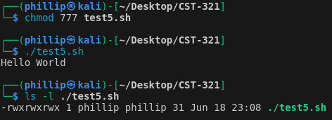

# Week 6

### Class: CST-321
### Professor: Dr. White
### Author: Phillip Ball

---

[File System](#file-system)

# Activity 6

1. [Simple File System Navigation](#simple-file-system-navigation) 
2. [Simple File Manipulation](#simple-file-manipulation)
3. [Simple Text File Viewing](#simple-text-file-viewing)
4. [Misc. Commands](#misc-commands)
5. [Permissions](#permissions)
6. [Redirection](#redirection)
7. [Head and Tail Files](#head-and-tail-files)
8. [Working with the Disk Utilities](#working-with-the-disk-utilities)

## Simple File System Navigation

[Back to Assignment](#activity-6)

**Screenshot**


**Code**

````
#!/bin/bash

# i. Echo your current directory to the screen.
echo "Current Directory:"
pwd

# ii. Change directory to your home directory.
cd ~
echo "Changed to Home Directory:"
pwd

# iii. Change directory to a child directory within your home directory.
CHILD_DIR="Desktop"
cd "$CHILD_DIR"
echo "Changed to Child Directory ($CHILD_DIR):"
pwd

# iv. List all of the files that end with .c within the child directory.
echo "Listing .c files in $CHILD_DIR:"
ls *.c

# v. Navigate back to your home directory.
cd ~
echo "Navigated back to Home Directory:"
pwd
````

**Theory of Operation**

This Bash script showcases fundamental file system operations in a Linux setting. It starts by displaying the current directory with the pwd command. Next, it switches to the user's home directory using cd ~, confirming the change by printing the new directory path. The script then moves into a specified subdirectory within the home directory (replace child_directory_name with the actual directory name) and lists all .c files in this directory using ls *.c. Finally, it navigates back to the home directory and prints the directory path again to verify the navigation. Each step is echoed to the screen for clarity.

## Simple File Manipulation

[Back to Assignment](#activity-6)

**Screenshots**


**Code**

````
#!/bin/bash

# Change directory to home directory
cd ~

# Create a child directory called MyCode
mkdir MyCode

# Change to the MyCode directory
cd MyCode

# Copy all .c files developed in the CST-321 directory
cp ~/Desktop/CST-321/*.c .

# Navigate up a directory
cd ..

# Create a new child directory called MyCode2
mkdir MyCode2

# Copy all files from the MyCode directory to the MyCode2 directory
cp MyCode/* MyCode2/

# Rename the MyCode directory to deadcode
mv MyCode deadcode

# Remove the deadcode directory and all its files
rm -rf deadcode

````

**Theory of Operation**

This script begins by navigating to the home directory using cd ~. It then creates a new directory named MyCode with the mkdir MyCode command and enters this directory using cd MyCode. Next, it copies all .c files from the specified course directory to MyCode using cp ~/Desktop/CST-321/*.c.
After this, the script moves up one directory level with cd .., creates another directory called MyCode2 (mkdir MyCode2), and copies all files from MyCode to MyCode2 using cp MyCode/ * MyCode2/.
The script then renames MyCode to deadcode with mv MyCode deadcode and finally removes the deadcode directory and its contents using rm -rf deadcode.

## Simple Text File Viewing

[Back to Assignment](#activity-6)

**Screenshots**


**less -N**


**less -p "bank"**


**less -G**


**more -d**


**more --lines n**


**more -s**


**file ~/\***


**file /bin/\***


**file /home/phillip/Desktop/CST-321/\***


**1. ls**

**2. ls -a**

**3. ls -l**


**Theory of Operation**

When dealing with directories full of .c files, commands like ls, less, more, and file can boost file management and navigation. The ls command lists directory contents, with options like -a to include hidden files and -l for detailed file information. The less command allows for paginated viewing of file contents, where options such as -N add line numbers, and -p searches for patterns. Similarly, more provides simple paginated viewing, useful for quick, straightforward browsing. The file command identifies the type of each file, offering insights into their format and content, which is particularly handy when working with various file types within a directory. These commands collectively improve efficiency and clarity when handling multiple code files

## Misc. Commands

[Back to Assignment](#activity-6)

**Screenshot**


**Code**

````
#!/bin/bash
# Variable to save your name
name="Phillip"

# Variable that stores your age
age=22

# Echo both variables to the screen
echo "Name: $name"
echo "Age: $age"
````

**Theory of Operation**

The script ./test3.sh starts with a #!/bin/bash, indicating that it should be executed using the Bash shell. The name variable is set to a string representing the user's name, and the age variable is set to a numerical value representing the user's age. The echo commands print the values of these variables to the terminal. Before running the script, chmod 777 ./test3.sh is executed to make the script executable by all users. Running ./test3.sh then displays the name and age on the screen

**Screenshot**


**Code**

````
#!/bin/bash
# Sets the IFS variable to a value of '-'
IFS='-'

# Echo various parameter values
echo "File Name: $0"
echo "First Parameter: $1"
echo "Second Parameter: $2"
echo "Quoted Values: $@"
echo "Quoted Values: $*"
echo "Total Number of Parameters: $#"
````

**Theory of Operation**

The script ./test4.sh starts with #!/bin/bash for Bash execution. The IFS (Internal Field Separator) variable is set to -, changing how Bash recognizes word boundaries. The echo commands then display various pieces of information: 0 prints the script's name, 1 and 2 print the first and second arguments respectively, @ and * print all arguments in different ways, and # prints the total number of arguments. Executing chmod 777 ./test4.sh makes the script executable, and running ./test4.sh arg1 arg2 displays the parameters and their details.


**Theory of Operation for which gcc and man gcc**

The which gcc command searches the directories listed in the PATH environment variable for an executable named gcc and returns its path. This confirms whether gcc is installed and where it resides. The man gcc command accesses the system's manual pages, specifically for gcc, offering comprehensive documentation on the command's usage, options, and examples. This aids users in understanding and effectively using the GNU Compiler Collection.

## Permissions

[Back to Assignment](#activity-6)

**Screenshots**

**Who is the owner of this file?**


**Can you execute this script?**


**Theory of Operation**

The script ./test5.sh contains #!/bin/bash to indicate it should be executed with the Bash shell. The echo "Hello World" command prints "Hello World" to the terminal. Running ls -l on the script shows its permissions, owner, and group. Without execute permissions, the script cannot be run directly. The lack of x in the permission string (-rw-r--r--) prevents execution.

**Modify File Permissions to Execute the Script**



**Theory of Operation**

The chmod 777 ./test5.sh command adds execute permissions to the script, allowing it to be run directly. The ls -l command confirms this change by displaying the new permissions string (-rwxr-xr-x), where x indicates execute permissions. Now, running ./test5.sh will execute the script, printing "Hello World" to the terminal.

## Redirection

[Back to Assignment](#activity-6)

**Screenshot**

**Run the sort < names.txt command**


**Run the ls –l | less command**


**Explore one other command we have used that you could pipe into less** 

**cat myfiles.txt | less**


**Theory of Operation**

The command "ls -l > myfiles.txt" lists the files in the current directory and redirects the output to a file named myfiles.txt. Opening myfiles.txt with a text editor allows you to inspect this detailed listing.

The sort < names.txt command reads the contents of names.txt, sorts the names alphabetically, and outputs the sorted list to the terminal. Piping the ls -l output into less with ls -l | less provides a convenient way to scroll through the detailed file listing one screen at a time. Similarly, cat myfiles.txt | less allows for paginated viewing of the myfiles.txt contents, useful for large files. These commands and their combinations enhance the efficiency of file management and content inspection in a Unix-like environment.

## Head and Tail Files

[Back to Assignment](#activity-6)

**Screenshot**


**Theory of Operation**

The head command displays the first 10 lines of the specified file, in this case, syslog, allowing you to see the earliest log entries currently in the file. Conversely, the tail command shows the last 10 lines of the file, providing a view of the most recent log entries. Using sudo grants elevated privileges necessary to read protected files like system logs, ensuring you have the required permissions to execute these commands.

### From the Ubuntu Desktop, search for the Logs application. Run the application

**Screenshot**


## Working with the Disk Utilities

[Back to Assignment](#activity-6)

**I couldn't find a reasonable 'Disk Usage Analyzer' other than just using the df command on the terminal. As I am using Kali Linux and not Ubuntu, I will just take the hit on this one. The only deliverable for this section is:**

*Take a screenshot of Disk Usage Analyzer application*

**... and this is an application I do not have access to.**

# File System

[Back to Top](#week-6)

| [Top-Level Directories](#top-level-directories) | [Flowchart](#flowchart) |

## Linux File System

|Directory|Purpose|
|--|--|
|/| Top-level directory in the hierarchy, serving as the starting point from which all other directories branch out|
|/bin| Contains essential binary executables that are necessary for the system to boot and run in single-user mode. These include fundamental commands like ls, cp, and mkdir|
|/dev| Contains device files, which represent hardware devices and drivers. These files allow software to interact with hardware devices, such as hard drives, terminals, and printers|
|/etc| Holds system-wide configuration files and shell scripts that are used for managing system settings and services|
|/lib| Contains shared library files and kernel modules needed by the binaries in /bin and /sbin. These libraries provide essential functions for system commands and utilities|
|/boot| Contains the files needed to boot the system, including the Linux kernel, initial RAM disk image (initrd), and bootloader configuration files like grub|
|/home| Holds the personal directories for all users on the system. Each user has a subdirectory in /home where they can store personal files, settings, and documents|
|/mnt|Used as a mount point for temporarily mounting filesystems, such as external drives or network shares, during system maintenance or recovery|
|/proc|Virtual filesystem that provides an interface to kernel data structures. It contains files and directories that represent the current state of the system|
|/tmp|Used to store temporary files created by applications and the system. These files are typically deleted upon system reboot or after a certain period|
|/usr|Contains user-related programs and data that are not essential for the system to run in single-user mode, including subdirectories for executable binaries, libraries, and documentation|
|/var|Holds variable data that changes frequently during system operation. This includes log files (/var/log), mail and printer spool files, and transient files used by various applications|
|/sbin|Contains system binaries that are essential for system administration tasks. These commands are typically used by the root user for system maintenance and repair, such as fsck, reboot, and ifconfig|

## Top-Level Directories

[Back to Assignment](#file-system)

|Directory|Purpose|
|--|--|
|Desktop|Contains files and shortcuts that appear on the user's desktop. It provides a convenient place to store and access frequently used files, folders, and application shortcuts|
|Documents|Intended for storing personal documents such as text files, PDFs, spreadsheets, and other work-related files. It helps users organize their important documents in a centralized location|
|Downloads|The default location where files downloaded from the internet are stored. It includes files from web browsers, email attachments, and other download sources, making it easy to manage and access recently downloaded files|
|Music|Used for storing audio files, such as MP3s, WAVs, and other music formats. Music players and media applications often use this directory to locate and organize the user's music collection|
|Pictures|Designated for storing image files, including photos, screenshots, and graphics. It helps users keep their image files organized and accessible for viewing and editing|
|Videos|Intended for storing video files, such as movies, TV shows, and personal video recordings. Media players and video editing applications typically use this directory to locate and manage video content|
|Public|A special folder that can be used to share files with other users on the same system or network. Files placed in this directory are accessible by other users, making it useful for collaborative work or file sharing|
|Templates|Used for storing file templates, which can be used to create new files with predefined content or formatting. Applications may use this directory to provide users with starting points for creating new documents, spreadsheets, or other file types|
|.config|Contains user-specific configuration files and settings for various applications. These files typically control application behavior, appearance, and preferences, allowing users to customize their software environment|
|.local|Holds user-specific data and application files that are not intended to be shared with other users. This includes application cache files, user-specific binary files, and other data necessary for the operation of installed software|

## Flowchart

[Back to Assignment](#file-system)


