# Week 7

### Class: CST-321
### Professor: Dr. White
### Author: Phillip Ball

---
**[Activity 7](#activity-7) | [Security](#security) | [User Interface & Security](#user-interface-and-security)**
<br>


# Activity 7

**[Back to Top](#week-7)**

1. [Applying Basic Security](#applying-basic-security)
2. [Working with OpenSSL](#working-with-openssl)
3. [Working with Network Utilities](#working-with-network-utilities)
4. [Ethical Hacking](#ethical-hacking)

# Applying Basic Security

**[Back to Assignment](#activity-7)**

### Screenshots

**Create a new User with a password of your choosing in the default Group**

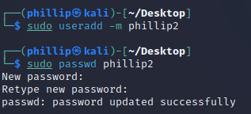

**Validate the new User's home directory. Validate the new User's groups (use the groups command)**

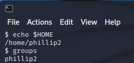

**Add the new User to a Group 'TestMe' and validate**

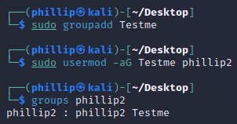

**Delete the new User and validate**

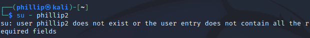

**Delete the new User's home directory and validate**

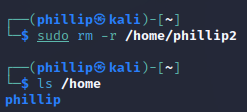

### Theory of Operation

The commands for creating, managing, and deleting a user on Kali Linux work based on how the Linux operating system manages user accounts and permissions. When creating a user (useradd), the system allocates a unique user ID (UID) and a home directory (-m option) where user-specific files are stored. Setting a password (passwd) encrypts and securely stores the password hash. Logging off and logging into the new user account validates its functionality, ensuring the user can access their designated home directory ($HOME). Adding the user to a group (usermod -aG) grants additional permissions and validates group membership (groups). Deleting the user (userdel) removes the user's entry from the system's user database, effectively disabling access, while deleting the home directory (rm -r) cleans up associated files. These operations are fundamental to Linux's user management system, ensuring security and proper access control throughout the system.

## Detect Login

### Screenshot

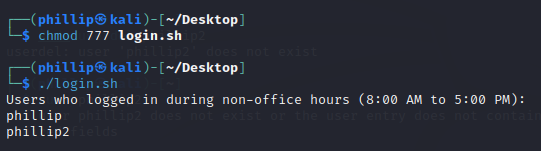

### Code

````
#!/bin/bash

# Start and end times in 24-hour format
start_time="08:00"
end_time="17:00"

# Get current date in YYYY-MM-DD format
current_date=$(date "+%Y-%m-%d")

# Retrieve user login times for the current day
last_logins=$(last | grep "$(date "+%a %b %e")")

# Filter and display users who logged in outside office hours
echo "Users who logged in during non-office hours:"
echo "$last_logins" | grep -v "\(LOGIN\|reboot\|shutdown\)" | \
awk -v st="$start_time" -v et="$end_time" '$NF !~ st && $NF !~ et {print $1}' | sort -u
````

## Hardening a Linux Server

### Areas and Services to Harden

1. Network services 
2. File system permissions
3. User authentication
4. Firewall Configuration
5. Logging and Monitoring

### Configuration Files to Harden

1. /etc/ssh/sshd_config
2. /etc/sysctl.conf
3. /etc/fstab
4. /etc/services

### Linux Commands for Hardening

1. chmod and chown
2. iptables
3. passwd
4. sshd_config
5. sysctl

### Tools for Hardening 

1. Security scanners like Nmap and OpenVAS for vulnerability assessment
2. Intrusion detection systems like Snort or Suricata
3. File integrity checkers like Tripwire or AIDE
4. Log analysis tools like ELK stack (Elasticsearch, Logstash, Kibana)

# Working with OpenSSL

**[Back to Assignment](#activity-7)**

**Check version, Create text file, Encrypt file**

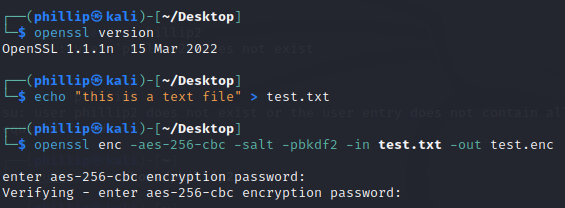

**Encrypt file using base 64 (-a)**

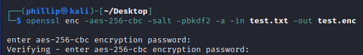

**Decrypt files**

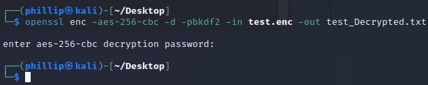

### Theory of Operation for File Encryption/Decryption

The OpenSSL commands used in this scenario illustrate fundamental cryptographic operations for securing data and managing passwords. First, checking the OpenSSL version ensures compatibility and security with encryption methods. Creating a text file and encrypting it with AES-256-CBC mode and a salt enhances data security by using a strong encryption algorithm and adding randomization. Optionally, using Base64 encoding alongside encryption facilitates compatibility in text-based systems. Decrypting files demonstrates the reverse process, ensuring data integrity and confidentiality. Creating a password with openssl passwd generates a hashed password suitable for secure authentication. These operations exemplify practical cryptography applications, safeguarding data confidentiality and authentication integrity in Linux environments.

**Create a Password**

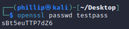

### Theory of Operation for Password Hashing

Password hashing with OpenSSL involves security practices to ensure the integrity of stored passwords. When generating a hashed password, OpenSSL applies a cryptographic hash function to the password. This process converts the password into a fixed-length string of characters that is impractical to reverse. To enhance security, OpenSSL incorporates salting, where a random value is added to each password before hashing. Salting prevents attackers from using tables for rapid password cracking. Additionally, OpenSSL supports various hashing algorithms such as MD5, SHA-256, and SHA-512, among others, allowing administrators to choose algorithms based on their security needs.

**Create a MD5 Hash on image**

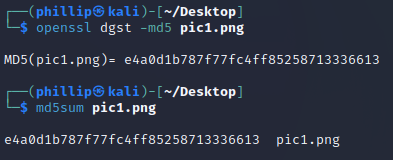

### What is Steganography

Steganography is the practice of concealing a file, message, image, or video within another file, message, image, or video to hide its existence.

### How to Prevent Steganography

An MD5 hash of an image file can be used to verify its integrity. If someone tries to embed data through steganography, the MD5 hash will change, indicating tampering or modifications. This hash comparison helps data integrity and security.

# Working with Network Utilities

**[Back to Assignment](#activity-7)**

**Install/hostname**

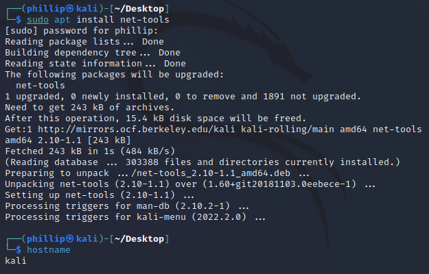

### Theory of Operation for Install

This command installs the netstat utility, which is essential for network monitoring and troubleshooting on Linux systems. netstat provides information about network connections, routing tables, interface statistics, masquerade connections, and multicast memberships.

### Theory of Operation for hostname

The hostname command retrieves the hostname of the local machine. The hostname is crucial for identifying the system within a network and is used in various network configurations and communications.

**ifconfig -a**

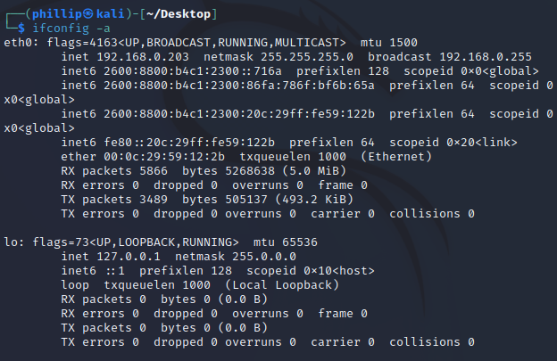

### Theory of Operation for ifconfig -a

ifconfig displays the configuration of all network interfaces, including IP addresses, MAC addresses, and network status. It helps administrators manage and troubleshoot network connectivity, configure interfaces, and diagnose network-related issues.

**netstat -a**

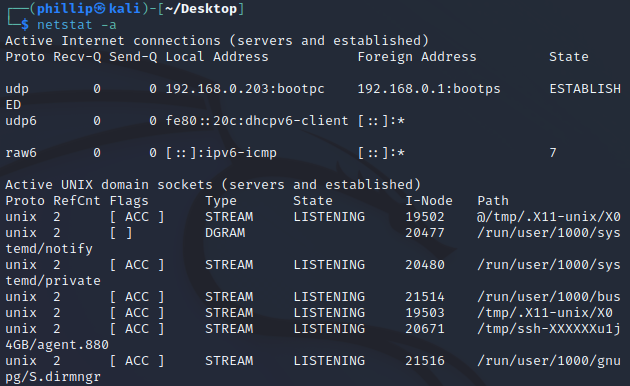

### Theory of Operation for netstat -a

netstat -a lists all active network connections and their corresponding listening ports. It provides information about established connections, listening ports, and the protocols (TCP, UDP) used. This helps administrators monitor network activity and identify any unauthorized or suspicious connections.

**netstat -at**

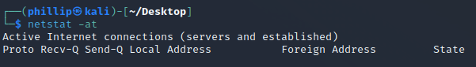

### Theory of Operation for netstat -at

netstat -at filters and displays only TCP connections. TCP (Transmission Control Protocol) is a connection-oriented protocol used for reliable data transmission across networks. This command helps focus on TCP connections specifically, useful for detailed network analysis and troubleshooting.

**netstat -tnl**

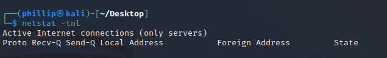

### Theory of Operation for netstat -tnl

netstat -tnl lists TCP connections that are in a listening state. Listening ports are crucial for servers waiting to accept incoming connections. Monitoring listening connections helps administrators ensure that only authorized services are accessible and detect any potential security vulnerabilities.

**sudo netstat -ltpe**

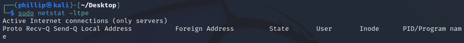

### Theory of Operation for sudo netstat -ltpe

netstat -ltpe provides detailed information about active connections, including the process name, process ID (PID), and user ID (UID) associated with each connection. This command is executed with elevated privileges (sudo) to view process details, helping administrators identify which applications or services are utilizing network resources.

**netstat -i**

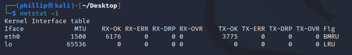

### Theory of Operation for sudo netstat -i

netstat -i displays a table of all network interfaces and their associated statistics, such as packets transmitted and received. This command is useful for monitoring interface performance and detecting network congestion or errors.

# Ethical Hacking

**[Back to Assignment](#activity-7)**

### Types of Hacking

Hacking encompasses various techniques and approaches aimed at exploiting vulnerabilities in computer systems or networks. Some common types include:

1. Phishing: Deceptive methods to obtain sensitive information.
2. Malware: Malicious software designed to disrupt or gain unauthorized access.
3. Denial-of-Service (DoS): Flooding a system to overwhelm and disrupt services.
4. SQL Injection: Exploiting vulnerabilities in web applications to manipulate databases.
5. Man-in-the-Middle (MitM): Intercepting and altering communication between parties.

### Tools Available

There is a wide range of tools used in hacking, categorized based on their function:

1. Network Scanning: Nmap, Netcat
2. Vulnerability Assessment: Nessus, OpenVAS
3. Password Cracking: John the Ripper, Hashcat
4. Packet Sniffing: Wireshark, Tcpdump
5. Exploitation: Metasploit, ExploitDB
6. Social Engineering: SET (Social-Engineer Toolkit)
7. Forensics: EnCase, Autopsy

### Different Attacks

Attacks are methods hackers use to exploit vulnerabilities. Some types include:

1. Brute Force Attack: Trying all possible combinations to crack passwords.
2. Phishing Attack: Deceiving users to disclose sensitive information.
3. DDoS Attack: Flooding a network with traffic to overwhelm it.
4. Spoofing: Pretending to be someone else to gain access.
5. Ransomware Attack: Encrypting data and demanding payment for decryption.
6. Cross-Site Scripting (XSS): Injecting malicious scripts into web pages.
7. Social Engineering: Manipulating individuals to divulge confidential information.

### Other Types of Tools

Depending on the specific job or task within cybersecurity or ethical hacking, additional tools may be necessary:

1. Intrusion Detection Systems (IDS/IPS): Snort, Suricata
2. Firewall Management: iptables, pfSense
3. Web Application Security: Burp Suite, OWASP ZAP
4. Endpoint Protection: McAfee, Symantec

### Additional Training

Continued learning and resources are crucial in the field of cybersecurity:

1. Certifications: CISSP, CEH (Certified Ethical Hacker), CompTIA Security+
2. Online Courses: Coursera, Udemy, edX
3. Books and Publications: Stay updated with industry trends and best practices.
4. Hands-on Practice: Capture The Flag (CTF) competitions, labs, and real-world scenarios.

</br>
</br>

# Security

**[Back to Top](#week-7)**

1. [Buffer Overflow](#buffer-overflow)
2. [Zero-Day Exploit](#zero-day-exploit)
3. [Kali Linux](#kali-linux)
4. [Password Strength](#password-strength)
5. [Manage Users](#manage-users)

## Buffer Overflow

**[Back to Assignment](#security)**

A buffer overflow occurs when a program writes more data to a buffer than it can hold. This overflow can overwrite adjacent memory, leading to unpredictable behavior, crashes, or security vulnerabilities. Common in languages like C, which do not automatically check bounds, buffer overflows can be exploited to execute arbitrary code.

 ### Diagram 

| |
|:----:|
|Stack|
|Return Address|
|Saved Frame Pointer|
|Local Variables|
|Buffer|
| |

### Issues

Buffer overflows can lead to serious problems like system crashes, data corruption, and significant security vulnerabilities. In C programs, unchecked buffer operations may overwrite critical memory, allowing attackers to execute arbitrary code. This could result in unauthorized system control, data theft, or further exploitation of vulnerabilities, making buffer overflows a critical issue to address in software development.


### Prevention

Modern operating systems implement these techniques to mitigate buffer overflow risks, enhancing system security and stability:
1. Bounds Checking: Ensures all buffer operations respect memory limits.
2. Safe Libraries: Uses libraries that perform automatic bounds checking.
3. Stack Canaries: Inserts guard values to detect stack corruption.
4. Address Space Layout Randomization (ASLR): Randomizes memory addresses to make exploits less predictable.
5. Data Execution Prevention (DEP): Marks certain memory regions as non-executable to block arbitrary code execution.

## Zero-Day Exploit

**[Back to Assignment](#security)**

A zero-day exploit involves exploiting a software vulnerability that the vendor is unaware of, lacking a patch. Attackers use these vulnerabilities to gain unauthorized access before countermeasures are developed, posing risks like data breaches and financial losses. These exploits are termed "zero-day" because they're executed when the vulnerability becomes public, offering no defense window. They're prized by cybercriminals for their effectiveness and brief risk window. Detecting and mitigating zero-day exploits requires swift response and proactive security measures to safeguard systems and users from potential harm.

### Ethical Issues

Understanding these ethical concerns guides individuals to use their technical knowledge responsibly in cybersecurity. It emphasizes protecting, not exploiting, vulnerabilities to uphold trust and justice in digital interactions. This approach benefits oneself by fostering moral integrity and safeguards others by promoting a secure digital environment. Applying this knowledge ethically means using technical skills to defend against such exploits, enhancing cybersecurity practices, and contributing positively to the broader community's safety and integrity.

## Kali Linux

**[Back to Assignment](#security)**

Kali Linux is a specialized operating system designed for training cybersecurity professionals, particularly in penetration testing and digital forensics. It comes equipped with a comprehensive suite of pre-installed tools tailored to evaluate and enhance the security of computer systems and networks. In training environments, Kali Linux serves as a practical platform where professionals engage in ethical hacking exercises, perform thorough security audits, and simulate diverse cyber attacks. This hands-on approach enables them to identify vulnerabilities, understand the capabilities of cybersecurity tools, and apply them ethically in real-world scenarios.

Through the use of Kali Linux, cybersecurity experts gain invaluable experience in mitigating risks and protecting digital assets. It prepares them to defend against sophisticated cyber threats, equipping them with the skills needed to maintain robust security measures within their organizations. Ultimately, Kali Linux plays a critical role in educating and preparing cybersecurity professionals by providing practical expertise to effectively manage and mitigate evolving cybersecurity challenges.

### Table

| Tool | Function | Use |
|:---|:----|----|
| **Nmap** | Network mapping and port scanning | Used to discover hosts and services on a computer network, aiding in vulnerability assessment and network auditing. | 
|**Metasploit Framework**| Penetration testing platform.|Provides tools for developing and executing exploit code against remote targets, helping professionals understand and simulate cyber attacks.|
|**Wireshark**|Network protocol analyzer.| Captures and displays packets in real-time, allowing analysis of network traffic to troubleshoot, analyze security vulnerabilities, and detect intrusions.|
|**Burp Suite**|Web application security testing tool.|Helps identify vulnerabilities in web applications through scanning, crawling, and penetration testing techniques.|
|**John the Ripper**|Password cracking tool.|Used to detect weak passwords and improve password security by testing password strength and cracking encrypted passwords.|
|**Aircrack-ng**|Wireless network security assessment tool.|Enables monitoring, attacking, testing, and cracking WiFi networks for security auditing and penetration testing purposes.|
|**Hydra**|Online password cracking tool.|Performs brute-force attacks against various network protocols, including FTP, SSH, Telnet, and more, to test password strength and security configurations.|
|**Gobuster**| Directory and file brute-forcing tool.|Helps identify hidden directories and files on web servers, aiding in vulnerability assessment and web application security testing.|
|**SQLMap**|Automatic SQL injection and database takeover tool.|Detects and exploits SQL injection vulnerabilities in web applications and databases, demonstrating risks and mitigation strategies.|
|**Hashcat**|Advanced password recovery tool.|Supports cracking a wide range of hash types, including MD5, SHA-1, and NTLM, to assess password security and implement stronger authentication measures.|
| | | |

### Ethics

Understanding the ethical implications from a Christian worldview regarding systems like Kali Linux involves considerations of integrity, stewardship, and respect for others. Knowledge gained from using such tools can be ethically beneficial when applied to protect against cyber threats and safeguard digital integrity, aligning with principles of responsible stewardship. However, ethical challenges arise in how this knowledge is wielded, whether for defensive purposes to enhance security or potentially for unauthorized access or harm. Applying this knowledge ethically means prioritizing honesty, transparency, and accountability in cybersecurity practices, fostering trust and respect in digital interactions. Ultimately, using Kali Linux ethically from a Christian perspective involves using technology responsibly to uphold moral values, safeguarding others' rights and digital assets, and promoting the common good.

## Password Strength

**[Back to Assignment](#security)**

### Screenshot

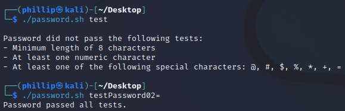

### Code

````
#!/bin/bash

check_password() {
    password=$1
    pass_length=${#password}

    # Initialize flags for tests
    length_passed=false
    numeric_passed=false
    special_char_passed=false

    # Test for minimum length
    if [ "$pass_length" -ge 8 ]; then
        length_passed=true
    fi

    # Test for numeric character
    if echo "$password" | grep -q '[0-9]'; then
        numeric_passed=true
    fi

    # Test for special character
    if echo "$password" | grep -q '[@#$%*+=]'; then
        special_char_passed=true
    fi

    # Check all conditions
    if $length_passed && $numeric_passed && $special_char_passed; then
        echo "Password passed all tests."
    else
        echo "Password did not pass the following tests:"
        if ! $length_passed; then
            echo "- Minimum length of 8 characters"
        fi
        if ! $numeric_passed; then
            echo "- At least one numeric character"
        fi
        if ! $special_char_passed; then
            echo "- At least one of the following special characters: @, #, $, %, *, +, ="
        fi
    fi
}

# Check password provided as argument
if [ $# -eq 0 ]; then
    echo "Please provide a password as an argument."
    exit 1
fi

password=$1
check_password "$password"
````

## Manage Users

**[Back to Assignment](#security)**

### Screenshot

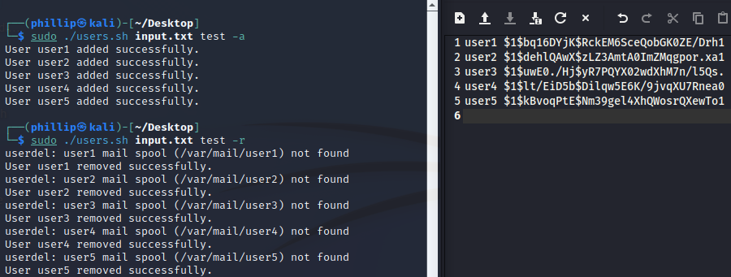

### Code

````
#!/bin/bash

# Check arguments
if [ $# -ne 3 ]; then
    echo "Usage: $0 <input_file> <group_name> < -a|-r >"
    exit 1
fi

input_file=$1
group_name=$2
operation=$3

# Check if input file exists
if [ ! -f "$input_file" ]; then
    echo "Input file $input_file not found!"
    exit 1
fi

# Check if group exists, if not create it
if ! getent group "$group_name" &>/dev/null; then
    groupadd "$group_name"
    if [ $? -eq 0 ]; then
        echo "Group $group_name created successfully."
    else
        echo "Failed to create group $group_name."
        exit 1
    fi
fi

# Function to add users
add_users() {
    while read -r user_id user_pass; do
        if [ -z "$user_id" ] || [ -z "$user_pass" ]; then
            continue
        fi
        
        # Check if user already exists
        if id "$user_id" &>/dev/null; then
            echo "User $user_id already exists."
        else
            # Add user and set password
            useradd -m -G "$group_name" -p "$user_pass" "$user_id"
            if [ $? -eq 0 ]; then
                echo "User $user_id added successfully."
            else
                echo "Failed to add user $user_id."
            fi
        fi
    done < "$input_file"
}

# Function to remove users
remove_users() {
    while read -r user_id _; do
        if [ -z "$user_id" ]; then
            continue
        fi

        # Check if user exists
        if id "$user_id" &>/dev/null; then
            # Remove user
            userdel -r "$user_id"
            if [ $? -eq 0 ]; then
                echo "User $user_id removed successfully."
            else
                echo "Failed to remove user $user_id."
            fi
        else
            echo "User $user_id does not exist."
        fi
    done < "$input_file"
}

# Perform operation
case "$operation" in
    -a)
        add_users
        ;;
    -r)
        remove_users
        ;;
    *)
        echo "Invalid operation. Use -a to add users or -r to remove users."
        exit 1
        ;;
esac
````
</br>
</br>

# User Interface and Security 

**[Back to Top](#week-7)**

1. [Login Function](#login-function)<br>
2. [Getting Help](#getting-help-on-a-system-function)<br>
3. [Listing All](#listing-all-processes)

# Login Function

**[Back to Assignment](#user-interface-and-security)**

### Interface Design

**Single-factor Authentication**
1. Scheme: Username & Password
2. Factors: 1 (Password)
3. Security Considerations: Enforce strong password policies, lockout after failed attempts, encryption

**Two-factor Authentication**
1. Scheme: Username, Password, and OTP sent via SMS/Email
2. Factors: 2 (Password + OTP)
3. Security Considerations: OTP generation and validation, ensure secure transmission and storage of OTP.

### Functional Requirements Table

| Functional Requirement | Security Policy |
| --- | --- |
| Username must be alphanumeric, 8-10 characters long | Enforce username complexity rules |
| Password must be alphanumeric, 1 uppercase, 10-15 characters long | Enforce password complexity rules |
| Encrypt username and password at rest | Use industry-standard encryption methods |
| Password hidden during entry and transmission | Mask input fields and use secure transmission protocols (HTTPS) |
| Lock user out after three unsuccessful attempts | Implement account lockout mechanism |
| Rotate passwords every 90 days | Implement password expiration policy |
| Prevent reuse of last 10 passwords | Store password history and enforce reuse policy |
| Do not disclose which authentication factor failed | Provide generic error messages for failed login attempts |

### Wireframe

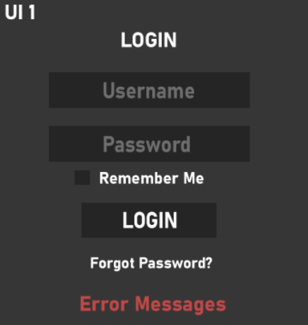

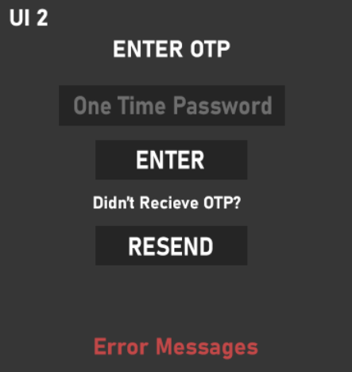

### Flowchart of Logic

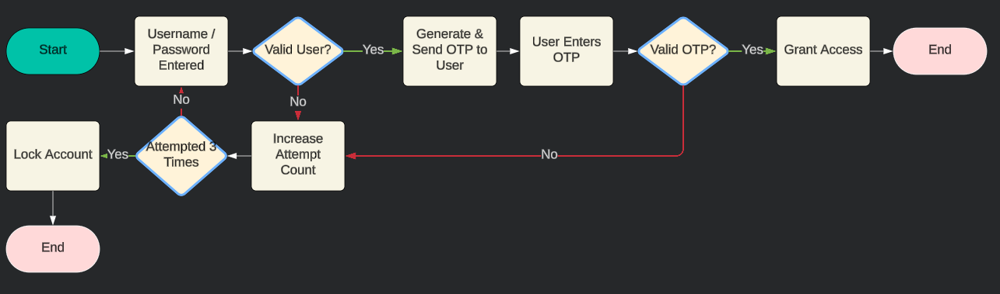
 
## Getting Help on a System Function

**[Back to Assignment](#user-interface-and-security)**

### Interface Design

**Single-factor Authentication**
1. Scheme: Click to access help
2. Factors: 0
3. Security Considerations: Basic access to non-sensitive help topics.

**Two-factor Authentication**
1. Scheme: Click to access help + Security Question
2. Factors: 1 (Security Question)
3. Security Considerations: Validate user's identity for accessing sensitive help topics.

### Functional Requirements Table

| Functional Requirement | Security Policy |
| --- | --- |
| Click to access help function | No authentication for general help |
| Security question for sensitive help topics | Validate answers to pre-defined security questions |
| Session timeout for help access | Implement session management policies |
| Encrypt sensitive help content | Use industry-standard encryption for sensitive data |
| Log access to sensitive help topics | Maintain audit logs for access to sensitive help content |

### Wireframe

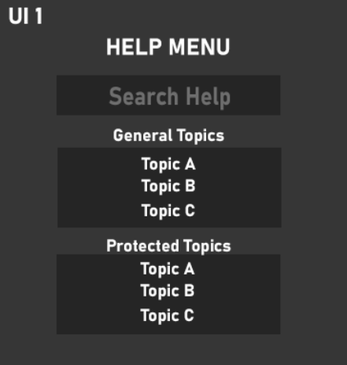

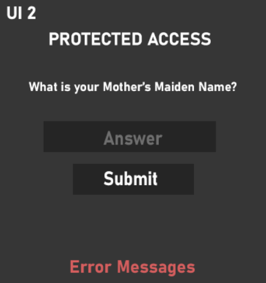

### Flowchart of Logic

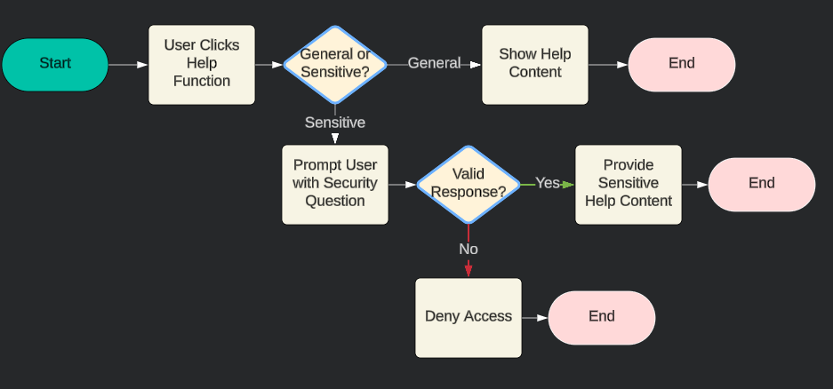

## Listing All Processes

**[Back to Assignment](#user-interface-and-security)**

### Interface Design

**Single-factor Authentication**
1. Scheme: Admin username and password
2. Factors: 1 (Password)
3. Security Considerations: Enforce strong password policies, restrict access to admin users.

**Two-factor Authentication**
1. Scheme: Admin username, password, and biometric verification
2. Factors: 2 (Password + Biometric)
3. Security Considerations: Ensure secure storage and validation of biometric data.

### Functional Requirements Table

| Functional Requirement | Security Policy |
| --- | --- |
| Admin username must be alphanumeric, 8-10 characters long | Enforce username complexity rules |
| Admin password must be alphanumeric, 1 uppercase, 10-15 characters long | Enforce password complexity rules |
| Encrypt username and password at rest | Use industry-standard encryption methods |
| Password hidden during entry and transmission | Mask input fields and use secure transmission protocols (HTTPS) |
| Biometric verification for 2FA | Implement secure storage and validation of biometric data |
| Log access to process listing | Maintain audit logs for access to process information |
| Lock user out after three unsuccessful attempts | Implement account lockout mechanism |
| Rotate passwords every 90 days | Implement password expiration policy |
| Prevent reuse of last 10 passwords | Store password history and enforce reuse policy |
| Do not disclose which authentication factor failed | Provide generic error messages for failed login attempts |

### Wireframe

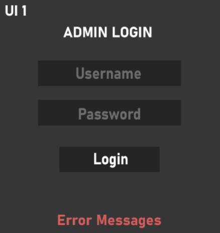

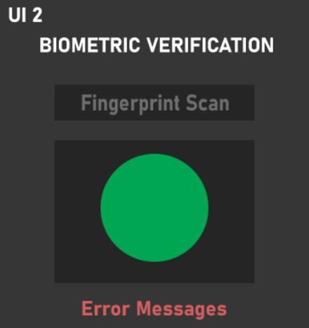

### Flowchart of Logic

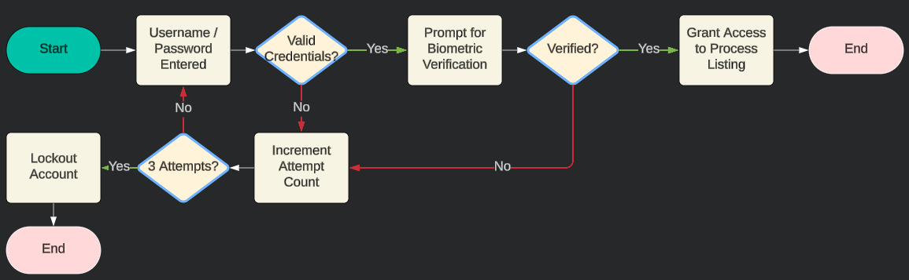