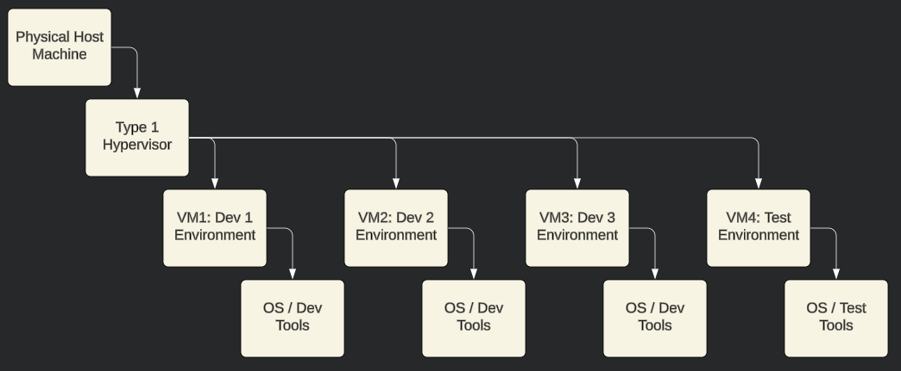

# Week 8

### Class: CST-321
### Professor: Dr. White
### Author: Phillip Ball

---

# Assessing Virtualization Software

### Description

A software development company is in need of a secure and scalable virtualization solution to provide development environments for its team. Each developer requires a virtual machine that can run multiple operating systems, allowing them to test their applications across different platforms. The solution must support high availability, disaster recovery, and efficient resource management to minimize downtime and ensure optimal performance.

### Diagram

### Table

| Company | Product | Version | Release | Performance | Cost | Disaster Recovery | High Availability | Security | Scaling | Type | Management Tools | Score (1-5) | 
Justification
 | 
|---|---|---|---|---|---|---|---|---|---|---|---|---|----------|
|VMware|vSphere|7.0|April 2020|Excellent|$995/CPU|Yes|Yes|High|Excellent|1|Yes|5|Top performance and features, well-suited for enterprise use.|
|Microsoft|Hyper-V|2019|October 2018|Very Good|$60/CPU|Yes|Yes|High|Good|1|Yes|4|Integrated with Windows Server, good for mixed environments.|
|Oracle|VirtualBox|6.1|December 2019|Good|Free|No|No|Medium|Limited|2|Basic|3|Great for personal use and small-scale development.|
|Red Hat|KVM|4.2|June 2019|Very Good|Subscription-Based|Yes|Yes|High|Excellent|1|Yes|4|Excellent for Linux environments, robust features.|
|Citrix|XenServer|8.2|May 2020|Good|$763/CPU|Yes|Yes|High|Good|1|Yes|4|Solid performance, good for enterprise environments.|

### Analysis

**Top Choice: VMware vSphere**

VMware vSphere stands out as the premier option for this scenario, thanks to its stellar performance, high availability, robust disaster recovery options, and comprehensive security features. It's ideal for enterprise settings where multiple developers require isolated, high-performance virtual machines. The platform also excels in infrastructure scaling and offers a rich array of management tools, making it perfect for efficiently handling numerous virtual environments. Although it comes with a higher price tag, its features and performance make it a worthwhile investment for professional software development environments.

**Justification**

- Performance Metrics (5): VMware vSphere consistently ranks at the top of performance benchmarks, ensuring smooth and efficient operation for multiple VMs.
- Cost (4): Despite being on the pricier side, its extensive feature set makes the cost worthwhile for enterprise use.
- Disaster Recovery (5): VMware vSphere offers robust disaster recovery solutions, including vSphere Replication and Site Recovery Manager.
- High Availability (5): The high availability capabilities of VMware vSphere ensure minimal downtime and quick recovery from hardware failures.
- Security (5): VMware vSphere provides extensive security features, such as encrypted VMs and secure boot.
- Infrastructure Scaling (5): VMware vSphere boasts excellent scalability, adept at supporting large and complex environments with ease.
- Type (5): As a Type 1 hypervisor, VMware vSphere delivers superior performance and isolation.
- Management Tools (5): The platform includes comprehensive management tools and reporting capabilities with vCenter Server.