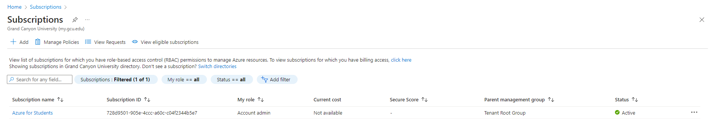

# Week One

### Class: CST-323
### Professor: Jason Jazzar
### Author: Phillip Ball

---

## Cover Sheet

**A screenshot of being logged into the Azure Portal (Got my student account to work)**

**The framework and technology chosen for the test application**

1. Angular CLI
2. REST API
3. MongoDB
4. Github Pages
5. Heroku

Link to main page github: https://github.com/PhillipBall1/PhillipBall1.github.io 
Link to API github: https://github.com/PhillipBall1/LeafLoungeAPI

**The progress and status on the test application development, outlining what pages and services have been built, as well as what pages and services are remaining to be built** 

Application development is great and functional. There are some features that can be added, such as a functional cart and checkout system. As services go the website is functional.

**A list of issues that are currently ongoing that are hampering the completion of the test application** N/A

[Screen Cast, demonstrating full use of the website and its functionality](https://www.youtube.com/watch?v=TemviAMneaM)

## Cloud Computing Research

**Cloud Evolution**

Cloud computing has evolved from bringing "web-based" software with limited functionality to an advanced infrastructure that utilizes cloud services, allowing for a high degree of on-demand services and scalability. Companies originally based their infrastructure on physical servers and hardware, which were not flexible but entailed large capital expenses. With an improvement in technology, more and more types of resources were virtualized and pooled, handled through the use of IaaS, PaaS, SaaS. These days physical solutions reside on the cloud for data storage, application hosting, and development environment providing businesses the ability to be agile and operate in a more efficient manner.

**Advantages/Disadvantages**

**Advantages**

- Scalability: Enables corporations to scale resources based on fluctuating demand, thus improving service availability.

- Cost Savings: The company is able to reduce hardware and maintenance costs after moving to a cloud-based model.

- Improved Collaboration: Unlike before, employees can work remotely on various projects, making productivity higher with cloud access.

**Disadvantages**

- Security Risks: transferring data must be stored in the cloud out of control and thus more susceptible to hacker attacks.

- Dependence on cloud providers leading to downtime: in rare instances, the corporation faced downtime issues due to dependence on third-party cloud providers.

- Challenge with Data Migration: Migration of volumes of legacy data into the cloud is complex and expensive & need more for planning and testing.

**Cloud vs. On-Premise Solution Recommendation**

I would recommend a cloud-based solution for deploying a company’s business application. The cloud provides unmatched flexibility and scalability, allowing to scale resources up or down based on demand, which reduces unnecessary operational expenses. Cloud services offer reliable data backup, disaster recovery, and built-in security protocols, which are essential for safeguarding sensitive information. Although initial migration may pose challenges, the long-term benefits of lower maintenance costs, automatic updates, and improved accessibility make the cloud solution the most practical and efficient choice for supporting a company’s growth and adapting to evolving technological needs.