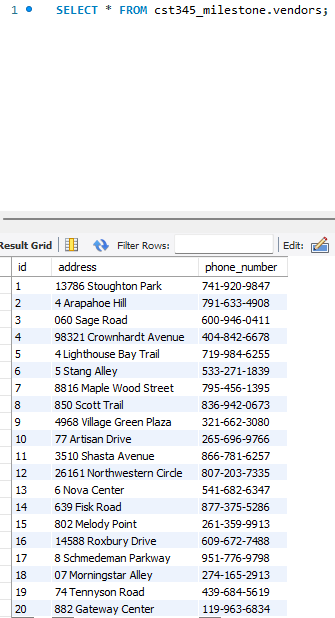

# Milestone Project 

### Class: CST-345
### Professor: Nathan Braun
### Author: Phillip Ball

---
| Milestone | Link | 
| --- | ---| 
| 1 | [Here](#milestone-1) |
| 2 | [Here](#milestone-2) |


# Milestone 1

| Links |
| --- |
| [Screenshots](#screenshots-1) |
| [Tables](#tables-1) |
|[Back to Top](#milestone-project) |

## Screenshots 1

[Back to Milestone 1](#milestone-1)

```Show an example of selecting users based on a partial match of a username```

>displaying names that were generated from mockoo containing Ka from customers


```Show an example of selecting products based on an ID number```

>Selected id 45 and displayed it


```Show an example of inserting a store record using a SQL statement```

>Inserted Albertsons at store id 21 


```Show an example of deleting a product category record based on a category ID```

>Displays unchanged product_categories with a delete me at 11


>Shows the statement used to delete the product_category


>After statement has been executed, displaying the product_categories


```Show an example of updating a single vendor record, changing one of its properties```

>Vendors before the update



>Vendors update statement shown


>Vendors after update executed


## Tables 1

[Back to Milestone 1](#milestone-1)

### Customers


### Employees


### Order


### Order Item


### Payments


### Product Categories


### Products


### Stores


### Vendor


# Milestone 2

| Links |
| --- |
|[Back to Top](#milestone-project) |