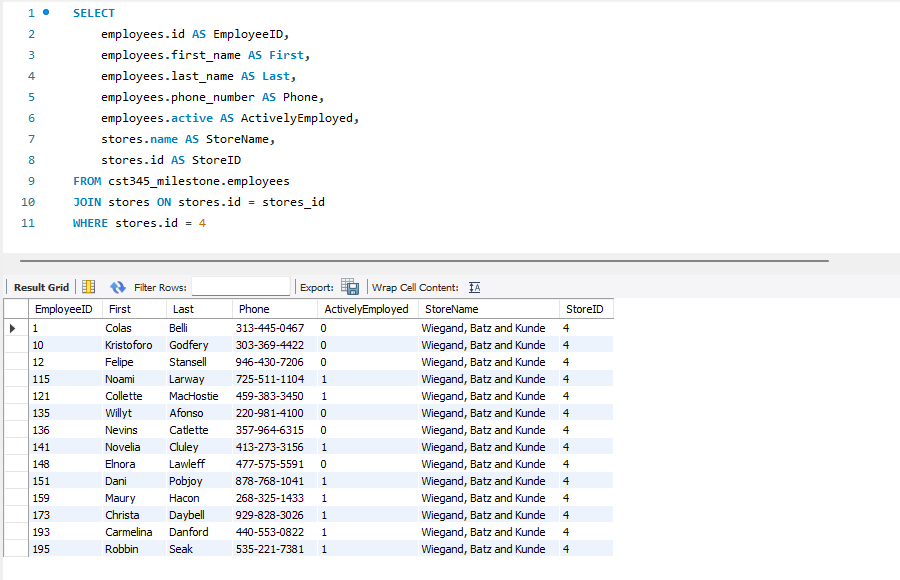

# Milestone Project 

### Class: CST-345
### Professor: Nathan Braun
### Author: Phillip Ball

---
| Link | 
| --- |
| [Milestone 1](#milestone-1) |
| [Milestone 2](#milestone-2) |
| [Milestone 3](#milestone-3) |


# Milestone 1

| Links |
| --- |
| [Screenshots](#screenshots-1) |
| [Tables](#tables-1) |
|[Back to Top](#milestone-project) |

## Screenshots 1

[Back to Milestone 1](#milestone-1)

```Show an example of selecting users based on a partial match of a username```

>displaying names that were generated from mockoo containing Ka from customers


```Show an example of selecting products based on an ID number```

>Selected id 45 and displayed it


```Show an example of inserting a store record using a SQL statement```

>Inserted Albertsons at store id 21 


```Show an example of deleting a product category record based on a category ID```

>Displays unchanged product_categories with a delete me at 11


>Shows the statement used to delete the product_category


>After statement has been executed, displaying the product_categories


```Show an example of updating a single vendor record, changing one of its properties```

>Vendors before the update


>Vendors update statement shown


>Vendors after update executed


## Tables 1

[Back to Milestone 1](#milestone-1)

### Customers


### Employees


### Order


### Order Item


### Payments


### Product Categories


### Products


### Stores


### Vendor


# Milestone 2

| Links |
| --- |
|[Back to Top](#milestone-project) |

## Screenshots 2


```A screenshot of the MySQL Workbench diagram showing the relationships between all the tables.```


```Screenshots of SQL queries and four results for the INSERT order```


```Screenshots of SQL queries and three INSERT order item queries. ```

> I created a bunch of orders and just made them random for certain inputs so I could just spam create them. This joining the orders later look better due to an increased number of order_items


```Screenshots of the SQL SELECT query and results that show all items associated with a single order.```

>Only chose to show two orders because these ones got filled the most from the random entries. Also used a round statement to clean up the decimals on the Total column. 


# Milestone 3

| Links |
| --- |
|[Back to Top](#milestone-project) |

## Screenshots 3

```Create a report showing all employees with associated store information. Show employee ID, first name and last name, employee phone number, active status, the name of the store where he/she works, and the store ID number```


```Modify the employee report to show the employees from only a single store. Choose a store that has multiple employees associated with it.```



```Show all the products in the system. Include the vendor name and vendor ID associated with each product.```


```Modify the previous query to limit the results to a vendor who provides multiple products```


```Extend the previous query to show all products while including vendor information and the category name and category ID values for each product. Sort the list by product ID number```


```Show all products, including vendor information and category information. Include results from only one category```


```Write a select statement that fetches all the line items for a single order. Show the product price, product description, product name, quantity, and retail price for each line item. Calculate the subtotal for each line. Multiply quantity x product retail price to get the subtotal```


```Show all orders, date of order, employee ID, employee first name, employee last name, customer ID, customer first name, customer last name```


# Milestone 4

| Links |
| --- |
|[Back to Top](#milestone-project) |

## Screenshots 4

**Initial Application on start-up**


**After add category has been pressed**


**Displaying that the new category does show up**


**After delete selected category has been pressed**


**Displaying that the search function does work using 'Frozen'**


**Displaying that after Category 2 has been clicked in the datagridview, the products datagridview displays all of the products in that category**


**After adding a new product**


**Showing that the new product has been added**


**After delete selected product has been pressed on the created product**


