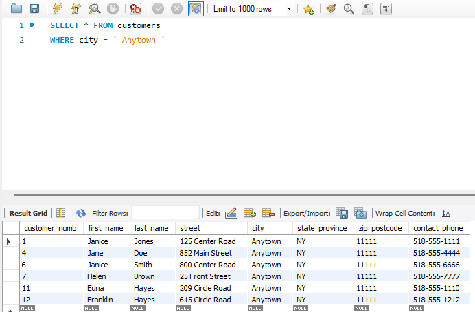
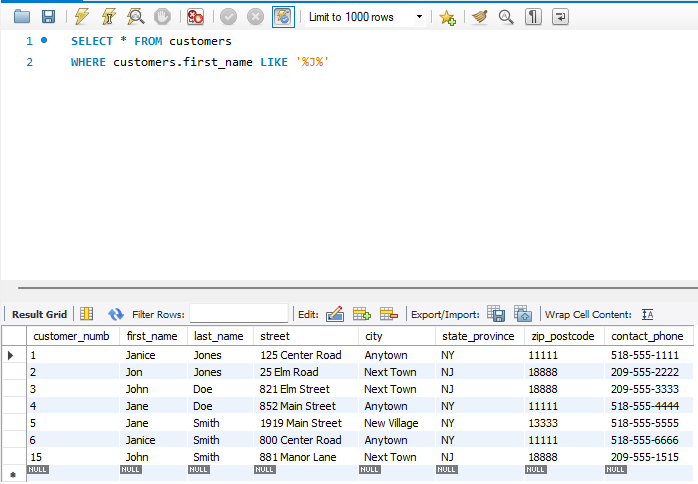
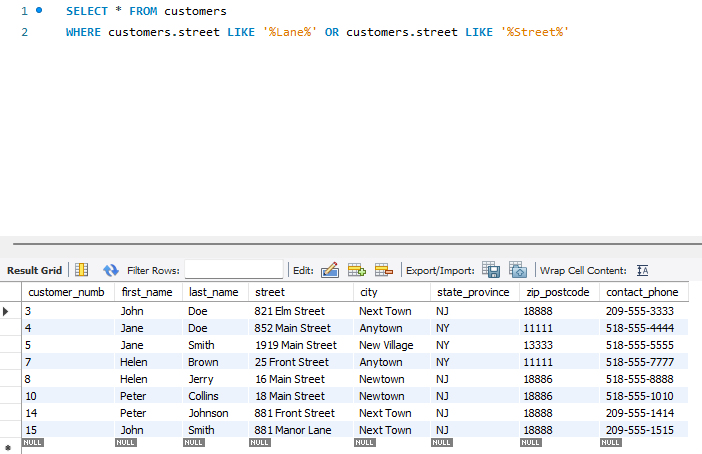
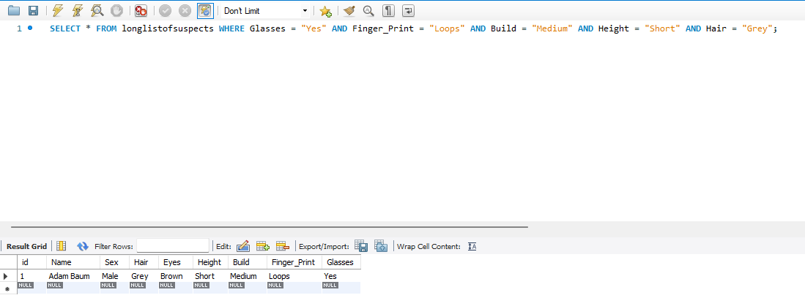
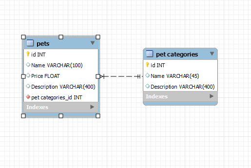
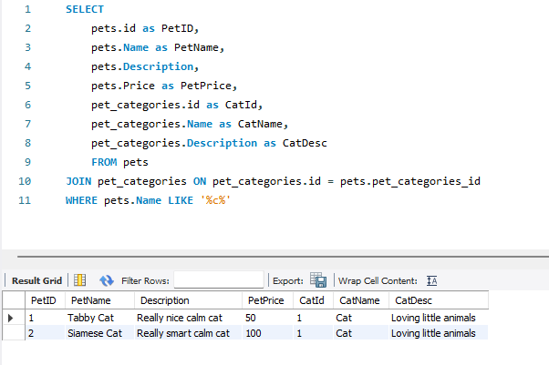
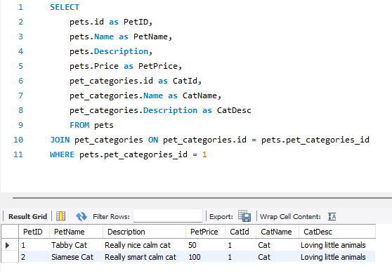

# Activity 1

### Class: CST-345
### Professor: Nathan Braun
### Author: Phillip Ball

---

**Proof of tutorial completion**

**Query listing all customers that are from Anytown**

**Query listing first names that have a 'J' in it**

**Query listing streets that contain 'Lane' or 'Street'**

**Selecting random suspect from the longlistofcriminals**

**EER Diagram displaying the pet store**

**Displaying all of the added animals**

**Displaying all of the cats**

**Displaying all of the animals with pet_categories_id = 1**
