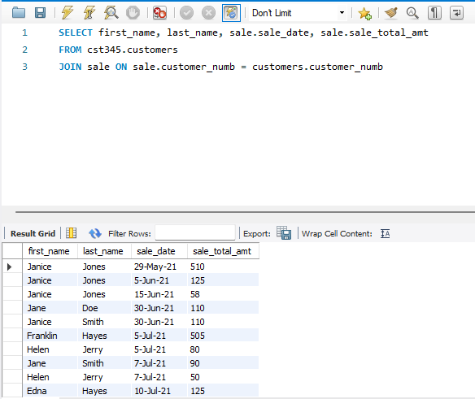
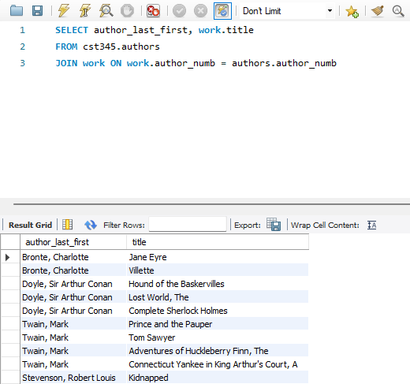
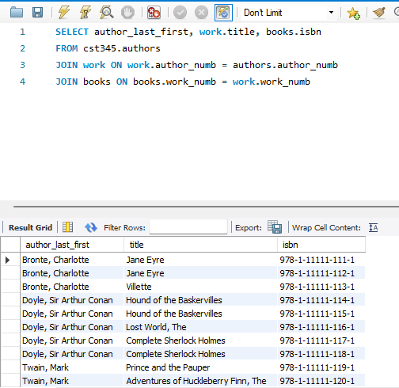
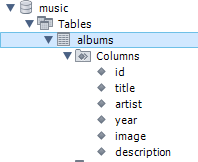
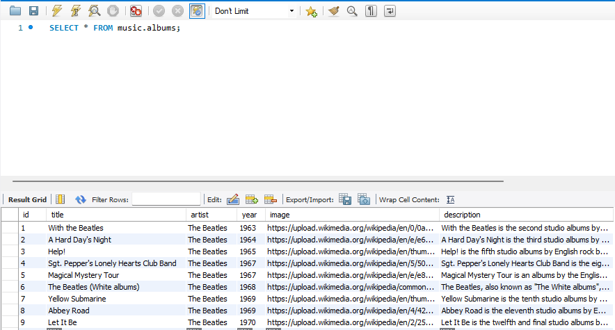

# Activity 2

### Class: CST-345
### Professor: Nathan Braun
### Author: Phillip Ball

---

## Screen Shots

**Proof of tutorial completion**


**SQL statement to select customer first name, last name, sale date, and sale amount using a join statement**



**SQL statement to select author_last_first and work_title using a join statement**



**SQL statement to select author_last_first, work_title, and isbn using a double join statement**



**Displaying that the tables for the music database are created**



**Music database albums table with 9 beatles entries completed (all info received from wikipedia)**



## Research

```A one-paragraph summary of the key concepts demonstrated in this section of the tutorial```

>The key concepts demonstrated in this assignment were mainly receiving info from different tables and combining them based on JOIN statements using connected ids such as 'customer_numb' or 'work_numb'. Using these specific ids, we were able to connect table entries on one another, from authors names connected to books that they wrote, from the books that they wrote the isbn number connected to that book. Then in part two we created a database, music, and created tables with columns and filled them out, teaching us how to make tables on our own and add information. The way I achieved this was using INSERT INTO music VALUES (id, title, artist, year, image, description), as I really can not get MAMP to work I hope that this is accepted.