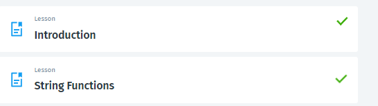

# Activity 3

### Class: CST-345
### Professor: Nathan Braun
### Author: Phillip Ball

---

## Screen Shots

**Proof of tutorial completion**



**Select statement to join (union) two sets of user data. Select all users whose last name contains "Smith." Select all users whose last name contains "Hayes." Return the names in a single result.**


**SQL statement to select all columns from the customers table. Exclude all customers who conducted a sale after August 1, 2021.**


**SQL statement to select sale_id and sale_total_amt from the sale table. Calculate a 10% tax on each sale. Calculate a 12-month interest free payment plan for the total bill.**


**Show that a select statement uses a "Full Table Scan" when no index is present.**


**Show that the same select statement achieves a more efficient result when an index is applied.**


**Take a screenshot of the results of a WHERE clause used in a SELECT statement.**


**Take a screenshot of the results of a WHERE clause used to find a partial string match in a column.**


**All albums being loaded**


**Album cover being displayed on click of an album**


**Search query for albums that contain the letter 'g'**


**After add album has been clicked, displaying the MessageBox.Show(result + " new row(s) inserted")**


**Showing that the album was successfully added on the button 'Load Albums' click**


## Research

```Write a one-paragraph summary of the key concepts that were demonstrated in this lesson```

>The first part of this lesson demonstrated statements that were able to 1, combine to sets using a union to get both last names of 'Smith' and 'Hayes', 2, Exclude unwanted information by setting a particular date, and 3, where we selected an ID, original_amt, total + tax, monthly_pay and calculated a total with tax and a monthly payment. In the second part, we learned different variations on the WHERE clause and  scenarios to use them. Lastly we created a GUI for the music database using WinFormsApp. We learned how to create a DAO to control the querying commands and received data from those commands to be displayed on an application.