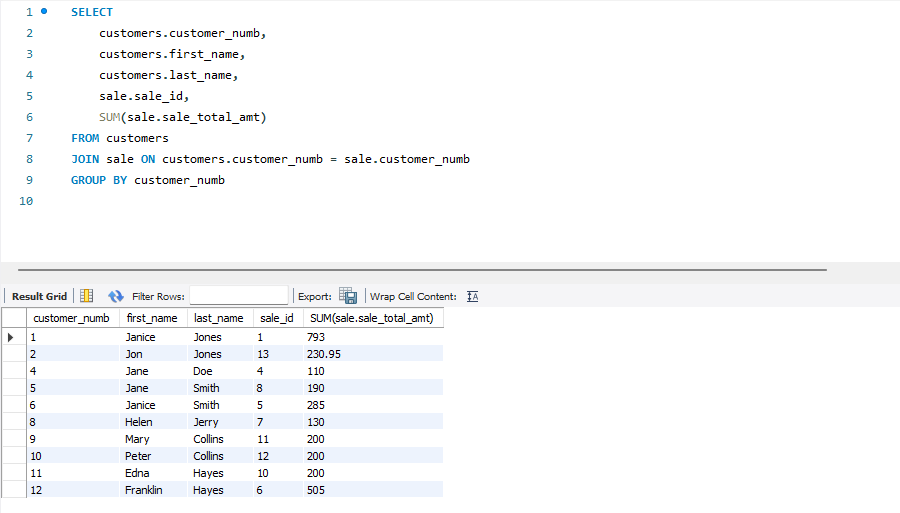

# Activity 4

### Class: CST-345
### Professor: Nathan Braun
### Author: Phillip Ball

---

**[Code Link](https://github.com/PhillipBall1/GCU/tree/main/cst345/week3/DatabaseSQLMusicApp)**

## Screenshots

**Proof of tutorial completion, I could not find a section titled "Challenges"**


**Use a select statement to fetch the maximum, minimum, and average: sale_total_amount from the sale table**


**Modify the statement to return only the sales that were above the average selling price.**


**Modify the select statement to show each customer ID and first and last name with a total amount (sum) of money that the customer has spent at the store**



```Give an example of a table that violates the "First Normal Form" principle... Explain why it is incorrect. Show a corrected version. Explain what problem the correction solves```

>In this example table that I created, the "Skills" column violates 1NF because it contains a list of skills for each employee. </br></br>

>Now, the "Skills" information is stored in a separate table, and the skills table follows the First Normal Form.</br></br>


```Give an example of a database design that violates the "Second Normal Form" principle... Explain why it is incorrect. Show a corrected version. Explain what problem the correction solves```

>In this example table that I created, the "zSales" table has 2 primary keys OrderID, ProductID. The issue is that the "ProductName" column depends only on the "ProductID" part of the composite key, not the entire key, which violates the Second Normal Form.</br></br>

>Now, the "ProductName" is stored in the "zProducts" table, and the "zSales" table references the "zProducts" table using the "ProductID" foreign key. This design adheres to the Second Normal Form.</br></br>


```Give an example of a database that violates the "Third Normal Form" principle... Explain why it is incorrect. Show a corrected version. Explain what problem the correction solves```

>In this example table that I created, the "zEmployee" table has a duel dependency between "DepartmentName" and "ManagerID" through the "EmployeeID" (primary key). The "ManagerID" depends on "EmployeeID," and "DepartmentName" also depends on "EmployeeID." Therefore, "DepartmentName" indirectly depends on "ManagerID" through the "EmployeeID."</br></br>

>Now, the "DepartmentName" is stored in the "zDepartment" table, and the "zEmployee" table references the "zDepartment" table using the "DepartmentID" foreign key. This design adheres to the Third Normal Form.


```Show the tracks associated with an album when the album data is clicked```


```Show the video player displaying a YouTube video when the track is clicked```

