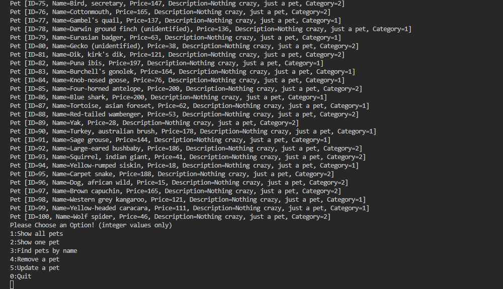

# Activity 5

### Class: CST-345
### Professor: Nathan Braun
### Author: Phillip Ball

---

| Link | 
| --- |
| [Screenshots](#screenshots) |
| [Research](#research) |

## Screenshots

[Back to Top](#activity-5)

**On Startup**

**After selecting the first option**

**After selecting the second option and choosing ID 34**

**After selecting the third option and using 'Cat' as the search parameter**

**After selecting the fourth option and choosing to remove the pet with ID 101**

**Demonstrating that the pet which was previously in 101 is now gone**

**After selecting the fifth option and demonstrating the update method, changing pet #54 and then looking it up to show that the method worked**

**Write a SQL statements to insert a new customer into the "customers" table. Use a friend's name for the new customer**

>
>

**Write SQL statements to insert at least two lines into the "sale" table. Attribute the new sales to your own user record.**

>
>

**Add your own personal data to the "author" table**

>
>

**Add a new item to the "work" table. Invent a new title for the work. Make yourself the author of the new work**

>
>

**Add a new item to the "book" table. Associate your own "work" item (previous step) to the new book.**

>
>

**For this one I actually don't think we got a volume table, or at least I didn't from the activity 1 downloads. I ended up just using inventory instead and it seemed to work out fine. Add a new item to the "volume" table. Associate your own "book" item (previous step) to the new volume.**

>
>

**Run the following SQL statement to verify that your information was added successfully**

