# Cover Sheet

### Class: CST-345
### Professor: Nathan Braun
### Author: Phillip Ball

---

## Screenshots

**Tutorial Completion**

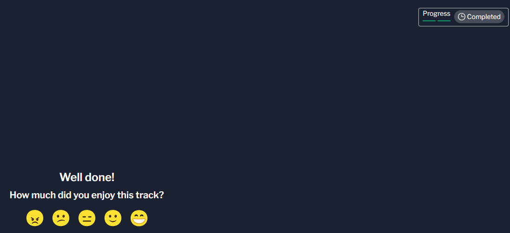

**Display all albums in the database**

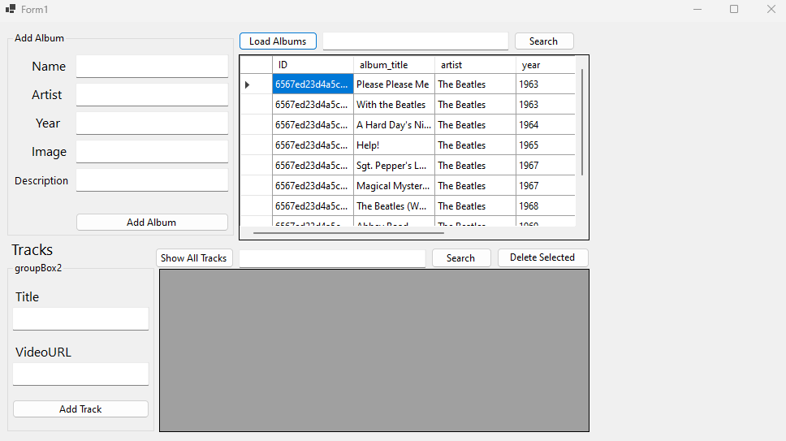

**Show the album art by clicking on an album**

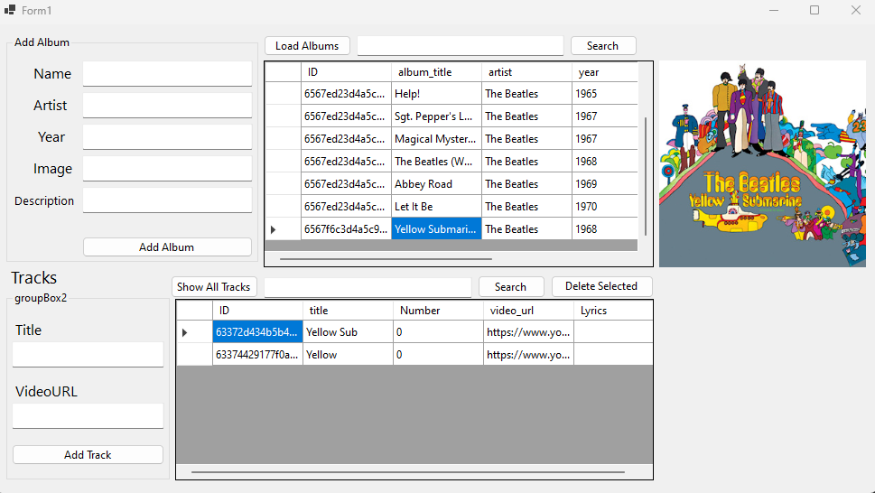

**Search for an album by title**

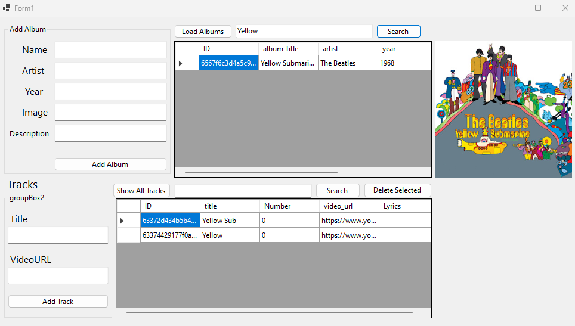

**Add a new album**

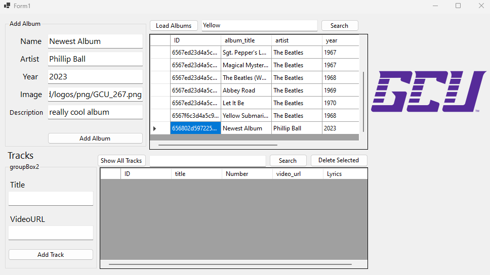

**Delete an album (I forgot to add it so that's why the button came out of no where)**

>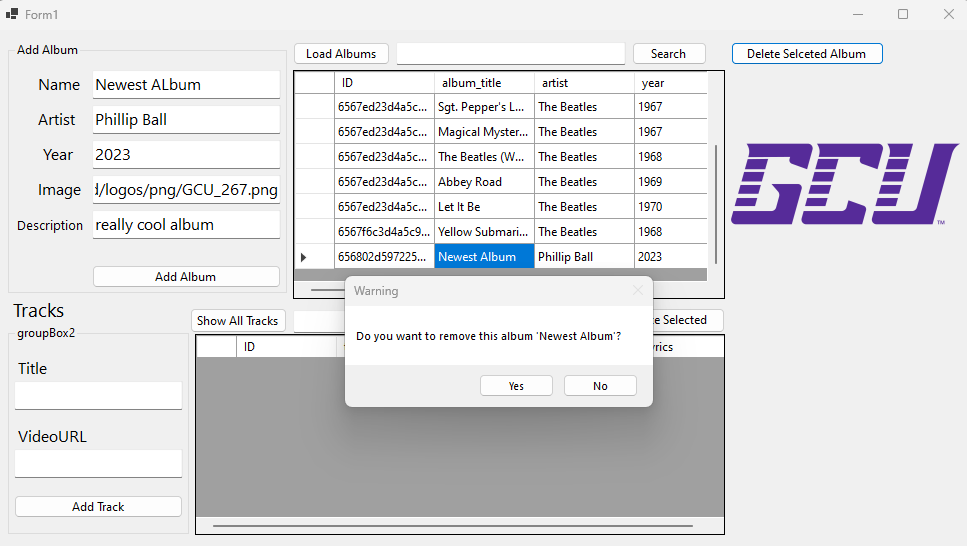
>**Proof of Deletion**
>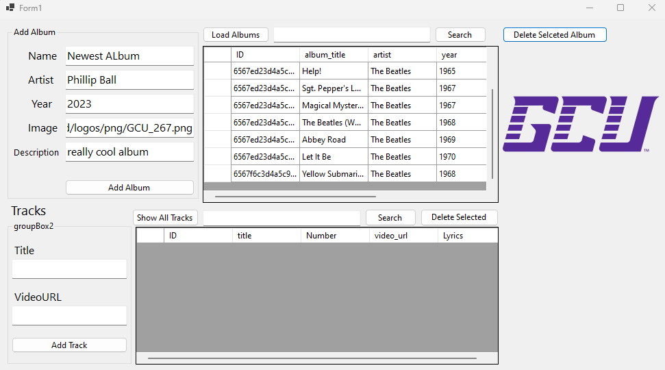

**Display all tracks for a given album**

**Search for tracks by title**

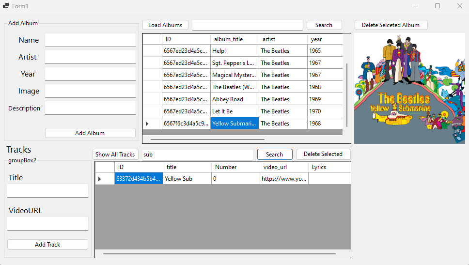

**Add a new track**

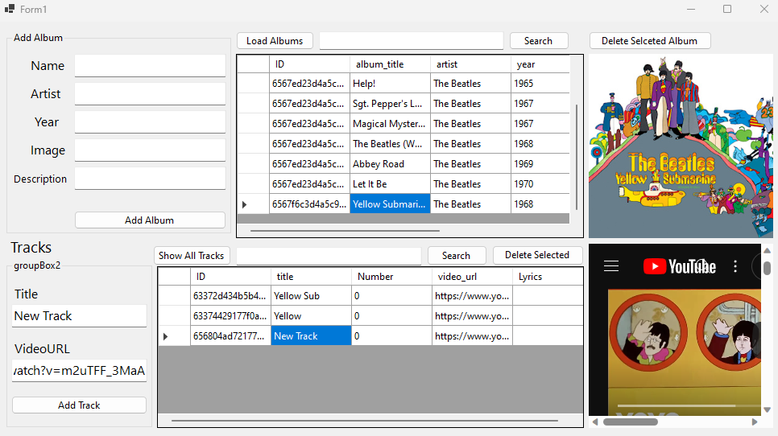

**Delete a track**

>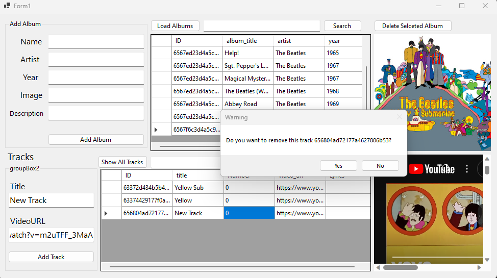
>**Proof of Deletion**
>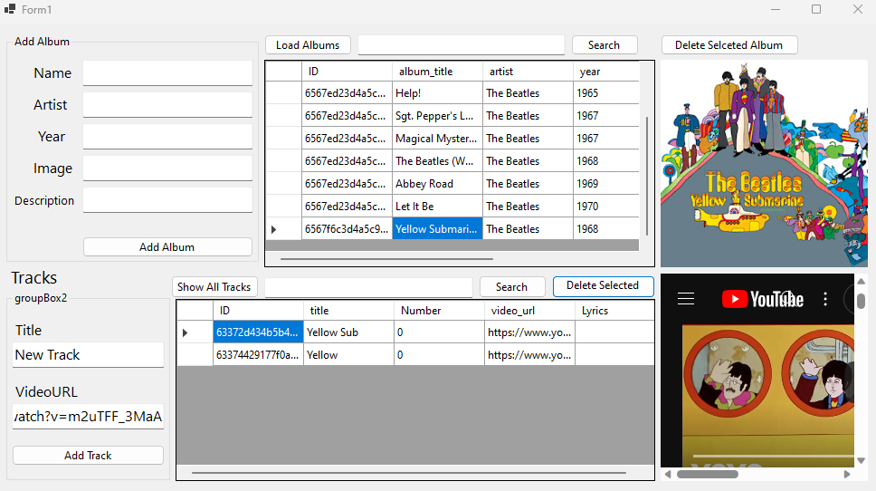

**Play the video for a track**

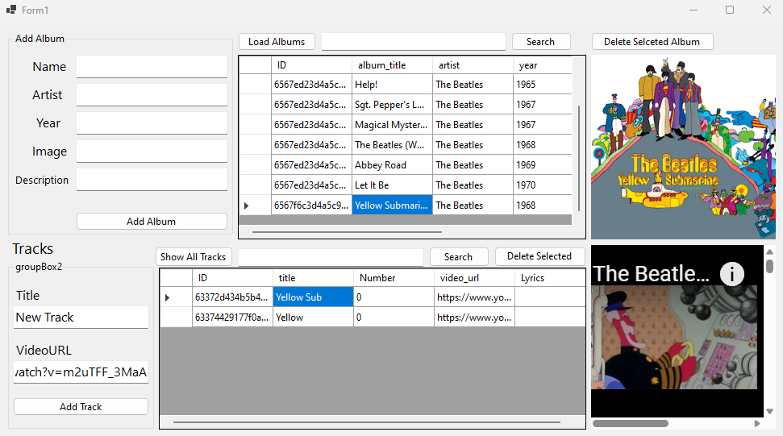

## Research 

**Write a one-paragraph summary of the key concepts that were demonstrated in this lesson.**

>The key concepts that we learned in this lesson were how to connect to a mongo database. This included replacing our previous SQL database and fixing our visual studio code to implement the new mongo database functionality. Personally, I learned that the workflow of mongo database is much faster than MySQL.