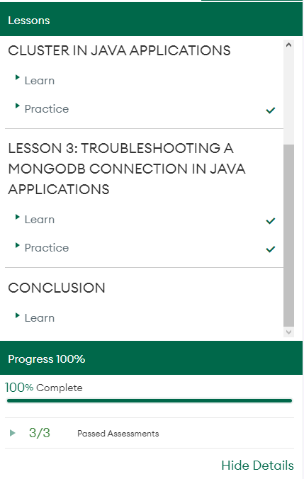
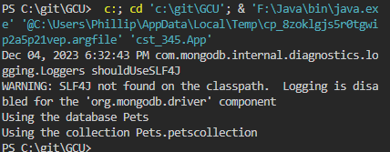
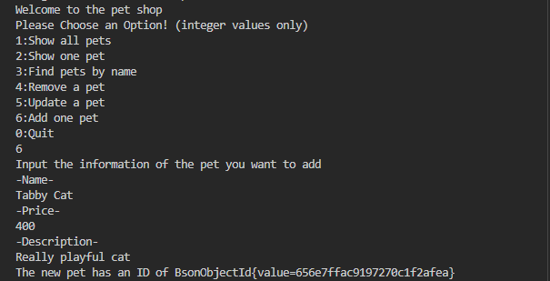
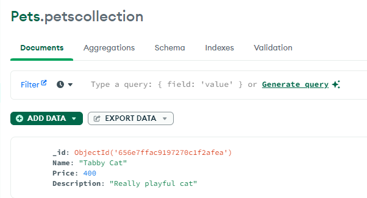
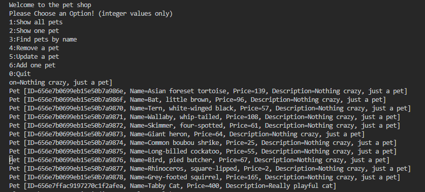
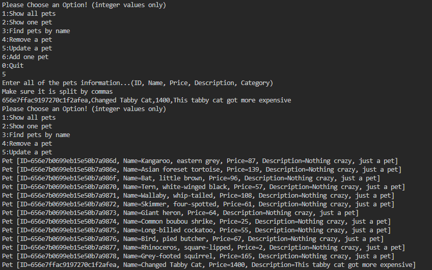
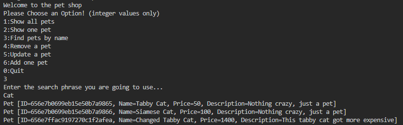
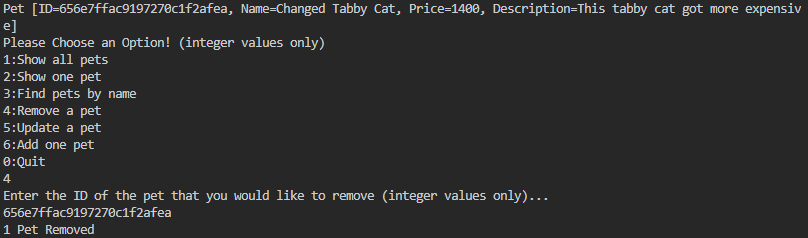
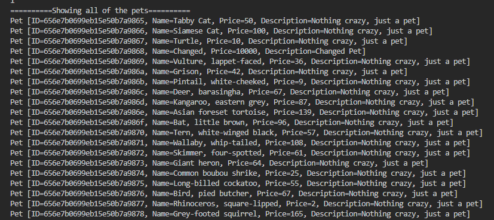
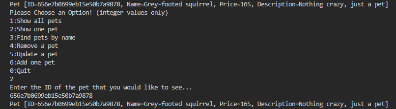

# Activity 7

### Class: CST-345
### Professor: Nathan Braun
### Author: Phillip Ball

---

[Screenshots](#screenshots)

[Research](#research)

## Screenshots

[Back to Top](#activity-7)

**Tutorial Completion**

**Showing the successful connection**

**Showing the successful insert**

> **Interactively Added**
>
>
>
> **Proof of insertion on Compass**
>
>

**Showing the GetAllPets with the newly added pet displayed**

**Showing the added Tabby cat getting updated to "Changed Tabby Cat", also displaying on GetAllPets that it has updated correctly**

**Showing the successful search of "Cat"**

**Showing the successful delete**

> **The ID above is reference for the ID that I used to delete as it was the changed tabby cat**
>
>
>
> **Proof that the changed tabby cat was deleted**
>
>

**Showing the successful findbyid using the ID above as reference**

## Research 

[Back to Top](#activity-7)

**Write a one-paragraph summary of the key concepts that were demonstrated in this lesson**

>I believe that we learned how to connect data to a mongoDB and then to a functional application. These steps were similar to the SQL version that we did in week 5, but using mongoDB seems to be much more efficient as an upside. The key concepts were mainly creating the components to make the connections between the database and application.
