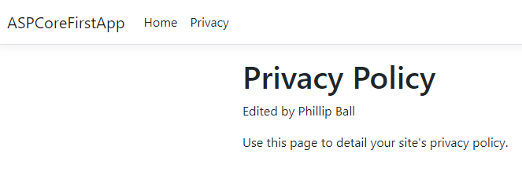
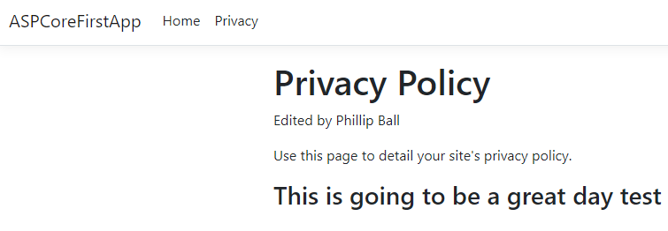
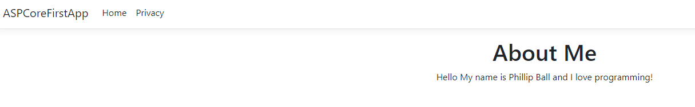
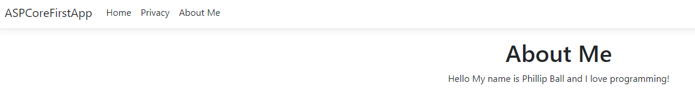
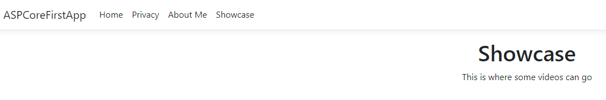
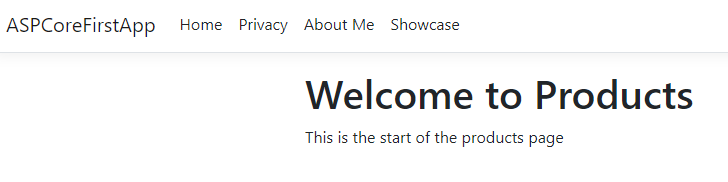
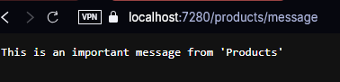
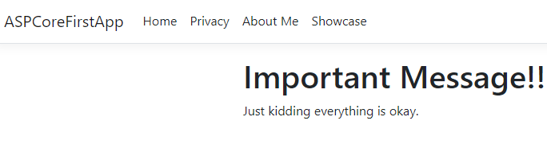
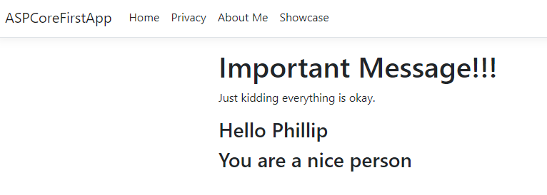
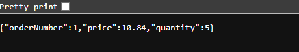

# Week 1

### CST-350
### Prof. Jackson
### Phillip Ball

---

## Part 1: Tools Installation and Default App

**1: Altered the default privacy policy text**

**2: Used ViewData["Message"] to display a variable inside of HTML**

**3: Creating my own View named About**

**4: Adding this view to the layout navbar**

**5: Extended - Creating a showcase page using the steps from above**

## Part 2: Controllers and Views

**6: After creating a products controller and adding a view to it**

**7: Sending a string instead of HTML to the browser**

**8: Changing the view back to an HTML display using Razor View**

**9: Creating a 2 parameter URL**

**10: Returning Json information**

## Part 3: What I learned

> I believe I learned a lot as so far I have only developed websites using javascript/typescript frameworks. I prefer to code in C# so this has been a really interesting lesson. I love how simple it is to incorporate code into HTML using @{} whereas a framework like Angular feels more abstract. Key concepts would mainly be showing how these pages can show data and how that data can be altered. 