# Cover Sheet

### Class: CST-391
### Application Name: Fruit Fiesta
### Author: Phillip Ball

---
## Fast Travel
1. [Introduction](#introduction)
2. [Fruit Routes](#fruit-routes)
3. [User Routes](#user-routes)
3. [Functionality](#functionality--ui)
4. [Risks](#risks)

 
 
 
 

# Introduction

[Back to Top](#cover-sheet)

Fruit Fiesta is a fruit only shop, where the user can create an account, add fruit to their cart, and checkout. I have never seen a fruit only shop and mainly thought it would be a fun idea. 

## Documentation Videos

[Milestone 3 Screencast](https://www.youtube.com/watch?v=H2ZXxgh3xb4)

[Milestone 4 Screencast](https://www.youtube.com/watch?v=fiotvay9-ZY)

## Design Report

|Date|Change made|
|:-------:|----------------------------------|
|8/28/23|changed the id values from the fruit and user database to match their respective names (fruitId)(userId) in sql|
|9/13/23|removed expiration from the database as I could not find a reasonable use for it inside the website|

## To-Do

|Date|Entry|
|:-------:|----------------------------------|
|9/13/23|finish the search function for the fruit|
|9/13/23|add a home page|
|9/13/23|add a cart function|
|9/13/23|when the user selects a fruit from search, the display looks gross, fix that|

 
 
 
 

# Fruit Routes
[Back to Top](#cover-sheet)
|GET|fruit|
|:-------:|:----------------------------------:|
|Route-|/fruit|
|DAO-|+readFruit()|
|Task-|retrieves all of the fruit|

|GET|fruitByDescription|
|:-------:|:----------------------------------:|
|Route-|/fruit/search/description/:search|
|DAO-|+readFruitByDescription()|
|Task-|retrieves all of the fruit that contain the :search|

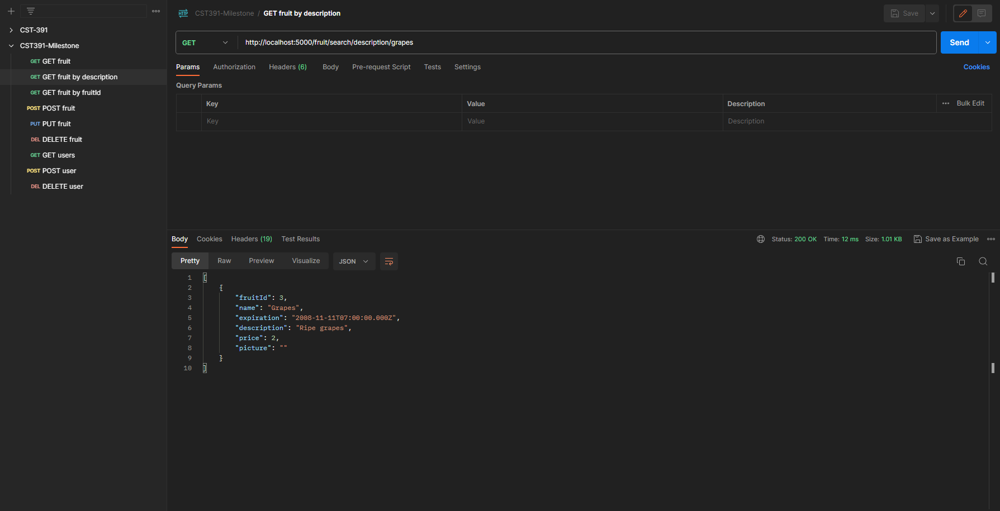

|GET|fruitById|
|:-------:|:----------------------------------:|
|Route-|/fruit?fruitId=?|
|DAO-|+readFruitByFruitId()|
|Task-|retrieve a single fruit by the input ID|

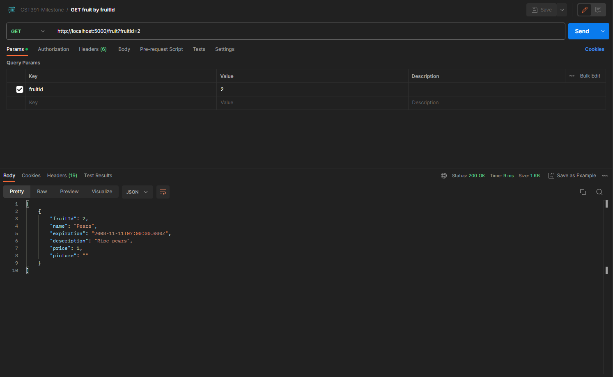

|POST|fruit|
|:-------:|:----------------------------------:|
|Route-|/fruit|
|DAO-|+createFruit()|
|Task-|creates a single fruit|

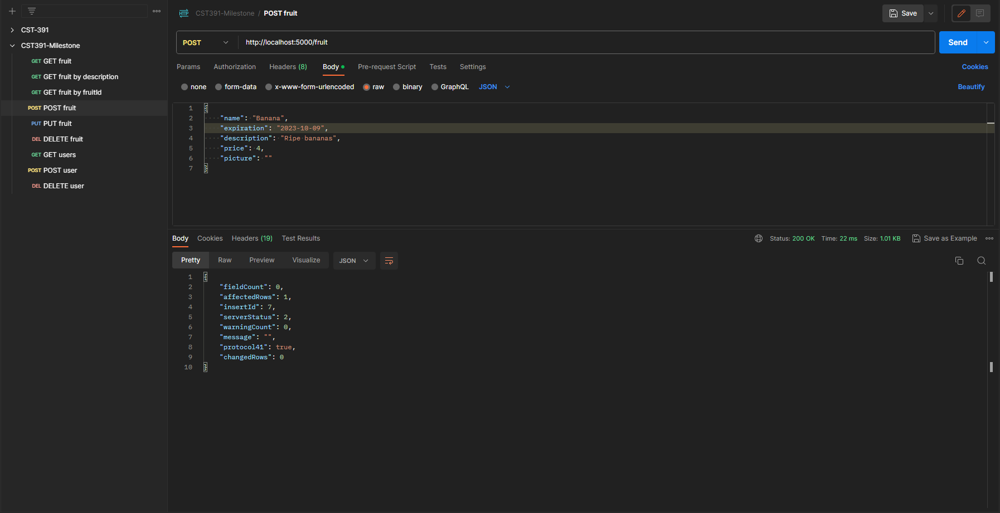

|PUT|fruit|
|:-------:|:----------------------------------:|
|Route-|/fruit|
|DAO-|+updateFruit()|
|Task-|updates a single fruit by id|

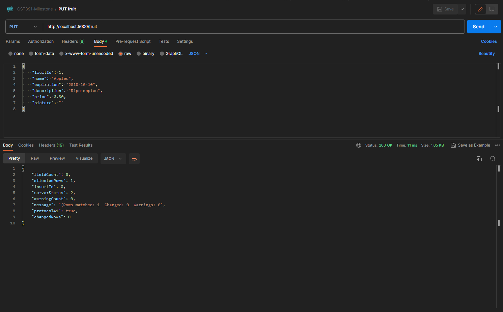

|DELETE|fruit|
|:-------:|:----------------------------------:|
|Route-|/fruit|
|DAO-|+deleteFruit()|
|Task-|removes a single fruit by id|

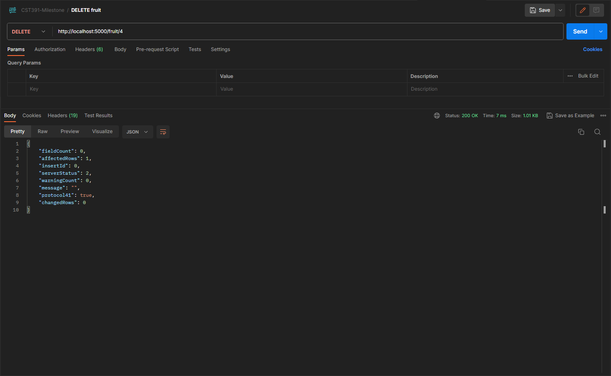

# User Routes
[Back to Top](#cover-sheet)
|GET|users[]|
|:-------:|:----------------------------------:|
|Route-|/user|
|DAO-|+readUsers()|
|Task-|retrieves all users|

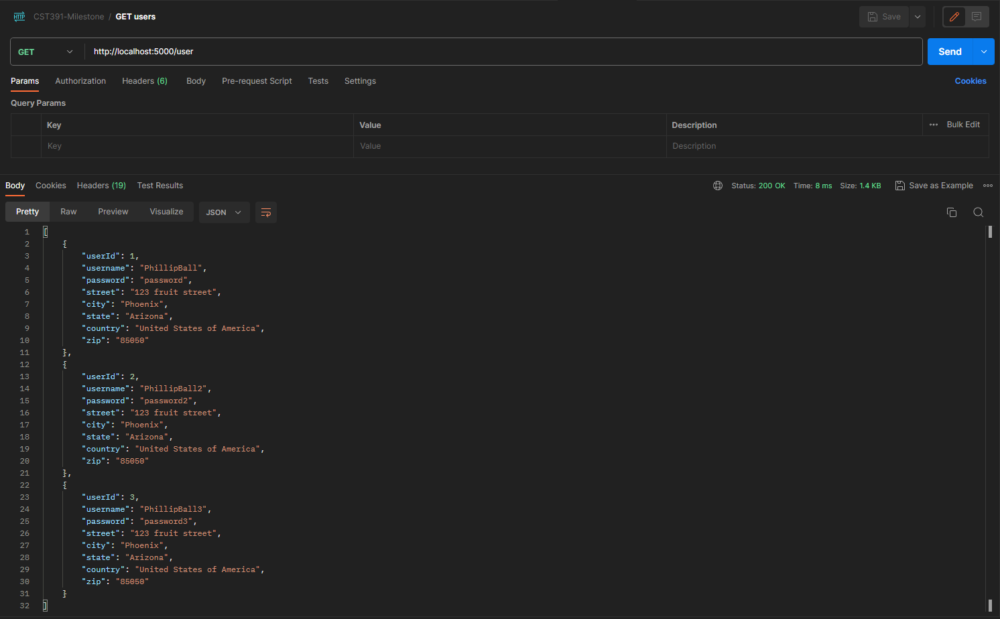

|POST|user|
|:-------:|:----------------------------------:|
|Route-|/user|
|DAO-|+createUser()|
|Task-|creates a single user|

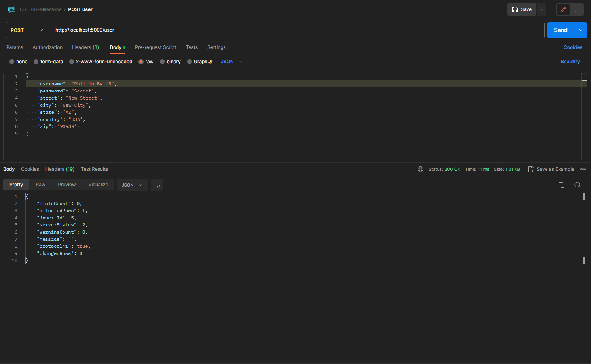

|PUT|user|
|:-------:|:----------------------------------:|
|Route-|/user|
|DAO-|+updateUser()|
|Task-|updates a single user by id|

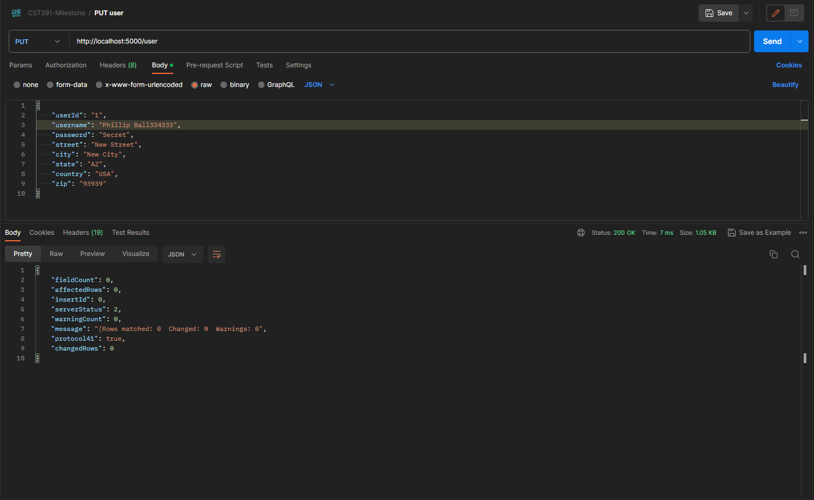

|DELETE|user|
|:-------:|:----------------------------------:|
|Route-|/user|
|DAO-|+deleteUser()|
|Task-|removes a single user by id|

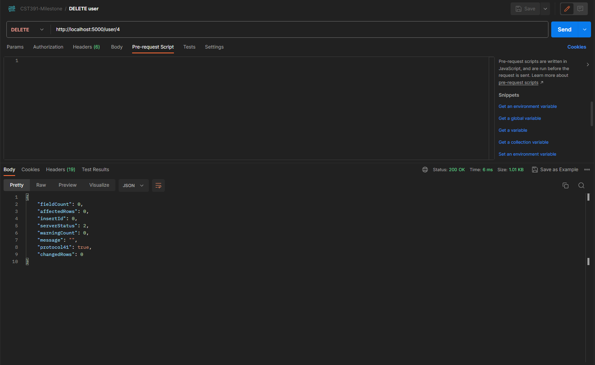

# Functionality / UI
[Back to Top](#cover-sheet)
<h4>As a customer, I would like to:</h4>

- simply scroll view all of the products on the home page
- click on a product and view details
- add a product to the cart
- find specific products on search
- make an account to save information

<h4>As the owner, I would like to:</h4>

- update products that may have changed 
- create new products 

## Initial Database Design

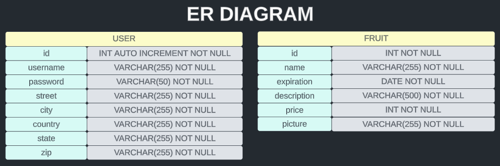

## Initial UI Sitemap

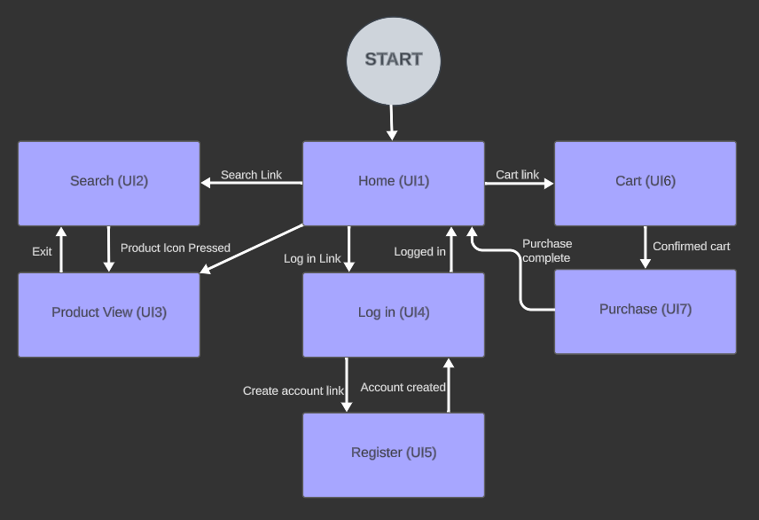

## Initial UI Wireframes

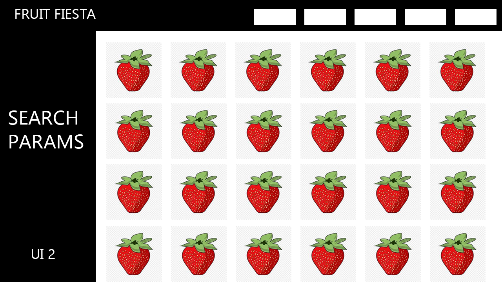

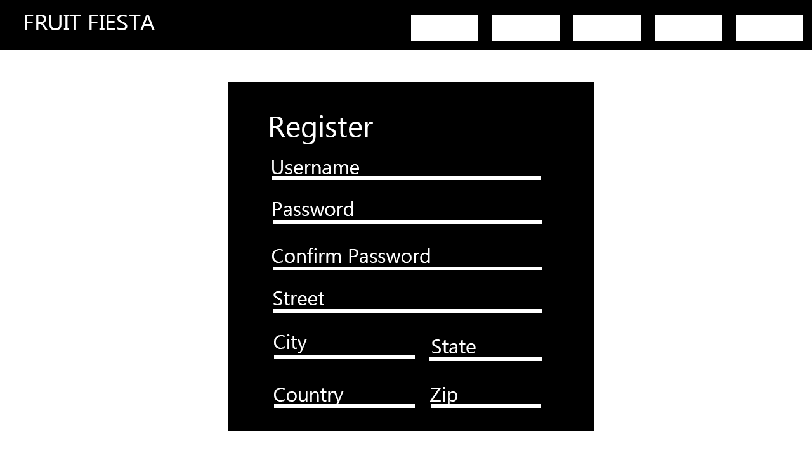

## Initial UML Classes

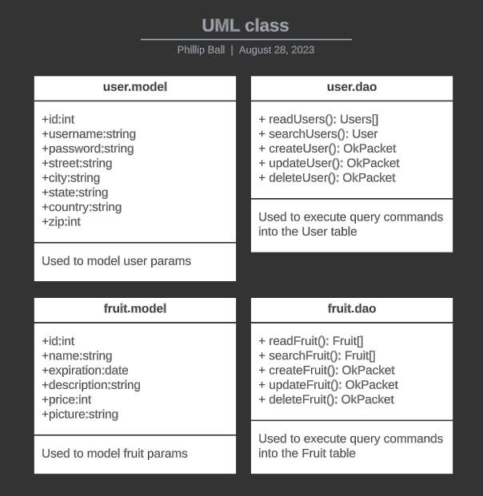

# Risks
[Back to Top](#cover-sheet)

I believe that the biggest risks in this project will be time related, I believe that I can do everything that I have listed out in the website for the UI side of things, but due to being new to the whole backend side, I believe that it will eat up a majority of my time. All-in-all this is a very exciting project and I believe it will be fun nonetheless! 
