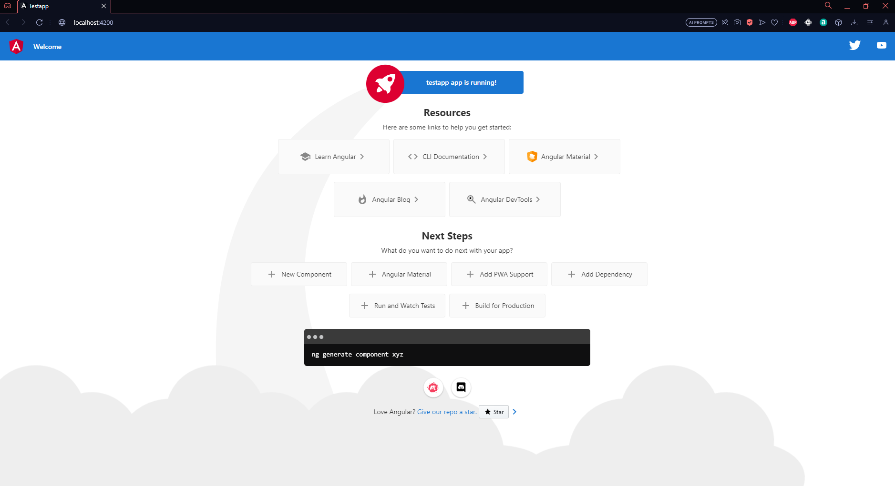

# Cover Sheet

### Class: CST-391
### Professor: Bobby Estey
### Author: Phillip Ball

---

## Screenshots

<h4>1: Proof of Angular app running</h4>



<h4>2: Proof of Angular app with changed title</h4>


<h4>3: Proof of Angular app with included message as name near title</h4>


## Research


>Inspect the default test project structure created in the Activity. 
>
>Describe the purpose for each of the folders of the following in the project structure: node_modules, src, src/app, src/assets, and src/environments. 
>
>Also, describe the purpose for each of the following files in the project: angular.json, package.json, and tsconfig.json.


**The purpose of:**
- node_modules inside of the app help to include all of the imported packages that the application needs to use to function.
- src is to contain all of the source code that the application uses 
- src/app is to contain all of the source code that relates to the app alone
- src/assets is to contain all of the non-post files such as images
- src/environments contains all of the configurations for the application
- angular.json is to provide workspace/project configuration defaults
- package.json is to contain metadata about the project, such as dependencies
- tsconfig.json is to specify root files and requirements to compile

<br>

>Inspect the page source for the default page displayed when running the test project. 
>
>Explain how the resultant page was generated by Angular by providing a brief overview and purpose for each of the following files: main.ts, app.component.css, app.component.html, app.component.ts, and app.module.ts

The page was generated through the app.component.html file and started by Main.ts with a bootstrapping method. Starting up the website is Main.ts's purpose. 

app.component.css's purpose is to create styles for the page being generated, although you can do this in an index.html with the 'style' tag, the styles used inside of css will be reusable and can make styling multiple pages much cleaner.

app.component.html's purpose is to display the html onto the website. Seen in screenshot three, I included a message through this html file near the title.
```
<span>{{ title }} app is running!</span>

<h3>{{ message }}</h3>
```

app.component.ts's purpose is to link include programming into the html, just like seen above, two variables inside of app.component.ts were able to be used inside of the html using {{ variable }}, of course it can be more complex but this was a good example to show the basics.

app.module.ts's purpose is to contain all of the components and services that are being imported then bootstrapped. 