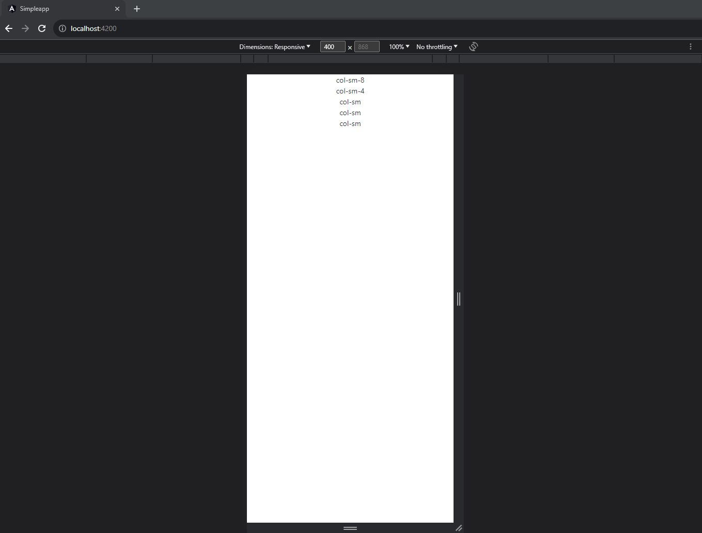
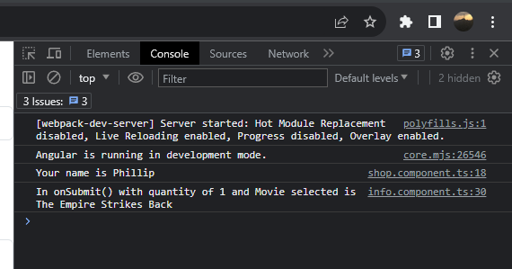
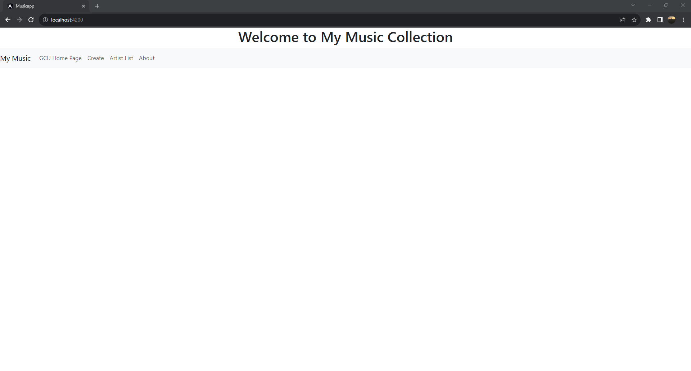
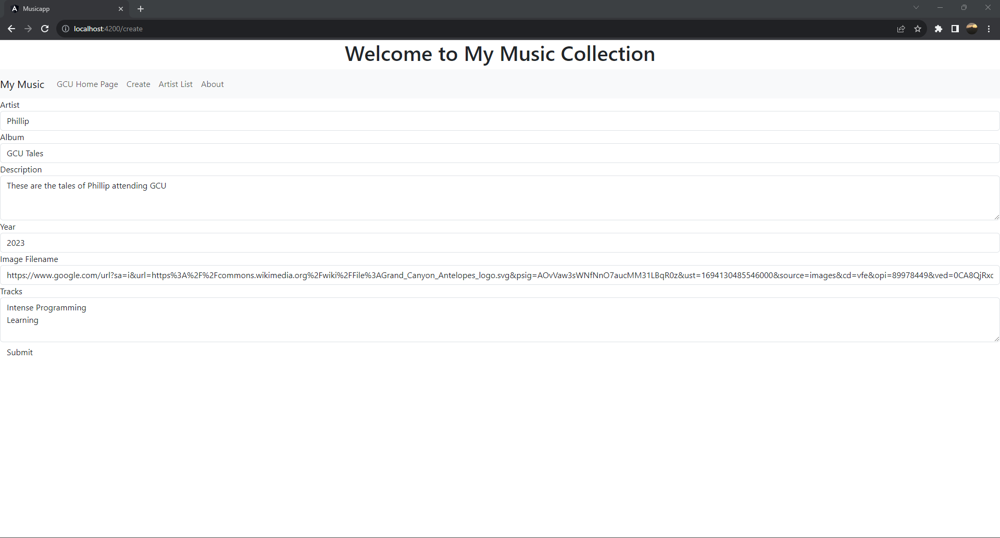
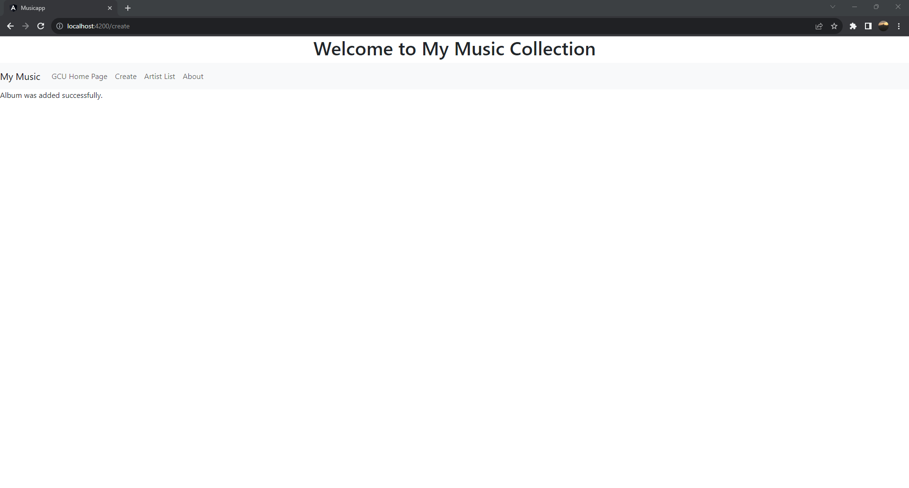
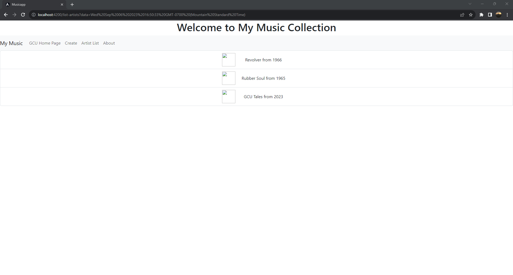

# Cover Sheet

### Class: CST-391
### Professor: Bobby Estey
### Author: Phillip Ball

---

[Part One](#part-one)

[Part Two](#part-two)

## Part One

[Back to Top](#cover-sheet)

[Research](#research)

### Screenshots

**Responsive columns**




**Before name entered**


**After name entered**


**After buy button has been pressed (Console)**



### Research

---
***Describe @Input decorator used in info.component.ts***

>The @Input decorator was used on the 'name: string' variable and its use inside of the shop view was:
>```
>'< [name]="answer" *ngIf="answer != 'unknown'"></>app-info>'
>```
>inside of the shop component. This allowed '[name]="answer"' to have the name inputted into where "answer" is and if the answer was not made it would then be rendered as unknown.

---

***Describe [value] used in info.component.html***

>The [value] was used on the product from the choice of products inside of info.component.html:
>
>```
>[value]="product">{{product}}</option>
>```
>This allowed for the product to be set from a choice to info.component.ts and later used as a variable to be displayed into the console from screenshot 5.

---

***Describe [(ngModel)] also used in info.component.html***

> The [(ngModel)] was used twice in info.component.html, where the first one was used to bind the quantity and the second was used to bind the selected product the user wanted:
>
>```
>[(ngModel)]="quantity" name="quantity">
>```
>
>```
>[(ngModel)]="selectedProduct" name="products" #selected="ngModel">
>```
>
> This allows for both of the variables to get set and this can be shown in screenshot 5.

## Part Two

[Back to Top](#cover-sheet)

### Screenshots

**Initial page on server start**



**GCU Home Page**


**Create page with info filled in**



**After creation success**



**The created album in the list**



**Version showing up on about click**


### Research

***Add complete comments to music-service.service.ts. Include this commented code in a Microsoft Word document or a text document. Make sure your submission reads like a code file.***

    //injecting service
    import { Injectable } from '@angular/core';

    //data from the given json
    import exampledata from '../data/sample-music-data.json';

    //models imported to use their variables
    import { Album } from '../models/albums.model';
    import { Artist } from '../models/artists.model';
    import { Track } from '../models/tracks.model';

    //service is injected into root
    @Injectable({ providedIn: 'root' })
    export class MusicServiceService {

    //json file data stored into variables
	private readonly artists: Artist[] = [];
	private readonly albums: Album[] = [];

    //setting up environment
	constructor() {
		this.createArtists();
		this.createAlbums();
	}

    //method to create artists
	private createArtists(): void {

        //using model constructor to push a new artist into the array created above, which is the beatles
		this.artists.push(new Artist(0, 'The Beatles'));
	}

    //method to create albums
	private createAlbums(): void {

        //for each loop to go through each album and retrieve data from it
		exampledata.forEach((data: any) => {

            //if data included the beatles create tracks and albums from the data, this doesn't matter too much because its only used to showcase the data from the json file, exampledata, to the students
			if (data.artist === 'The Beatles') {
				const tracks = data.tracks.map((trackData: any) => new Track(trackData.id, trackData.number, trackData.title, trackData.lyrics, trackData.video));
				const album = new Album(data.id, data.title, data.artist, data.description, data.year, data.image, tracks);
				this.albums.push(album);
			}
		});
	}

    //getter for artists
	public getArtists(): Artist[] {
		return this.artists;
	}

    //getter for albums
	public getAlbums(artist: string): Album[] {
		return this.albums;
	}

    //getter for a particular album based on search params
	public getAlbum(artist: string, id: number): Album | undefined {

        //finding an album that relates to any album based on search
		const album = this.albums.find((a) => a.Artist === artist && a.Id === id);

        //if album found, map tracks and return the album 
		if (album) {
			const tracks = album.Tracks.map((track) => new Track(track.Id, track.Number, track.Title, track.Lyrics, track.Video));
			return new Album(album.Id, album.Title, album.Artist, album.Description, album.Year, album.Image, tracks);
		}

        //if no album found then return undefined
		return undefined;
	}

    //adds an album to the albums[] with an album input
	public createAlbum(album: Album): void {
		this.albums.push(album);
	}

    //updates a selected album with an album input
	public updateAlbum(album: Album): void {

        //attempts to find an album that matches the input id
		const index = this.albums.findIndex((a) => a.Id === album.Id);

        //if found
		if (index !== -1) {

            //change album to the input one
			this.albums.splice(index, 1, album);
		}
	}

    //deletes an album with an id and artist input
	public deleteAlbum(id: number, artist: string): void {

        //attempts to find an album that matches the input id
		const index = this.albums.findIndex((a) => a.Id === id);

         //if found
		if (index !== -1) {

            //delete the album
			this.albums.splice(index, 1);
		}
	}
    }


