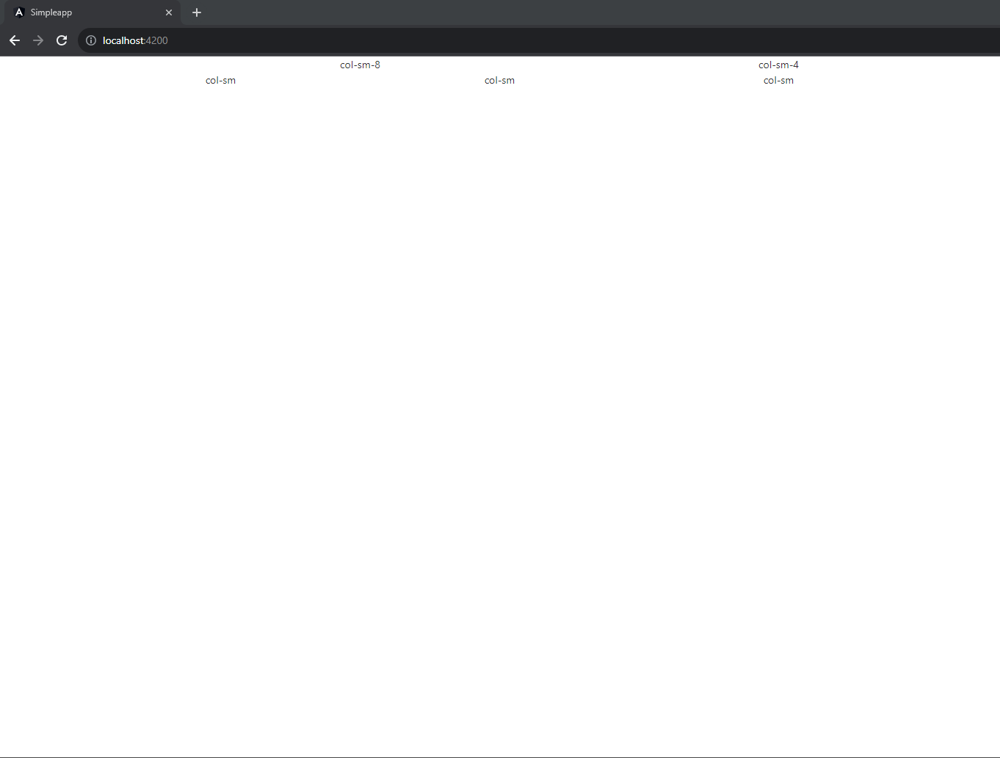
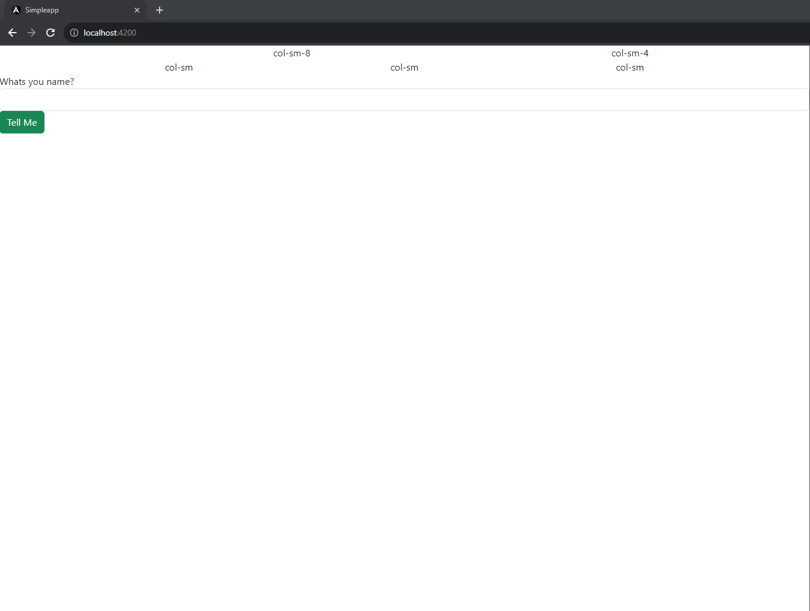

# Cover Sheet

### Class: CST-391
### Professor: Bobby Estey
### Author: Phillip Ball

---

[Part One](#part-one)

[Part Two](#part-two)

## Part One

[Back to Top](#cover-sheet)

[Research](#research)

### Screenshots

**Responsive columns**




**Before name entered**



**After name entered**


**After buy buttoned has been pressed (Console)**


### Research

---
***Describe @Input decorator used in info.component.ts***

>The @Input decorator was used on the 'name: string' variable and its use inside of the shop view was:
>```
>'< [name]="answer" *ngIf="answer != 'unknown'"></>app-info>'
>```
>inside of the shop component. This allowed '[name]="answer"' to have the name inputted into where "answer" is and if the answer was not made it would then be rendered as unknown.

---

***Describe [value] used in info.component.html***

>The [value] was used on the product from the choice of products inside of info.component.html:
>
>```
>[value]="product">{{product}}</option>
>```
>This allowed for the product to be set from the info.component.ts and later used as a variable to be displayed into the console from screenshot 5.

---

***Describe [(ngModel)] also used in info.component.html***

## Part Two

[Back to Top](#cover-sheet)