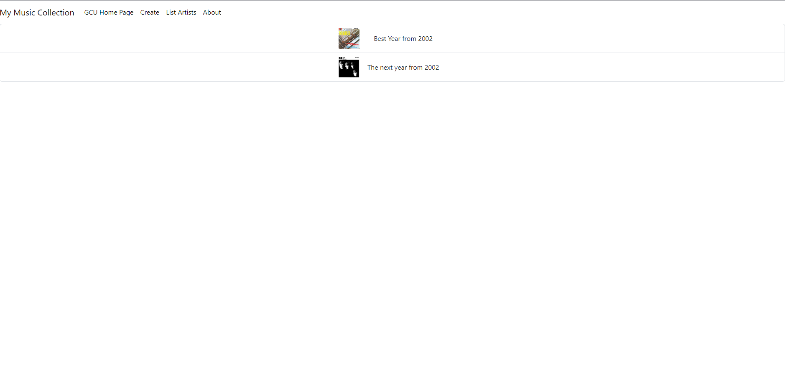
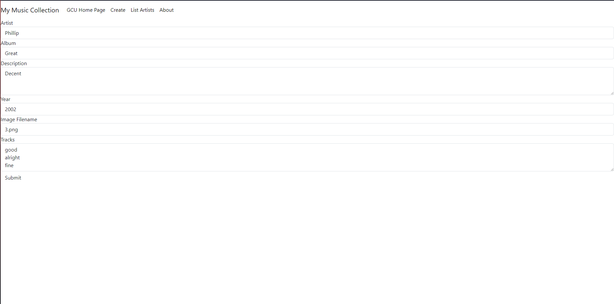

# Cover Sheet

### Class: CST-391
### Professor: Bobby Estey
### Author: Phillip Ball

---

## Screenshots

**Main Screen**

**Artists list**

**After user chooses artist, displayed albums**

**After user chooses album, displayed album details + tracks**

**Create album**

**Showing that the album creation was successful**

## Research

***Research how an Angular application maintains a logged in state. How does it communicate this state to the server***

>Angular applications utilize a combination of client-side storage, typically through JWT tokens stored in cookies or local storage, and server-side authentication mechanisms to maintain a logged-in state. These tokens represent the user's identity and are sent with each HTTP request through interceptors to validate the user's access. Route guards ensure that protected routes are only accessible to authenticated users, and the server can periodically check token validity. By combining these techniques, Angular maintains a secure and seamless logged-in state, enhancing user experience while preserving data integrity.