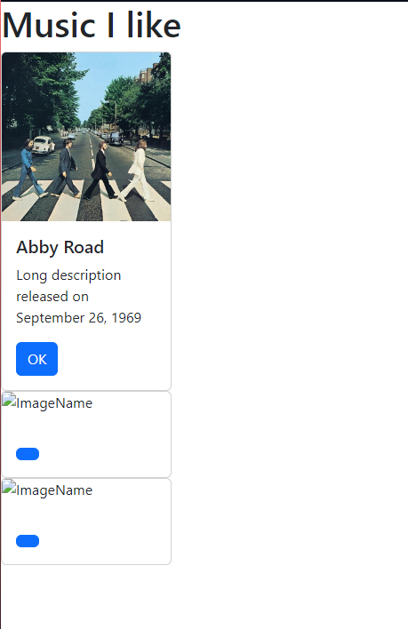
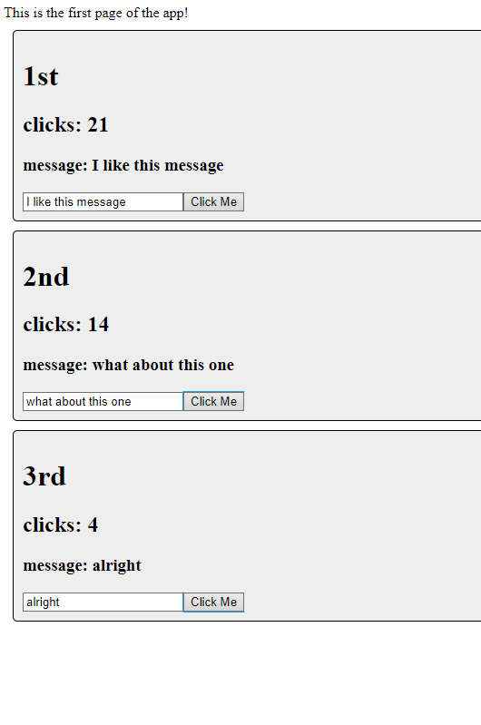
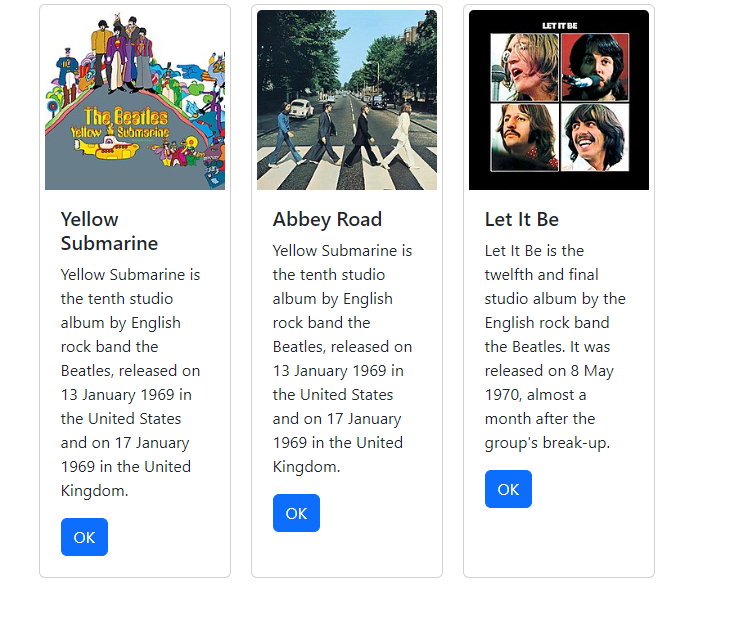

# Cover Sheet

### Class: CST-391
### Professor: Bobby Estey
### Author: Phillip Ball

---

## Screenshots

**Displaying the card that was generated from the Card + App class parameters**



**Displaying the counters that were generated from the Counter + App class**



**Displaying the new looking cards generated from the list of albums and changed the positioning by using css**



## Research

***Activity 1: Write a one-paragraph summary of the new features that have been added. Define new terminology that was used in the lesson.***

>In this activity we learned how to create and run a react application. Creating and rendering JSX content on the page, we created a card to display the album in a good looking style. We created a Card class that allows for the cards to become an object rather than a repeat of the same lines of code over and over, further increasing the reusability of the code.

***Activity 3: Write a one-paragraph summary of the new features that have been added. Define new terminology that was used in the lesson.***

>In this activity we took the steps a bit further and introduced an array of album data. From the array, instead of using : 
>
>```
><Card 
>    albumTitle="an album title"
>    albumDescription="an album description"
>    buttonText='OK' 
>    imgURL="an album image" 
>/> 
>```
>over and over again to display each album, we created a function to render the list and make the instance from data -> rendered card -> card much more reusable, where the only change in code needed to display other items would be to the data itself.