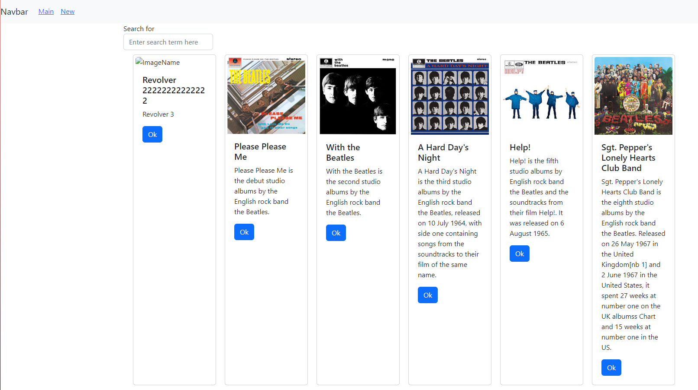
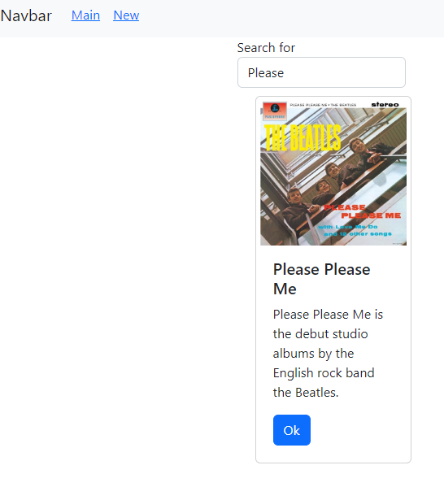

# React Assignments

### Class: CST-391
### Professor: Bobby Estey
### Author: Phillip Ball

---

[Week 5](#week-5)

[Week 6](#week-6)

[Week 7](#week-7)

# Week 5

[Back to Top](#cover-sheet)

## Screenshots

**Displaying the card that was generated from the Card + App class parameters**


**Displaying the counters that were generated from the Counter + App class**


**Displaying the new looking cards generated from the list of albums and changed the positioning by using css**


## Research

***Activity 1: Write a one-paragraph summary of the new features that have been added. Define new terminology that was used in the lesson.***

>In this activity we learned how to create and run a react application. Creating and rendering JSX content on the page, we created a card to display the album in a good looking style. We created a Card class that allows for the cards to become an object rather than a repeat of the same lines of code over and over, further increasing the reusability of the code.

***Activity 3: Write a one-paragraph summary of the new features that have been added. Define new terminology that was used in the lesson.***

>In this activity we took the steps a bit further and introduced an array of album data. From the array, instead of using : 
>
>```
><Card 
>    albumTitle="an album title"
>    albumDescription="an album description"
>    buttonText='OK' 
>    imgURL="an album image" 
>/> 
>```
>over and over again to display each album, we created a function to render the list and make the instance from data -> rendered card -> card much more reusable, where the only change in code needed to display other items would be to the data itself.


# Week 6

[Back to Top](#cover-sheet)

## Screenshots

### Activity 1

**Initial start up of the website with all of the albums inside of the database from week 1 being displayed**


**After the search params were made, displaying the 'please please' input to show the album 'Please Please Me'**


### Activity 2

**Initial startup of the application, showing that the user needs to login**


**Login portion of the application, after the click the user is considered logged in and can continue to see the web pages**


**About page after logged in**


**Contact Us page after logged in**


**User page after logged in**


### Activity 3

**Initial page on open**



**Page with 'please' placed into the search to demonstrate that the album 'Please Please Me' shows up**



**Page after the navbar 'New' reference was pressed**


**Back to main and also demonstrating multiple albums showing up with an input of 'with'**


## Research

***Activity 1: Write a one-paragraph summary of the new features that have been added. Define new terminology that was used in the lesson.***

>This activity was based on dynamic ways to get and display data to the user, we went from using a hard coded method, with the albums programmed into the code, to a new method of creating a JSON file and retrieving that data from the JSON file to the display, and lastly, we used the data from the week 1 MusicAPI and displayed it using axios, which generated the data source.  

***Activity 2: Write a paragraph explaining the new terminology and new features that you just demonstrated.***

>This activity was based on creating webpages using javascript and representing them with a route. We used this route to connect to a navbar and set the routes through Navbar.js. After we were able to fill the contents in the page by setting their returns to be HTML. Using the App.js, we were able to display these created routes through PrivateRouter.js.

***Activity 3: Write a one-paragraph summary of the new features that have been added. Define new terminology that was used in the lesson.***

>This activity brought the whole learning session of this assignment together by taking what we learned from activity 1, which was different methods of getting information into the website leading to our MusicAPI database, and activity 2, where we learned how to use different routing methods of the information, including dynamic features to reduce any hard programmed methods. These features allow for greater flexibility in dynamic website design with object like information.

# Week 7

[Back to Top](#cover-sheet)

## Screenshots

### Activity 1

**Start display of the site with the blog posts and add text area**


**Display after a blogs delete button has been pressed**


**Display after adding a new blog (at 12 because I kept adding and deleting blog posts)**


### Activity 2

**Create album display**


**Create album display filled out**


**After submit pressed on create album**


**New album displayed**


### Activity 3

**View button pressed on album**


**Edit button pressed on album**


**After edit was submitted**


## Research

***Activity 1: Write a one-paragraph summary of the new features that have been added. Define new terminology that was used in the lesson.***

>In activity 1 we used button handlers to control the adding and removing of a blog post object, using an add button to create a blog post using the text area input from the user, and a delete button to remove that blog post using onDelete and filtering out the post.

***Activity 2: Write a one-paragraph summary of the new features that have been added. Define new terminology that was used in the lesson.***

> In activity 2 we created a create album function that achieves the same thing as the last activity where the user inputs get applied to data, but this time it was applied to our MusicAPI backend data and stored there. 

***Activity 3: Write a one-paragraph summary of the new features that have been added. Define new terminology that was used in the lesson.***

> In activity 3 we added a view and edit button onto the cards, the view button onClick would take in an albumId and return the album that was selected and display it using '/show/', and the edit button opens up the '/edit/' route to display the inputs to change the selected album.