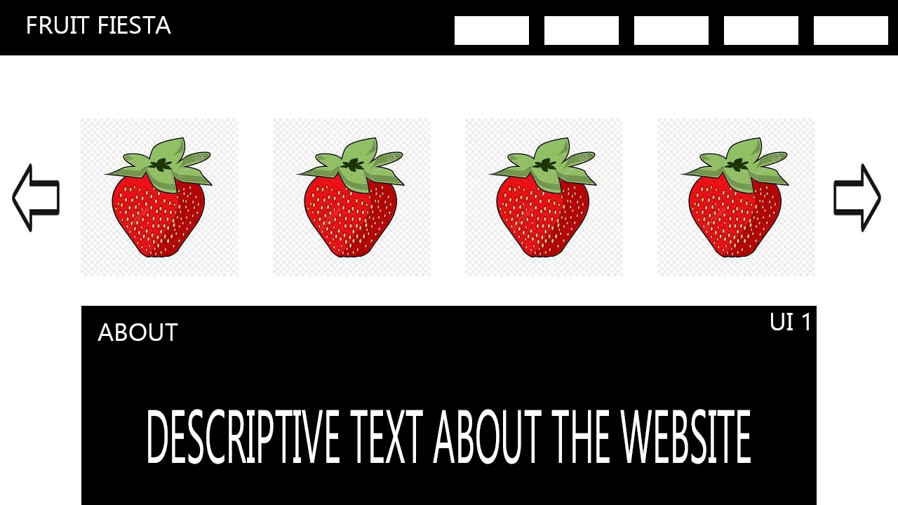
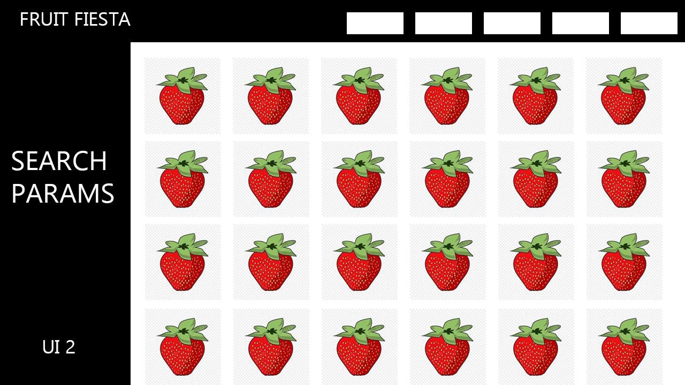
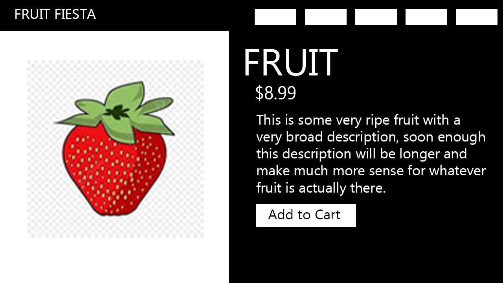
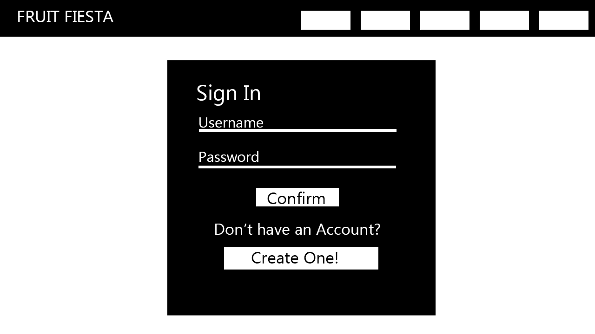
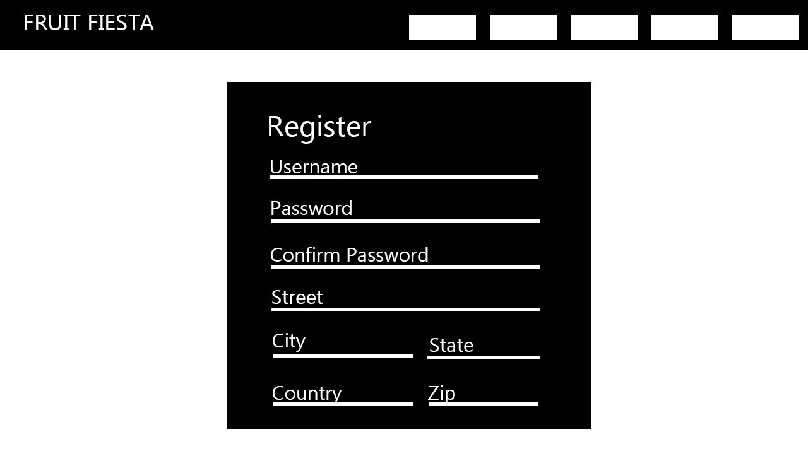
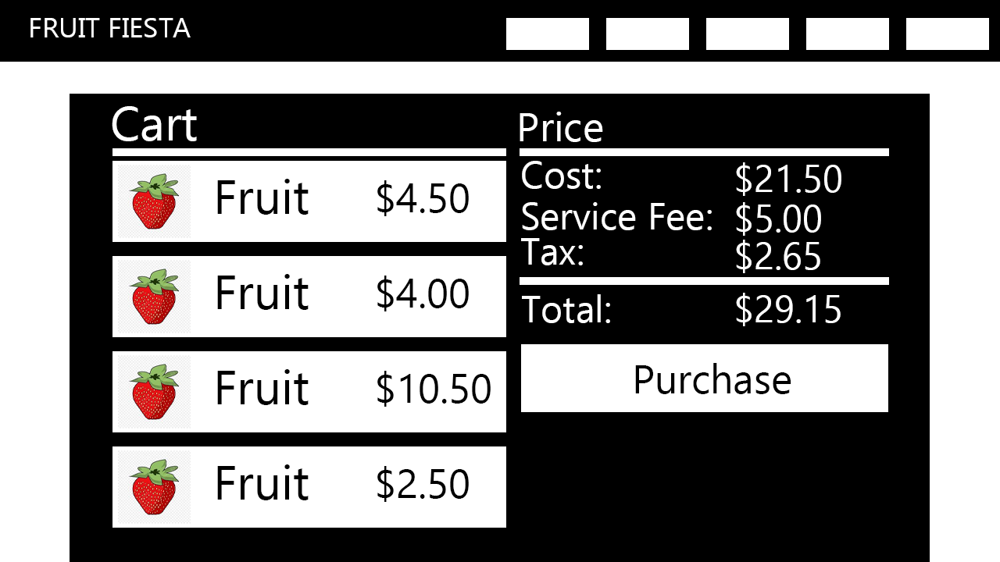
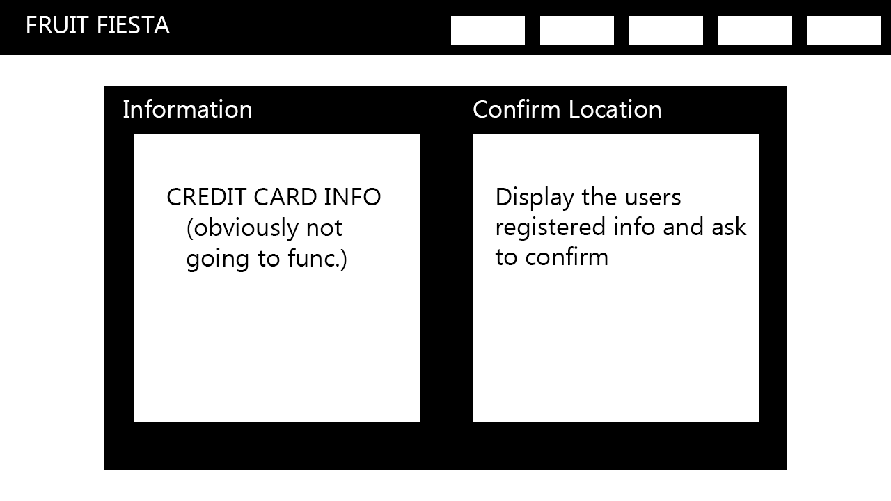
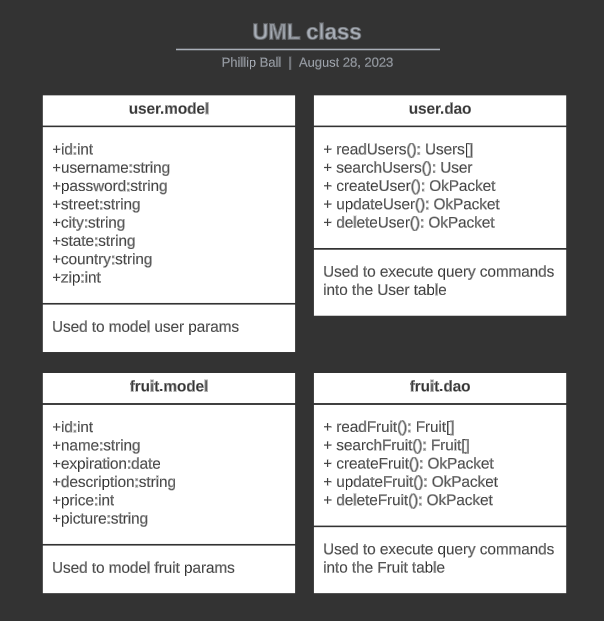

# Cover Sheet

### Class: CST-391
### Application Name: Fruit Fiesta
### Author: Phillip Ball

---
## Introduction

Fruit Fiesta is a fruit only shop, where the user can create an account, add fruit to their cart, and checkout. I have never seen a fruit only shop and mainly thought it would be a fun idea. 

## Functionality

<h4>As a customer, I would like to:</h4>

- simply scroll view all of the products on the home page
- click on a product and view details
- add a product to the cart
- find specific products on search
- make an account to save information

<h4>As the owner, I would like to:</h4>

- update products that may have changed 
- create new products 

## Initial Database Design

## Initial UI Sitemap

## Initial UI Wireframes

## Initial UML Classes

## Risks

I believe that the biggest risks in this project will be time related, I believe that I can do everything that I have listed out in the website for the UI side of things, but due to being new to the whole backend side, I believe that it will eat up a majority of my time. All-in-all this is a very exciting project and I believe it will be fun nonetheless! 